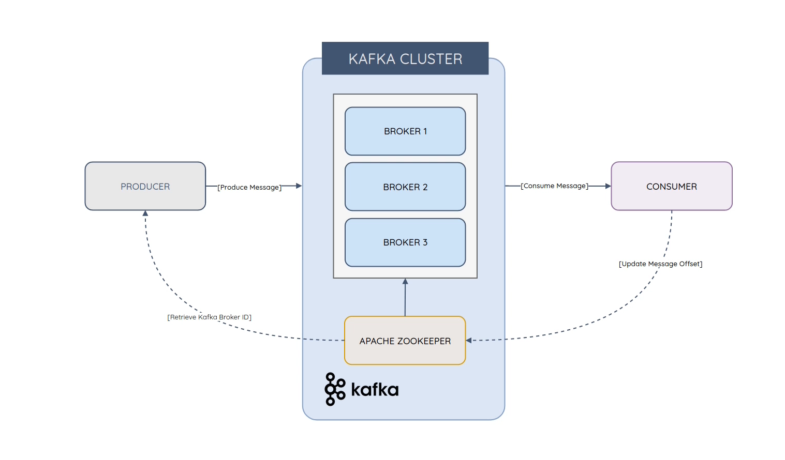
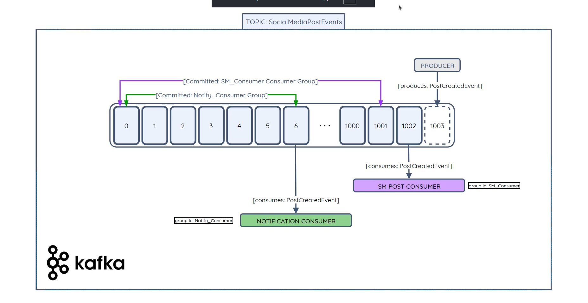
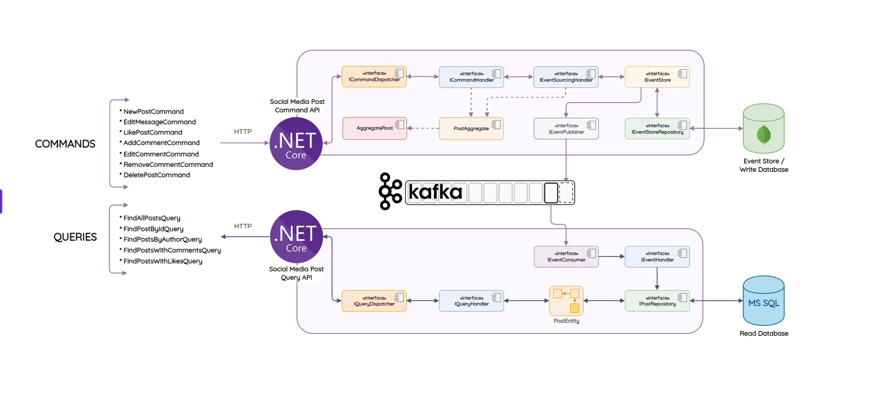

 # Microservices Event Sourcing using Kafka

The transcript describes **Event Sourcing**, a design pattern where all changes to an application's state are stored as a sequence of immutable events rather than just saving the final state. While the transcript mentions "secrets," this is likely a misinterpretation of **CQRS (Command Query Responsibility Segregation)**, a pattern very commonly used with Event Sourcing [, ].[^2]

### Key Concepts and Benefits

Event Sourcing offers several advantages over traditional data storage methods where you would typically update a row in a database.[^7]

* **Complete Audit Trail**: Since every change is saved as an event, you have a complete, unchangeable history of the entity. This is invaluable for auditing and debugging.[^2]
* **Recreate Historical State**: You can determine the state of an object at any point in time by replaying the events up to that point.[^8]
* **Improved Write Performance**: Writing events is a simple append-only operation, which is very fast. There are no slow `UPDATE` or `DELETE` operations on the event log.[^2]
* **Disaster Recovery**: The event log can be used as the definitive source of truth to rebuild read models or other databases in case of failure.


### Beginner-Friendly Code Example: A Bank Account

Let's model a simple bank account using Event Sourcing in C\#. In a traditional approach, you might have a single `Balance` property that you update directly. With Event Sourcing, we record the actions themselves.

#### 1. Define the Events

First, we define the immutable events that can happen to our account. C\# `record` types are perfect for this as they are immutable by design.[^1]

```csharp
// Base interface for all our events
public interface IEvent {}

// Event for when a new account is created
public record AccountCreated(Guid AccountId, decimal InitialBalance) : IEvent;

// Event for when money is deposited
public record MoneyDeposited(decimal Amount) : IEvent;

// Event for when money is withdrawn
public record MoneyWithdrawn(decimal Amount) : IEvent;
```


#### 2. Create the Aggregate

The **Aggregate** is the entity that processes commands and produces events. In our case, it's the `BankAccount`. Notice how its properties have `private set` to prevent direct changes from outside.

```csharp
public class BankAccount
{
    public Guid Id { get; private set; }
    public decimal Balance { get; private set; }
    public int Version { get; private set; } = 0;

    // A private list to track the changes (new events)
    private readonly List<IEvent> _uncommittedEvents = new();

    // Private constructor ensures it's created via events
    private BankAccount() { }

    // Public method to process a deposit command
    public void Deposit(decimal amount)
    {
        if (amount <= 0)
        {
            throw new InvalidOperationException("Deposit amount must be positive.");
        }
        var depositEvent = new MoneyDeposited(amount);
        Apply(depositEvent); // Apply the event to the current state
        _uncommittedEvents.Add(depositEvent); // Add to our list of new events
    }
    
    // A private method to apply an event to the state
    private void Apply(IEvent anEvent)
    {
        switch (anEvent)
        {
            case AccountCreated e:
                Id = e.AccountId;
                Balance = e.InitialBalance;
                break;
            case MoneyDeposited e:
                Balance += e.Amount;
                break;
            case MoneyWithdrawn e:
                Balance -= e.Amount;
                break;
        }
        Version++;
    }

    // A static method to rebuild the account's state from its history
    public static BankAccount RebuildFrom(Guid id, IEnumerable<IEvent> history)
    {
        var account = new BankAccount();
        foreach (var pastEvent in history)
        {
            account.Apply(pastEvent);
        }
        return account;
    }
}
```

In a real application, the `_uncommittedEvents` list would be saved to a specialized **Event Store** database like EventStoreDB or using a library like Marten with PostgreSQL [, ].

### Real-World Use Cases

Event Sourcing is particularly useful in systems where the history of an entity is as important as its current state.

* **E-commerce Platforms**: Tracking an order's lifecycle (`OrderPlaced`, `PaymentProcessed`, `ItemShipped`, `OrderDelivered`). This provides a full history for customer service and analytics.[^6]
* **Financial Systems**: For bank accounts, ledgers, and stock trading, an immutable log of all transactions (`MoneyDeposited`, `TransferSent`) is a legal and business requirement [, ].
* **Inventory Management**: Recording every stock movement (`ItemReceived`, `StockReserved`, `ItemShipped`) ensures a perfect audit trail and helps diagnose discrepancies.
* **Collaborative Applications**: In a tool like Google Docs, every keystroke or formatting change can be an event, allowing for features like viewing version history and collaborative editing.


### Summary and Interview Tips

For a .NET interview, focusing on these key points will demonstrate a strong understanding of Event Sourcing.

* **Explain the Core Idea**: Be ready to explain that Event Sourcing is about persisting state as a sequence of events, not just the current snapshot.
* **Connect it to CQRS**: Mentioning that Event Sourcing is often the "write side" of a CQRS architecture shows a deeper understanding. The event stream is optimized for writes, while separate "read models" are built from these events for fast queries.[^8]
* **Discuss the "Why"**: Emphasize the benefits: full auditability, the ability to debug by replaying history, and high-performance, append-only writes.
* **Acknowledge the Trade-offs**: Show that you have a balanced view. Event Sourcing can introduce complexity, such as "eventual consistency" (where read models might be slightly out of date) and the need to version events over time.
* **Name Key Technologies**: Mentioning popular .NET tools for Event Sourcing like **Marten** (for PostgreSQL) or dedicated databases like **EventStoreDB** shows you are aware of the ecosystem [, ]. You can also mention messaging systems like RabbitMQ or Kafka which are often used to publish events for other services to consume.

# Overall Architecture

This transcript describes a classic implementation of the **Command Query Responsibility Segregation (CQRS)** pattern combined with **Event Sourcing** for a social media application's backend. Here is a breakdown of the main points with code examples and interview advice.

### Summary of the Architecture

The architecture separates the application into two distinct microservices: a **Command API** for handling all data changes (writes) and a **Query API** for handling all data reads. This separation allows each service to be optimized and scaled independently.[^3][^4]

* **Command API (The "Write" Side)**: Manages all state changes, such as creating a new post, adding a comment, or liking a post. It uses Event Sourcing, meaning it doesn't just update data; it records each action as an immutable event in a write-optimized database (**MongoDB**).
* **Query API (The "Read" Side)**: Manages all data retrieval, such as finding all posts or fetching posts by a specific author. It uses a separate, read-optimized database (**SQL Server**) that is specifically designed for efficient querying.
* **Event Bus (The "Glue")**: An **Apache Kafka** message broker acts as the communication channel between the two services. When the Command API writes a new event, it publishes that event to Kafka. The Query API subscribes to these events to update its own read database, a process which leads to "eventual consistency."


### The Flow of Data Explained

The transcript details the lifecycle of a command (a write operation) and a query (a read operation).

#### Command Flow (e.g., Creating a New Post)

1. A client sends a `NewPostCommand` via an HTTP POST request to the **Command API**.
2. The API controller receives the command and uses a **dispatcher** to send it to the correct **command handler**.
3. The handler creates a `PostAggregate` (the business object) and applies the command, which raises a `PostCreatedEvent`.
4. This new event is saved to the **MongoDB Event Store**.
5. After successful persistence, the `PostCreatedEvent` is published to an **Apache Kafka** topic.

#### Query Flow (e.g., Finding All Posts)

1. An **event consumer** in the **Query API** listens to the Kafka topic. It receives the `PostCreatedEvent`.
2. An **event handler** processes this event and updates the **SQL Server read database**. For a `PostCreatedEvent`, it would insert a new record into the `Posts` table.
3. Later, a client sends a `FindAllPostsQuery` via an HTTP GET request to the **Query API**.
4. The controller dispatches this query to a **query handler**.
5. The handler executes a simple, fast query against the SQL Server read database and returns the data.

### Beginner-Friendly .NET Code Examples

The transcript mentions several interfaces like `ICommandDispatcher` and `ICommandHandler`. In modern .NET, this pattern is most easily implemented using the popular library **MediatR**, which handles the dispatching logic for you.[^2]

#### 1. Defining a Command

A command is a simple object that represents an intent to change something. A C\# `record` is a good choice as it's typically just a data carrier.

```csharp
// The command object, which implements MediatR's IRequest interface.
// It represents the "New Post" action from the transcript.
public record NewPostCommand(Guid PostId, string Author, string Message) : IRequest<Guid>;
```


#### 2. Creating a Command Handler

The handler contains the business logic for a specific command. It takes the command, interacts with the aggregate/event store, and publishes events.

```csharp
// This handler processes the NewPostCommand.
public class NewPostCommandHandler : IRequestHandler<NewPostCommand, Guid>
{
    // In a real app, these would be injected dependencies.
    private readonly IEventStoreRepository _eventStoreRepo;
    private readonly IEventPublisher _eventPublisher;

    public NewPostCommandHandler(IEventStoreRepository eventStoreRepo, IEventPublisher eventPublisher)
    {
        _eventStoreRepo = eventStoreRepo;
        _eventPublisher = eventPublisher;
    }

    public async Task<Guid> Handle(NewPostCommand command, CancellationToken cancellationToken)
    {
        // 1. Create the aggregate and raise the event.
        var aggregate = new PostAggregate(command.PostId, command.Author, command.Message);

        // 2. Persist the event to the write database (e.g., MongoDB).
        await _eventStoreRepo.SaveAsync(aggregate);

        // 3. Publish the event to the event bus (e.g., Kafka).
        await _eventPublisher.PublishAsync(aggregate.GetUncommittedEvents());
        
        return aggregate.Id;
    }
}
```


#### 3. Using the Dispatcher in the Controller

The API controller becomes very simple. It just needs to create the command object and send it via MediatR's `IMediator` interface.[^5]

```csharp
[ApiController]
[Route("api/posts")]
public class PostCommandController : ControllerBase
{
    private readonly IMediator _mediator;

    public PostCommandController(IMediator mediator)
    {
        _mediator = mediator;
    }

    [HttpPost]
    public async Task<IActionResult> NewPost([FromBody] NewPostCommand command)
    {
        var postId = await _mediator.Send(command);
        return StatusCode(201, new { Id = postId });
    }
}
```


### Real-World Use Cases

This architecture is powerful for complex systems where read and write needs differ significantly.[^4]

* **Social Media**: As described, handling a high volume of writes (posts, likes, comments) separately from the high volume of reads (loading feeds).
* **E-commerce**: Write-heavy operations like placing an order, processing payment, and updating inventory are separated from read-heavy operations like browsing products and searching.
* **Banking**: A transaction (`MoneyTransferredCommand`) is a write operation that must be perfectly audited (Event Sourcing), while checking your balance is a simple read query.
* **Booking Systems**: Handling flight or hotel reservations (writes) is a critical, complex process, while searching for available rooms/flights (reads) is a different performance challenge.


### Summary and Interview Tips

When discussing this architecture in an interview, focus on the "why" behind the design choices.

* **Clearly Define CQRS**: Start by stating that CQRS separates the models for reading and writing data. The write model is optimized for command processing and validation, while the read model is optimized for fast queries.[^3]
* **Explain the Scalability Benefit**: Emphasize that you can scale the read and write services independently. If your application gets millions of reads but only thousands of writes, you can add more instances of the Query API without touching the Command API.
* **Connect CQRS and Event Sourcing**: Explain that while they are separate patterns, they work very well together. Event Sourcing provides a perfect, auditable log for the write-side of a CQRS system.
* **Be Ready to Draw It**: An interviewer may ask you to whiteboard this architecture. Practice drawing the boxes: Client -> Command API -> Kafka -> Query API -> Read DB. Show the command and query flows clearly.
* **Discuss the Main Trade-off: Eventual Consistency**: This is the most important concept to show you have a balanced understanding. Because the read database is updated *after* an event is published, there is a small delay. The read model is "eventually consistent" with the write model. Discuss how this is acceptable for most social media features (e.g., a "like" appearing a second later is fine) but might not be for others (e.g., a bank transfer).

# All about Kafka

The provided transcript gives a high-level introduction to Apache Kafka, explaining its origin and purpose as a real-time event streaming platform. Here is a summary with more details on the key components mentioned, along with beginner-friendly .NET examples and interview tips.

### Summary of Apache Kafka

**Apache Kafka** is an open-source, distributed event streaming platform initially created at LinkedIn in 2011 to handle high-throughput data streams [, ]. It has since become the industry standard for building real-time, event-driven applications, capable of processing trillions of events per day. The transcript notes that it will be used as the **event bus** in the course's architecture, connecting the write side (Command API) and the read side (Query API).[^1]

### Key Architectural Components

The transcript mentions several core components of Kafka that are essential to understand [, ].


| Component | Description |
| :-- | :-- |
| **Broker** | A single Kafka server. A group of brokers forms a **Kafka cluster**, which provides scalability and fault tolerance [, ]. |
| **Topic** | A named category or channel to which records (events) are published. For example, you might have a `social-media-posts` topic [, ]. |
| **Partition** | A topic is split into one or more partitions. Each partition is an ordered, immutable sequence of records called a **commit log** [, ]. Partitions are the key to Kafka's parallelism and scalability. |
| **Producer** | A client application that writes or publishes records to a Kafka topic [, ]. In the CQRS architecture, the Command API acts as a producer. |
| **Consumer** | A client application that subscribes to one or more topics and reads and processes records [, ]. The Query API acts as a consumer. Consumers track their progress using an **offset**, which is a unique ID for each record in a partition [^7]. |
| **ZooKeeper** | An external service that was traditionally used to manage and coordinate the Kafka cluster, handling tasks like tracking broker status and electing leaders for partitions. Newer versions of Kafka are replacing ZooKeeper with an internal component called KRaft [, ]. |

### Beginner-Friendly .NET Code Examples

To interact with Kafka from a .NET application, you typically use a client library. The most popular one is `Confluent.Kafka`, provided by Confluent, the company founded by the creators of Kafka.

#### 1. Creating a Producer

This example shows how a .NET application (like the Command API) can produce a message to a Kafka topic.

```csharp
using Confluent.Kafka;
using System.Threading.Tasks;

public class KafkaProducer
{
    private readonly IProducer<string, string> _producer;

    public KafkaProducer(string bootstrapServers)
    {
        var config = new ProducerConfig { BootstrapServers = bootstrapServers };
        _producer = new ProducerBuilder<string, string>(config).Build();
    }

    public async Task ProduceMessageAsync(string topic, string key, string value)
    {
        var message = new Message<string, string> { Key = key, Value = value };
        
        // Asynchronously send the message to the specified topic
        var deliveryResult = await _producer.ProduceAsync(topic, message);
        
        Console.WriteLine($"Delivered '{deliveryResult.Value}' to '{deliveryResult.TopicPartitionOffset}'");
    }
}

// How to use it:
// var producer = new KafkaProducer("localhost:9092");
// await producer.ProduceMessageAsync("social-media-posts", "post-123", "{'event':'PostCreated', 'author':'John'}");
```

* **BootstrapServers**: The address of one or more Kafka brokers. The client only needs one to connect to the entire cluster.
* **Key**: The message key (`post-123`). All messages with the same key are guaranteed to go to the same partition, which ensures their order of processing.[^5]


#### 2. Creating a Consumer

This example shows how a background service in another application (like the Query API) can consume messages from a topic.

```csharp
using Confluent.Kafka;
using System;
using System.Threading;

public class KafkaConsumer
{
    private readonly IConsumer<string, string> _consumer;

    public KafkaConsumer(string bootstrapServers, string groupId)
    {
        var config = new ConsumerConfig
        {
            BootstrapServers = bootstrapServers,
            GroupId = groupId, // Identifies the consumer group
            AutoOffsetReset = AutoOffsetReset.Earliest // Start reading from the beginning of the topic
        };
        _consumer = new ConsumerBuilder<string, string>(config).Build();
    }

    public void StartConsuming(string topic, CancellationToken cancellationToken)
    {
        _consumer.Subscribe(topic);

        while (!cancellationToken.IsCancellationRequested)
        {
            try
            {
                // Poll for new messages
                var consumeResult = _consumer.Consume(cancellationToken);
                
                Console.WriteLine($"Consumed message '{consumeResult.Message.Value}' from topic '{consumeResult.Topic}'");
                
                // In a real app, you would process the message here (e.g., update the read database)
            }
            catch (ConsumeException e)
            {
                Console.WriteLine($"Error consuming: {e.Error.Reason}");
            }
        }
        _consumer.Close();
    }
}

// How to use it:
// var consumer = new KafkaConsumer("localhost:9092", "query-api-group");
// consumer.StartConsuming("social-media-posts", new CancellationToken());
```

* **GroupId**: This is a crucial concept. All consumers with the same `GroupId` work together to process messages from a topic. Kafka ensures that each partition is only consumed by one consumer within the group at any given time, which is how it achieves parallel processing.[^1]


### Summary and Interview Tips

When discussing Kafka in a .NET interview, focus on its role in a distributed system.

* **Explain Its Purpose**: Describe Kafka as a "distributed commit log" used for building real-time, event-driven architectures. Emphasize that it decouples services. The producer doesn't need to know who is consuming the message, and vice-versa.[^5]
* **Know the Core Components**: Be able to confidently define Topic, Partition, Producer, Consumer, and Broker. Explaining that partitions are the unit of parallelism is a key point.
* **Mention "At-Least-Once" Delivery**: By default, Kafka provides "at-least-once" message delivery guarantees. This means a message will never be lost but could, in rare failure scenarios, be delivered more than once. Mention that consumers must be designed to handle this (i.e., be idempotent).
* **Discuss Key vs. No Key**: Explain the importance of message keys. A key ensures all events for a specific entity (like a single social media post) go to the same partition and are processed in order. If no key is provided, Kafka distributes messages in a round-robin fashion for load balancing [, ].
* **Acknowledge ZooKeeper's Role (and its Decline)**: Mentioning that ZooKeeper handles cluster coordination shows historical knowledge. Adding that newer versions are replacing it with KRaft to simplify operations demonstrates that your knowledge is up-to-date.

### Summary of Prerequisites and Tools

The transcript lists all the tools needed for the course, emphasizing a cross-platform approach (Windows, macOS, Linux) and the use of Docker to simplify the setup of infrastructure services.


| Tool / Technology | Version Mentioned | Purpose |
| :-- | :-- | :-- |
| **.NET SDK** | .NET 6 | The core software development kit needed to build and run .NET applications. The transcript notes to use the latest stable version if .NET 6 is outdated [, ]. |
| **IDE / Code Editor** | N/A | For writing C\# code. The recommended options are **Visual Studio 2022**, **VS Code**, or **JetBrains Rider**. |
| **Postman** | N/A | A client tool for making HTTP requests to test the web APIs. |
| **Docker** | 20.10.7+ | A containerization platform used to easily run **Apache Kafka**, **MongoDB**, and **SQL Server** in isolated containers, avoiding complex local installations. |

### .NET Development Environment Setup

The transcript provides a step-by-step guide for setting up the development environment, including how to verify each installation.

#### 1. Install the .NET SDK

The first step is to install the .NET Software Development Kit. The SDK includes everything needed to build and run .NET applications, including the runtime and command-line tools [, ].[^2]

* **To Install**: Download the installer for your operating system from the official .NET website.
* **To Verify**: After installation, open a terminal or command prompt and run the following command. It will display the installed SDK version.

```bash
dotnet --version
```


#### 2. Choose and Configure a Code Editor

You need an editor to write code. The transcript highlights VS Code as a lightweight option that becomes powerful with extensions.[^10]

* **Visual Studio 2022**: A full-featured IDE popular among .NET developers.
* **JetBrains Rider**: A cross-platform .NET IDE known for its intelligent features.
* **Visual Studio Code (VS Code)**: A free, lightweight editor. If using VS Code, the transcript recommends installing these essential extensions from the marketplace:
    * **C\# for Visual Studio Code**: Provides core C\# support like syntax highlighting and IntelliSense.
    * **NuGet Package Manager**: A GUI for managing project dependencies (packages).
    * **SQL Server (mssql)**: A client for connecting to and querying a Microsoft SQL Server database directly from the editor.


#### 3. Install API Testing and Containerization Tools

* **Postman**: Download and install from the official Postman website to create and send HTTP requests to the APIs you will build.
* **Docker Desktop**: Download and install for your OS (Windows/Mac) from the Docker website. This tool allows you to run applications and databases in containers.
* **To Verify Docker**: Run the following command in a terminal to check the installed version.

```bash
docker --version
```


### Docker Configuration and Commands

The transcript introduces Docker as a way to manage the project's infrastructure (databases and message broker). It explains the basic commands to get started.

#### 1. Creating a Docker Network

A custom Docker network is created so that all the containers (Kafka, MongoDB, SQL Server) and the microservices can communicate with each other by name.

* **Command to Create Network**:

```bash
docker network create --driver bridge --attachable my-docker-network
```

    * `--driver bridge`: Creates a standard isolated network on the host machine.
    * `--attachable`: Allows you to attach other containers to this network after it's created.
    * `my-docker-network`: The custom name given to the network.
* **Command to List Networks**:

```bash
docker network ls
```


#### 2. Running Commands with Privileges (`sudo`)

The transcript correctly notes that on Linux, Docker commands often require administrative privileges and must be prefixed with `sudo`. On Windows, the equivalent is running Command Prompt or PowerShell "As Administrator."

* **Example (Linux)**:

```bash
sudo docker ps
```

This command lists all currently running Docker containers.


### Summary and Interview Tips

While a setup guide is not a typical interview topic, understanding the "why" behind these tools demonstrates practical experience.

* **Articulate the Role of the .NET SDK vs. Runtime**: Be able to explain that the **SDK (Software Development Kit)** is for developers (it contains compilers and tools to build apps), while the **Runtime** is for end-users (it's only needed to run already-built apps). Installing the SDK includes the runtime.[^6]
* **Explain Why Docker is Used**: State that Docker simplifies development and deployment by packaging applications and their dependencies into standardized units called **containers**. This ensures the application runs the same way everywhere (developer's laptop, testing, production) and avoids the "it works on my machine" problem.
* **Describe a Docker Network**: Explain that Docker networks allow isolated containers to communicate with each other. A **bridge network** is a private, internal network for containers on a single host. Using a custom bridge network allows containers to resolve each other's addresses by their container names, which is simpler and more reliable than using IP addresses.
* **Show You're Current**: The course uses .NET 6. Mentioning that the current LTS (Long-Term Support) version is .NET 8 would show that your knowledge is up-to-date. LTS versions are important for enterprise applications because they are supported by Microsoft for a longer period.


# Setting up Docker Compose with Kafka and Zookeeper Containers

 This transcript explains how to use **Docker Compose** to set up and run Apache Kafka and its dependency, Apache ZooKeeper. This approach simplifies the management of multi-container applications.

### Summary of Docker Compose for Kafka

**Docker Compose** is a tool for defining and running multi-container Docker applications [, ]. It uses a YAML file (by default, `docker-compose.yml`) to configure an application's services, networks, and volumes. The transcript outlines using Docker Compose to deploy Kafka and ZooKeeper, which are required for the event-driven architecture of the course.

* **Installation**: The transcript directs users to the official Docker documentation to install Docker Compose. It is important to note that for modern versions of **Docker Desktop** on Windows and Mac, Docker Compose is already included and can be run as `docker compose` (with a space) [, ]. The older standalone versions used `docker-compose` (with a hyphen).[^1]
* **Verification**: Once installed, you can verify the version by running `docker compose --version` in the terminal.


### The `docker-compose.yml` File Explained

The core of the setup is the `docker-compose.yml` file. The transcript breaks down a sample file that defines two main **services**: `zookeeper` and `kafka`.

#### 1. The `zookeeper` Service

Apache ZooKeeper is described as a mandatory dependency for older Kafka clusters. It manages the state of the Kafka brokers, such as tracking which brokers are online and electing a "leader" for partitions [, ].

```yaml
services:
  zookeeper:
    image: 'bitnami/zookeeper:latest' # The Docker image to use
    ports:
      - '2181:2181' # Maps host port 2181 to container port 2181
    environment:
      - ALLOW_ANONYMOUS_LOGIN=yes # A simple configuration for local development
    volumes:
      - 'zookeeper_data:/bitnami' # Persists Zookeeper data
```


#### 2. The `kafka` Service

This service defines the main Kafka broker.

```yaml
  kafka:
    image: 'bitnami/kafka:latest' # The Kafka Docker image from Bitnami
    ports:
      - '9092:9092' # Exposes the main Kafka port for clients to connect
    environment:
      # Tells Kafka where to find Zookeeper
      - KAFKA_ZOOKEEPER_CONNECT=zookeeper:2181 
      # Advertises its address to external clients (e.g., your .NET app)
      - KAFKA_ADVERTISED_LISTENERS=PLAINTEXT://localhost:9092 
      - ALLOW_PLAINTEXT_LISTENER=yes
    volumes:
      - 'kafka_data:/bitnami/kafka' # Persists Kafka topics and messages
    depends_on:
      - zookeeper # Ensures Zookeeper starts before Kafka
```


#### 3. Top-Level `volumes` and `networks`

The file also defines persistent volumes and connects the services to the network created in the previous step.

```yaml
volumes:
  zookeeper_data:
  kafka_data:

networks:
  default:
    external:
      name: my-docker-network
```

* **Persistent Volumes**: The `volumes` section is crucial. It ensures that if the containers are destroyed, the data (like Kafka messages and ZooKeeper state) is not lost because it is stored on the host machine.[^1]


### Running Kafka with Docker Compose

The process to launch the services is straightforward:

1. Create a file named `docker-compose.yml` with the content described above.
2. Open a terminal in the same directory as the file.
3. Run the command:

```bash
docker compose up -d
```

    * `up`: This command builds, (re)creates, starts, and attaches to containers for a service.
    * `-d` or `--detach`: This flag is very important for running the containers in the background. Without it, the containers would run in the foreground, and closing the terminal would stop them.

After running the command, Docker will download the specified images if they are not already on your machine and then start the containers. You can verify that they are running with `docker ps`.

### Summary and Interview Tips

Understanding Docker Compose is a valuable skill for any .NET developer working with microservices.

* **Explain the Purpose of Docker Compose**: Describe it as an orchestration tool for defining and managing multi-container applications on a single host. It simplifies development by allowing you to spin up an entire environment (app, database, message broker) with one command (`docker compose up`) [, ].
* **Contrast `docker run` vs. `docker compose up`**: `docker run` is used to start a single container. `docker compose up` reads a YAML file to start a complete set of services with their networks and volumes already configured.[^2]
* **Know Key YAML Properties**: Be able to explain the basic structure of a `docker-compose.yml` file, including `services`, `image`, `ports`, `environment`, `volumes`, and `depends_on`.
* **Discuss the Importance of Volumes**: Explain that containers are ephemeral. If you store data directly inside a container's filesystem, it will be lost when the container is removed. Volumes solve this by mapping a directory on the host machine to a directory inside the container, ensuring data persistence.[^1]
* **Acknowledge the Shift Away from ZooKeeper**: Mentioning that ZooKeeper was essential for Kafka cluster management is correct. However, showing you are up-to-date by adding that modern Kafka versions can run in **KRaft mode** (without ZooKeeper) demonstrates deeper knowledge. This simplifies the architecture significantly.

# Setting up MongoDB

This transcript covers the process of deploying MongoDB, the write database for the CQRS architecture, as a Docker container. Here is a summary of the process, a breakdown of the commands, and the relevant expert advice.

### Summary of Deploying MongoDB with Docker

The transcript explains how to run a MongoDB instance using a single `docker run` command instead of using Docker Compose. This method is straightforward for deploying a single service. The key steps are:[^1]

1. Executing the `docker run` command with specific flags to configure the container.
2. Using a **Docker Volume** to ensure the database's data persists even if the container is removed or recreated.
3. Connecting to the running MongoDB container using a GUI client like **Robo 3T** (now part of Studio 3T) to verify the setup [, ].

### The `docker run` Command Explained

The transcript provides a specific command to launch the MongoDB container. Let's break down what each part does [, ].

```bash
docker run \
    -d \
    --name mongo-container \
    -p 27017:27017 \
    --network my-docker-network \
    --restart always \
    -v mongo-data:/data/db \
    mongo:latest
```

| Flag | Purpose |
| :-- | :-- |
| **`docker run`** | The fundamental command to create and start a new container from an image. |
| **`-d`** | Runs the container in **detached** mode (in the background). |
| **`--name mongo-container`** | Assigns a memorable name to the container for easy reference. |
| **`-p 27017:27017`** | **Publishes** a port. It maps port 27017 on the host machine to port 27017 inside the container, allowing external applications (like your .NET app or Robo 3T) to connect to it [^1]. |
| **`--network my-docker-network`** | Attaches the container to the previously created user-defined bridge network, allowing it to communicate with the Kafka container and your microservices. |
| **`--restart always`** | A policy that automatically restarts the container if it stops for any reason (e.g., a crash or a system reboot). |
| **`-v mongo-data:/data/db`** | Creates and mounts a **volume**. This is the most critical part for a database [, ]. |
| **`mongo:latest`** | The name of the Docker **image** to use (`mongo`) and its tag (`latest`) [^3]. |

#### The Importance of Docker Volumes

As the transcript emphasizes, containers are ephemeral. If you write data directly into a container's filesystem and that container is deleted, the data is gone forever. **Volumes** solve this by storing data on the host machine in an area managed by Docker [, ].

The flag `-v mongo-data:/data/db` means:

* **`mongo-data`**: The name of the Docker volume on your host machine. If it doesn't exist, Docker creates it.[^2]
* **`:`**: The separator.
* **`/data/db`**: The path inside the MongoDB container where MongoDB stores its database files.

This command links the persistent volume on the host to the data directory inside the container, ensuring your data is safe.[^3]

### Beginner-Friendly .NET Code Example: Connecting to MongoDB

After running the container, you can connect to it from a .NET application using the official `MongoDB.Driver` NuGet package.

```csharp
using MongoDB.Driver;
using MongoDB.Bson;

public class MongoDbConnector
{
    public void ConnectAndListDatabases()
    {
        // 1. Connection String for the local Docker container
        const string connectionString = "mongodb://localhost:27017";

        // 2. Create a client
        var client = new MongoClient(connectionString);

        // 3. List all databases to verify the connection
        Console.WriteLine("Successfully connected to MongoDB. Databases:");
        using (var cursor = client.ListDatabases())
        {
            foreach (var dbDocument in cursor.ToEnumerable())
            {
                Console.WriteLine($"- {dbDocument["name"]}");
            }
        }
    }
}

// How to use it:
// var connector = new MongoDbConnector();
// connector.ConnectAndListDatabases();
```

This simple example demonstrates how your .NET microservice would connect to the `mongo-container` you deployed. It uses the standard `localhost:27017` address because the port was published to your host machine [, ].

### Real-World Use Cases

Running databases like MongoDB in Docker is extremely common in modern software development for several reasons:

* **Local Development**: It provides every developer on a team with an identical, isolated database instance without needing to install and configure MongoDB manually on their machine.
* **Integration Testing**: In automated CI/CD pipelines, a temporary MongoDB container can be spun up, tests can be run against it, and then it can be torn down. This ensures tests are clean and repeatable.
* **Prototyping**: It's a fast and easy way to get a database running for a new project or proof-of-concept.


### Summary and Interview Tips

When discussing running databases in Docker during an interview, focusing on the practical implications is key.

* **Explain the "Why"**: Start by explaining that containerizing a database standardizes the development environment and simplifies setup.
* **Prioritize Data Persistence**: Immediately bring up **volumes**. Explain that they are the correct mechanism for persisting database data outside of the container's lifecycle. Contrasting this with a bind mount (mapping a specific host folder) can also show deeper knowledge.
* **Distinguish `docker run` from `docker compose`**: Explain that `docker run` is great for single containers, but for a multi-service application (like one with a database, a cache, and an app), **Docker Compose** is superior as it defines the entire stack in one file.
* **Talk About Configuration**: Mention that configuration (like usernames and passwords for a production setup) should be passed in via **environment variables** (`-e` flag), not hardcoded in the image. The transcript's example omits authentication for simplicity, but you should acknowledge this isn't for production.
* **Mention Networking**: Briefly explain that custom Docker networks are used to provide a stable communication channel between containers, allowing them to resolve each other by their container names.

# Setting up Microsoft SQL Server

This transcript explains how to deploy Microsoft SQL Server, the read database for the application, as a Docker container. It covers the `docker run` command, important environment variables, and how to connect to the database using client tools.

### Summary of Deploying SQL Server with Docker

The guide demonstrates how to launch a Microsoft SQL Server container using a single `docker run` command. This is similar to the MongoDB setup, but with different configuration options specific to SQL Server. Key steps include:[^1]

1. Running the `docker run` command with mandatory environment variables for accepting the license agreement and setting the system administrator password.
2. Publishing the default SQL Server port (1433) to the host machine.
3. Connecting to the running database instance using either SQL Server Management Studio (SSMS) or the SQL Server extension in Visual Studio Code to verify the deployment.

### The `docker run` Command for SQL Server Explained

The transcript provides a detailed command to deploy the SQL Server container. Here's a breakdown of the components:

```bash
docker run \
    -d \
    --name sql-container \
    --network my-docker-network \
    --restart always \
    -e "ACCEPT_EULA=Y" \
    -e "SA_PASSWORD=YourStrong!Passw0rd" \
    -e "MSSQL_PID=Express" \
    -p 1433:1433 \
    mcr.microsoft.com/mssql/server:2017-latest
```

| Flag / Variable | Purpose |
| :-- | :-- |
| `-d`, `--name`, `--network`, `--restart` | These flags function the same as in the MongoDB example: run in detached mode, assign a name, connect to a network, and set a restart policy. |
| **`-e "ACCEPT_EULA=Y"`** | This environment variable is **mandatory**. You must explicitly accept the End-User License Agreement for the container to start [, ]. |
| **`-e "SA_PASSWORD=...`** | This sets the password for the **`sa` (system administrator)** user. You must provide a strong password. Note: The official documentation now recommends using `MSSQL_SA_PASSWORD` as `SA_PASSWORD` is deprecated [^2]. |
| **`-e "MSSQL_PID=Express"`** | This specifies the SQL Server edition to run. `Express` is a free edition suitable for development and small applications [^5]. Other options include `Developer` (free, full-featured) and `Standard`. |
| **`-p 1433:1433`** | This publishes the default TCP port for SQL Server, allowing client tools and applications to connect [^6]. |
| **Image Name** | `mcr.microsoft.com/mssql/server:2017-latest` points to Microsoft's official container registry for the 2017 version of SQL Server [^3]. |

**Important Note on Data Persistence:** The command in the transcript is missing a `-v` flag for a **volume**. Without a volume, all data created in the database will be lost if the container is removed. For any real use, you must add a volume to persist the database files, similar to the MongoDB example. A corrected command would include:[^2]
`-v sql-data:/var/opt/mssql`

### Beginner-Friendly .NET Code Example: Connecting to SQL Server

Once the container is running, you can connect to it from a .NET application using libraries like Dapper or Entity Framework Core. Here is a simple example using `System.Data.SqlClient`.

```csharp
using System.Data.SqlClient;

public class SqlServerConnector
{
    public void ConnectAndQuery()
    {
        // 1. Connection String for the local Docker container
        // Use the password you set in the docker run command.
        var connectionString = "Server=localhost,1433;User ID=sa;Password=YourStrong!Passw0rd;";

        // 2. Create and open a connection
        using (var connection = new SqlConnection(connectionString))
        {
            try
            {
                connection.Open();
                Console.WriteLine("Successfully connected to SQL Server.");

                // 3. Run a simple query to get the server version
                using (var command = new SqlCommand("SELECT @@VERSION", connection))
                {
                    var version = command.ExecuteScalar();
                    Console.WriteLine(version);
                }
            }
            catch (Exception ex)
            {
                Console.WriteLine($"Connection failed: {ex.Message}");
            }
        }
    }
}

// How to use it:
// var connector = new SqlServerConnector();
// connector.ConnectAndQuery();
```

This code demonstrates how your Query API would connect to the SQL Server container, using the credentials and port defined during deployment.

### Real-World Use Cases

Running SQL Server in Docker is now a standard practice for:

* **Cross-Platform Development**: It allows developers on macOS and Linux to easily run SQL Server, which was traditionally a Windows-only database.
* **CI/CD Pipelines**: Automated testing pipelines can spin up a fresh SQL Server instance for each test run, ensuring a clean and isolated environment.
* **Microservices**: In a microservices architecture, it allows a service to own its database and have it deployed alongside the service code, simplifying dependency management.


### Summary and Interview Tips

When discussing SQL Server on Docker in an interview, here are the key points to highlight:

* **Explain the Key Environment Variables**: Be ready to name the two mandatory variables: `ACCEPT_EULA` and `MSSQL_SA_PASSWORD` (or the older `SA_PASSWORD`). Mentioning `MSSQL_PID` to select the edition also shows strong knowledge.[^5]
* **Emphasize Data Persistence**: Proactively point out that the provided command is incomplete for real-world use because it lacks a **volume** (`-v` flag). Explain that without it, the database is ephemeral, and all data would be lost when the container stops. This demonstrates a practical, production-oriented mindset.
* **Discuss Connection Methods**: Talk about connecting from client tools (like SSMS or Azure Data Studio) and from a .NET application (using a standard connection string pointing to `localhost` and the mapped port).[^4]
* **Mention Client Tools**: Being familiar with popular client tools shows hands-on experience. **SQL Server Management Studio (SSMS)** is the classic Windows tool, while **Azure Data Studio** is a modern, cross-platform alternative that works well with VS Code.


# Setting up the Project Structure

This transcript details the initial project setup for the microservices solution using the .NET Command-Line Interface (CLI). It establishes a clean folder structure and creates the necessary projects for both the Command and Query APIs, reflecting a layered architectural approach.

### Summary of Project Structure

The setup organizes the code into a logical structure that separates the Command and Query responsibilities at the highest level, with each service further divided into layers.

**Top-Level Folder Structure:**

* `CQRS.Core/`: A shared class library for common CQRS components.
* `SM-Post/`: The main solution folder for the social media post microservices.
    * `Post.Cmd/`: Contains all projects for the **Command API**.
    * `Post.Query/`: Contains all projects for the **Query API**.

**Projects within each Service (`Cmd` and `Query`):**

* **`.Api` (ASP.NET Core Web API):** The entry point for the service, responsible for handling HTTP requests and responses.
* **`.Domain` (Class Library):** Contains the core business logic, entities, and aggregates. This layer should have no dependencies on other layers.
* **`.Infrastructure` (Class Library):** Handles external concerns like database access, messaging, and interacting with other services.


### Key .NET CLI Commands Used

The entire setup is performed using the `.NET CLI`, a powerful tool for managing .NET projects.


| Command | Purpose | Example from Transcript |
| :-- | :-- | :-- |
| **`dotnet new <TEMPLATE>`** | Creates a new project from a template [^1]. | `dotnet new webapi` or `dotnet new classlib` |
| **`-o <OUTPUT_DIR>`** | Specifies the output directory and project name. | `dotnet new classlib -o CQRS.Core` |
| **`dotnet new sln`** | Creates a new, empty solution file in the current directory. | `dotnet new sln` (creates `SM-Post.sln`) |
| **`dotnet sln add <PROJECT_PATH>`** | Adds one or more existing projects to the solution file. | `dotnet sln add Post.Cmd/Post.Cmd.Api/Post.Cmd.Api.csproj` |
| **`cd <DIRECTORY>`** | Changes the current directory in the terminal. | `cd Post.Cmd` |

### Summary and Interview Tips

Understanding how to structure a microservices solution is a critical skill for a .NET developer.

* **Explain the Layered Architecture**: Be ready to describe the purpose of each project (`Api`, `Domain`, `Infrastructure`). This setup is a form of **Clean Architecture** or **Onion Architecture**, where dependencies flow inward toward the `Domain` layer. The `Domain` is the heart of the service and should be independent of technical details like databases or APIs.[^7]
* **Advocate for Separation**: The structure in the transcript is excellent for demonstrating the separation of concerns. The Command and Query services are completely independent, each with its own layers. This allows them to be developed, deployed, and scaled separately.[^2]
* **Single Solution vs. Multiple Solutions**: The transcript uses a single solution file (`.sln`) to manage all the projects. This is common for smaller microservice systems or during initial development. For larger systems with many independent teams, a best practice is to have a **separate solution file for each microservice**. This improves performance (faster load times in Visual Studio) and enforces stronger boundaries between services.[^5][^6]
* **Mention the .NET CLI**: Highlighting your comfort with the `.NET CLI` shows you are proficient outside of the Visual Studio GUI. It's essential for automation, scripting, and working in non-Windows environments.


# Adding Project References

This transcript details how to connect the previously created projects by adding project references using the .NET CLI. It establishes the dependency hierarchy for each microservice, which is fundamental to a layered architecture.

### Summary of Project References

The process involves using the `dotnet add reference` command to create links between the projects. This ensures that code in one project (e.g., the API layer) can access the public types and methods of another (e.g., the Domain layer).

A key takeaway from the transcript is the creation of a new, shared project:

* **`Post.Common`**: A new class library was created to hold the event objects (`PostCreatedEvent`, `CommentAddedEvent`, etc.). This is a crucial architectural decision. Since both the **Command API** (which creates the events) and the **Query API** (which consumes them) need to understand these event contracts, they must be in a shared location.


### The Dependency Flow

The project references create a clear, one-way dependency flow, which is a hallmark of Clean Architecture.

**For both Command and Query services:**

* **API Layer** -> depends on -> **Infrastructure, Domain, Common, and Core**
    * The API layer is the entry point and orchestrates calls to the other layers.
* **Infrastructure Layer** -> depends on -> **Domain and Core**
    * The Infrastructure layer implements interfaces defined in the Domain (e.g., repositories) and needs the Domain objects.
* **Domain Layer** -> depends on -> **Common and Core**
    * The Domain contains the core business logic and should have the fewest dependencies. It depends on `Post.Common` for the event definitions.
* **Common Layer** -> depends on -> **Core**
    * The shared events project depends only on the core CQRS abstractions.

This structure ensures that the core business logic in the `Domain` is not dependent on technical details like databases or APIs.

### The `dotnet add reference` Command

The transcript extensively uses this command to wire up the projects.

**Command Structure:**
`dotnet add <PROJECT_TO_MODIFY> reference <PROJECT_TO_REFERENCE>` [, ]

**Example from Transcript:**

```bash
dotnet add Post.Cmd/Post.Cmd.Api/Post.Cmd.Api.csproj reference Post.Cmd/Post.Cmd.Domain/Post.Cmd.Domain.csproj
```

* This command modifies the `Post.Cmd.Api.csproj` file to add a reference to the `Post.Cmd.Domain` project.


### Summary and Interview Tips

Understanding project dependencies is fundamental to building maintainable .NET applications.

* **Explain the Dependency Rule**: A key principle of Clean Architecture is that **dependencies should always point inwards**. The outer layers (like API and Infrastructure) depend on the inner layers (Domain), but the Domain should never depend on the outer layers. The structure in the transcript correctly follows this rule.
* **The Importance of Shared "Contracts"**: The creation of the `Post.Common` project is a great point to discuss. In microservices, when services communicate (e.g., via events), they must agree on a "contract." Placing these event classes in a shared library is a common and effective way to manage these contracts.
* **CLI vs. IDE**: The transcript notes that doing this via the CLI can be tedious. In an interview, you can acknowledge this and mention that in practice, many developers use the Visual Studio or Rider GUI to manage references. However, knowing the CLI command is essential for scripting and automation in CI/CD pipelines.
* **Project Reference vs. NuGet Package**: Be able to explain the difference. A **project reference** links to another project *within the same solution*. A **NuGet package reference** pulls in a compiled library (a `.dll` file) from an external source like NuGet.org. The shared `Post.Common` project could also have been distributed as a private NuGet package, which is a common practice in larger organizations.

# Adding Nuget package references

his transcript explains how to add external dependencies, known as **NuGet packages**, to the projects. It highlights that dependencies are added only where they are needed, which is a key principle of a well-structured application.

### Summary of NuGet Packages Added

NuGet is the package manager for .NET, allowing developers to consume and share compiled libraries. The transcript demonstrates adding packages using the NuGet Package Manager GUI in VS Code.

**Packages are added only to specific layers:**

* **`CQRS.Core` Project**:
    * `MongoDB.Driver`: The official .NET driver for MongoDB [, ]. This suggests that some core event sourcing logic, likely related to the event store repository, resides in this shared project.
* **`Post.Cmd.Infrastructure` Project**:
    * `Confluent.Kafka`: The client library for producing messages to Apache Kafka.
    * `Microsoft.Extensions.Options`: Used for handling configuration, often for dependency injection.
    * `MongoDB.Driver`: Added again here, likely to implement the specific event store repository for the Command API.
* **`Post.Query.Infrastructure` Project**:
    * `Microsoft.EntityFrameworkCore.SqlServer`: The Object-Relational Mapper (ORM) for interacting with the SQL Server read database.
    * `Microsoft.Extensions.Hosting`: Provides hosting and lifetime management for background services, perfect for the Kafka consumer.
    * `Confluent.Kafka`: The same library, but used here to consume messages from Kafka.


### Important Architectural Points

* **No Packages in the Domain Layer**: A crucial observation is that **no NuGet packages were added to the `Domain` projects**. This is intentional and a core tenet of Clean Architecture. The domain should be free of external dependencies and technical details, containing only pure business logic.
* **Infrastructure is the "Plugin" Layer**: The `Infrastructure` projects are where all external dependencies live. This layer acts as a "plugin" to the core application, handling communication with databases (MongoDB, SQL Server) and message brokers (Kafka). This makes it easy to swap out technologies later if needed. For example, you could replace SQL Server with PostgreSQL by changing only the `Post.Query.Infrastructure` project.
* **Version Matching**: The transcript correctly notes the importance of matching the versions of `Microsoft.*` packages (like `Microsoft.Extensions.Options`) to the project's target framework (.NET 6). This helps avoid compatibility issues.


### The `dotnet restore` Command

After adding packages, the transcript shows the use of the `dotnet restore` command.

* **Purpose**: This command downloads and installs all the packages listed in the project files (`.csproj`) for the entire solution. It ensures that all dependencies are present before building the application. While commands like `dotnet build` and `dotnet run` often trigger a restore automatically, it's good practice to run it manually after changing dependencies.


### Summary and Interview Tips

Knowledge of NuGet and dependency management is essential for any .NET developer.

* **Explain NuGet's Role**: Describe NuGet as the package manager for .NET, used to add third-party libraries and frameworks to a project.
* **CLI vs. IDE for Packages**: Similar to project references, you can manage packages via the GUI (in Visual Studio or VS Code) or the CLI (`dotnet add package <PACKAGE_NAME>`). Mentioning both shows versatility. The CLI is vital for automated builds.
* **Articulate the Dependency Strategy**: Be prepared to explain *why* packages are only in the `Infrastructure` layers. The goal is to isolate the core business logic (`Domain`) from external concerns. This makes the domain easier to test and more resilient to changes in technology.
* **Discuss Transitive Dependencies**: NuGet packages can have their own dependencies. This is called a **transitive dependency**. `dotnet restore` handles resolving this entire dependency graph. Understanding this concept is a sign of a more experienced developer.


# Understanding Different Message Types

This transcript introduces the fundamental message types in CQRS and Event Sourcing, focusing on **Commands** and **Events**. It defines what a command is and establishes a clear naming convention.

### Key Message Types

In CQRS and Event Sourcing, the application communicates through distinct types of messages. While the transcript focuses on two, there are three primary types:[^1]

* **Command**: A request to perform an action or change the state of the system. It is an instruction that the system can either accept or reject.[^2]
* **Event**: A statement of fact that something has already happened in the past. Events are immutable and represent a state change.[^3]
* **Query**: A request for data that does not change the state of the system.


### Understanding Commands

As the transcript explains, a command is a message that encapsulates two things:

1. **Intent**: What the user wants to do.
2. **Data**: All the information required to perform that action.

**Key Characteristics of a Command:**

* **Imperative Naming**: Commands should always be named with a verb in the present tense, clearly stating the desired action (e.g., `CreatePostCommand`, `AddCommentCommand`).[^4]
* **Targets a Single Aggregate**: A command is typically directed at a single business object or aggregate (e.g., a specific social media post).
* **Can Be Rejected**: The system can validate a command and reject it if it violates business rules (e.g., attempting to add a comment to a deleted post).


### Beginner-Friendly .NET Code Example

A command is a simple data-transfer object (DTO). In C\#, a `record` is a perfect way to define a command because it's lightweight and primarily intended to carry data.

```csharp
// The base for all commands, often used for message routing
public abstract class BaseCommand
{
    // Every message should have a unique ID for traceability
    public Guid Id { get; protected set; } = Guid.NewGuid();
}

// Command to create a new social media post
public record NewPostCommand : BaseCommand
{
    public string Author { get; init; }
    public string Message { get; init; }
}

// Command to add a comment to an existing post
public record AddCommentCommand : BaseCommand
{
    // The ID of the post to which the comment is being added
    public Guid PostId { get; init; } 
    public string Comment { get; init; }
    public string Username { get; init; }
}
```

* The `init` keyword makes the properties "init-only," meaning they can only be set when the object is created, making the command object itself immutable after creation.


### Summary and Interview Tips

When discussing commands and events in an interview, clarity and precision are key.

* **Distinguish Command vs. Event**: This is a fundamental concept.
    * **Command**: "Please do this." (e.g., `ApproveOrderCommand`)
    * **Event**: "This happened." (e.g., `OrderApprovedEvent`)
A command is an *intent* that can be rejected; an event is a *fact* that cannot be changed.[^5]
* **Use Correct Naming Conventions**: Always use imperative, present-tense verbs for commands (`Create...`, `Add...`, `Update...`) and past-tense verbs for events (`...Created`, `...Added`, `...Updated`). This immediately communicates the purpose of the message.
* **Explain the Flow**: Describe how a **Command** is sent to a command handler, which validates it, processes it, and then produces one or more **Events**. These events are what get persisted in an Event Sourcing system.[^6]
* **Connect to CQRS**: Explain that commands belong to the "write side" of a CQRS architecture, as their purpose is to change state. Queries belong to the "read side."

# Creating Command Objects(Simple Data Transfer Objects (DTOs). Their only job is to carry data and express intent from the client to the command handler. They should not contain any business logic.)

This transcript details the process of creating the **Command** objects for the social media application. It establishes a clear class hierarchy to ensure all commands share a common structure and then defines the specific commands needed for the Command API.

### Summary of Command Object Creation

The approach follows two main steps:

1. **Create Base Classes**: An abstract `Message` class is created to provide a unique `Id` for all message types (Commands and Events). A `BaseCommand` class then inherits from `Message` to act as the foundation for all command objects. These are placed in the shared `CQRS.Core` project.[^1]
2. **Create Concrete Commands**: Specific command classes are created for each action the Command API must handle (e.g., `NewPostCommand`). These are placed in a `Commands` folder within the `Post.Cmd.Api` project.

### Code Examples of the Command Hierarchy

This structure ensures that every command is a message and automatically has an `Id` property for tracking and logging. Using C\# `record` types is a modern, beginner-friendly way to define these data-carrying objects.

#### 1. Base Classes (in `CQRS.Core` project)

```csharp
// The root of all messages, ensuring each has a unique identifier.
public abstract class Message
{
    public Guid Id { get; protected set; } = Guid.NewGuid();
}

// The base class for all commands, inheriting the Id from Message.
public abstract class BaseCommand : Message
{
}
```


#### 2. Concrete Commands (in `Post.Cmd.Api` project)

These `record` classes inherit from `BaseCommand` and contain the specific data needed for each action.

```csharp
// Creates a new post
public record NewPostCommand(string Author, string Message) : BaseCommand;

// Edits the text of an existing post
public record EditMessageCommand(string Message) : BaseCommand;

// Likes a post (no extra data needed)
public record LikePostCommand() : BaseCommand;

// Adds a new comment to a post
public record AddCommentCommand(string Comment, string Username) : BaseCommand;

// Edits an existing comment
public record EditCommentCommand(Guid CommentId, string Comment, string Username) : BaseCommand;

// Removes a comment from a post
public record RemoveCommentCommand(Guid CommentId, string Username) : BaseCommand;

// Deletes a post entirely
public record DeletePostCommand(string Username) : BaseCommand;
```

*Notice the inclusion of `Username` in commands like `EditCommentCommand` and `DeletePostCommand`. This is important data that will be used by the command handler to perform validation (e.g., "Is this user allowed to delete this post?").*

### Summary and Interview Tips

Understanding how to model commands is fundamental to CQRS.

* **Explain the Base Class Pattern**: Using a base `Message` or `BaseCommand` class is a common pattern to enforce consistency. It ensures all commands have common properties like an `Id` for traceability or a `Timestamp` without duplicating code.
* **Commands as Data Carriers**: Emphasize that commands are simple Data Transfer Objects (DTOs). Their only job is to carry data and express intent from the client to the command handler. They should not contain any business logic.
* **Immutability is Key**: Using C\# `record` types makes the command objects immutable by default. This is a best practice because once a command is created, its intent and data should not change as it moves through the system.
* **The "Why" Behind Command Properties**: When looking at a command's properties, you should be able to infer the business rule. For example, `DeletePostCommand` having a `Username` property implies a business rule that only the post's original author can delete it.


# Understanding Events

This transcript defines the second fundamental message type in Event Sourcing: the **Event**. It establishes what an event is, where it comes from, and the standard naming convention to follow.

### Understanding Events

An event is a message that describes something that has *already occurred* within the application. It is a statement of fact and, once created, is immutable.[^1]

**Key Characteristics of an Event:**

* **A Record of the Past**: Unlike a command (which is a request), an event is a notification that a state change has happened.
* **Originate from an Aggregate**: Events are typically raised by a business object (the aggregate) in response to a successfully processed command.[^2]
* **Past-Tense Naming**: Events should always be named with a verb in the past tense (e.g., `PostCreatedEvent`, `CommentAddedEvent`, `OrderShippedEvent`) to clearly indicate that the action is complete [, ].


### Beginner-Friendly .NET Code Example

Just like commands, events are simple data-carrying objects. They should contain all the relevant information about what happened so that other parts of the system can react to them without needing to query for more data.

C\# `record` types are an excellent choice for defining events due to their inherent immutability.[^3]

```csharp
// The base for all events, ensuring they are a type of Message
public abstract class BaseEvent : Message
{
    // A version number is crucial for replaying events in the correct order
    public int Version { get; set; }
}

// Event indicating a new post was successfully created
public record PostCreatedEvent : BaseEvent
{
    public Guid PostId { get; init; }
    public string Author { get; init; }
    public string Message { get; init; }
    public DateTime DatePosted { get; init; }
}

// Event indicating a comment was successfully added to a post
public record CommentAddedEvent : BaseEvent
{
    public Guid CommentId { get; init; }
    public string Comment { get; init; }
    public string Username { get; init; }
    public DateTime CommentDate { get; init; }
}
```


### Summary and Interview Tips

Distinguishing between commands and events is a frequent topic in system design interviews.

* **Command vs. Event is Key**: Be ready to clearly articulate the difference.
    * **Command**: An *intent* to do something. It can be rejected. (e.g., `CreatePostCommand`)
    * **Event**: A *record* of something that has happened. It is a fact and cannot be changed. (e.g., `PostCreatedEvent`)
* **Emphasize Naming Conventions**: Mentioning the "imperative vs. past-tense" naming convention for commands and events is a simple way to demonstrate a solid understanding of the pattern [, ].
* **Events as the Source of Truth**: In Event Sourcing, the sequence of events *is* the state of the application. Explain that you can rebuild the current state of any business object by replaying all of its historical events in order.[^1]
* **"Rich" Events**: Good events contain all the necessary data about the change. This is important because it allows other microservices that consume these events to be fully autonomous; they don't need to call back to the original service to get more information.


# Understanding Events and Types

This transcript details the creation of the **Event** objects that correspond to the previously defined commands. It establishes a clear class hierarchy and places the event classes in the `Post.Common` project, making them accessible to both the Command and Query microservices.

### Summary of Event Object Creation

The implementation follows a logical pattern that mirrors the command setup:

1. **Create a Base Class**: An abstract `BaseEvent` class is created in the `CQRS.Core` project. This class inherits from the `Message` class (providing a unique `Id`) and adds two important properties:
    * **`Version` (int)**: Crucial for Event Sourcing. When reconstructing the state of an object, events must be replayed in the exact order they occurred. The version number ensures this ordering.
    * **`Type` (string)**: Acts as a **discriminator**. When events are serialized (e.g., to JSON) and sent over Kafka, this field allows the consumer to know which specific event class to deserialize the message into.
2. **Create Concrete Events**: For each command, a corresponding event class is created in the `Post.Common` project. These classes inherit from `BaseEvent` and contain all the data representing the state change.

### Code Examples of the Event Hierarchy

Using modern C\# features makes the event definitions clean and robust.

#### 1. Base Class (in `CQRS.Core` project)

```csharp
// The root of all messages, ensuring each has a unique identifier.
public abstract class Message
{
    public Guid Id { get; protected set; } = Guid.NewGuid();
}

// The base for all events, adding Version and Type properties.
public abstract class BaseEvent : Message
{
    protected BaseEvent(string type)
    {
        Type = type;
    }

    public int Version { get; set; }
    public string Type { get; private set; }
}
```


#### 2. Concrete Events (in `Post.Common` project)

The transcript shows using a constructor to set the `Type` property. Using C\# `record` types simplifies this further.

```csharp
// Using a record with a constructor to set the base properties
public record PostCreatedEvent(Guid Id, string Author, string Message, DateTime DatePosted) 
    : BaseEvent(nameof(PostCreatedEvent));

public record MessageUpdatedEvent(Guid Id, string Message) 
    : BaseEvent(nameof(MessageUpdatedEvent));

public record PostLikedEvent(Guid Id) 
    : BaseEvent(nameof(PostLikedEvent));

public record CommentAddedEvent(Guid Id, Guid CommentId, string Comment, string Username, DateTime CommentDate) 
    : BaseEvent(nameof(CommentAddedEvent));
    
public record CommentUpdatedEvent(Guid Id, Guid CommentId, string Comment, string Username, DateTime EditDate) 
    : BaseEvent(nameof(CommentUpdatedEvent));

public record CommentRemovedEvent(Guid Id, Guid CommentId) 
    : BaseEvent(nameof(CommentRemovedEvent));
    
public record PostRemovedEvent(Guid Id) 
    : BaseEvent(nameof(PostRemovedEvent));
```

* The `nameof()` operator is a robust way to set the `Type` discriminator, as it automatically updates if the class name is refactored.


### Summary and Interview Tips

When discussing event objects in an interview, demonstrating knowledge of their role in a distributed system is crucial.

* **Explain the `Version` Property**: State that the `Version` is essential for optimistic concurrency control and for replaying events to rebuild an aggregate's state. Each new event for a specific aggregate instance will have an incrementing version number (1, 2, 3, etc.).
* **Explain the `Type` Discriminator**: The `Type` property is vital for **polymorphism** during deserialization [, ]. When a consumer receives a JSON message from Kafka, it's just text. The `Type` field tells the deserializer, "This message is a `PostCreatedEvent`, so you should use that class to parse it." This allows a single Kafka topic to carry multiple types of events.
* **Events Should Be "Fat"**: Good events are "fat" or "rich," meaning they contain all the data related to the change. This enables consuming services to be autonomous. For example, the `PostCreatedEvent` contains the `Author` and `Message`, so the Query API's consumer doesn't need to call back to the Command API to get those details.
* **Events in a Shared Location**: Placing the event classes in a shared library (`Post.Common`) is a critical design choice. Both the producer (Command API) and the consumer (Query API) need to agree on the event "contract." A shared library is the simplest way to enforce this agreement.


# Command Dispatching
This transcript explains how to build a **Command Dispatcher** using the **Mediator design pattern**. This pattern is used to decouple the part of the application that *sends* a command (the API controller) from the part that *handles* it (the command handler).

### Summary of the Mediator Pattern

The **Mediator pattern** is a behavioral design pattern that reduces complex dependencies between objects by introducing a central "mediator" object [, ]. Instead of communicating directly with each other, objects send messages to the mediator, which then forwards them to the appropriate destination. This promotes **loose coupling**, as objects no longer need to have explicit references to each other.[^1]

As the transcript explains using a UML diagram analogy:

* **Mediator (`ICommandDispatcher`)**: The central hub. Its job is to accept a command and know which handler should process it.
* **Colleague (`ICommandHandler`)**: The worker. It contains the actual business logic to process a specific command.


### The Command Dispatcher Implementation

The transcript describes a custom implementation of this pattern with two core components:

1. **`ICommandDispatcher` (The Mediator Interface)**: This interface defines the contract for the command dispatcher. It has two primary methods:

```
*   `RegisterHandler<T>(Action<T> handler)`: A method to register a handler for a specific command type.
```

    * `Send(BaseCommand command)`: A method to dispatch a command to its registered handler.
2. **`ICommandHandler` (The Colleague Interface)**: This interface defines the contract for a command handler. It has a single method:
    * `Handle(T command)`: A method that contains the logic to process a specific command.

The `CommandDispatcher` class implements `ICommandDispatcher` and maintains a dictionary or map to keep track of which handler method belongs to which command type. When `Send` is called, it looks up the correct handler in its registry and invokes it.

### Beginner-Friendly .NET Code Example

Here is a simplified C\# implementation of the interfaces described in the transcript.

```csharp
// --- Located in the CQRS.Core project ---

// The Mediator interface
public interface ICommandDispatcher
{
    // Registers a handler for a specific command type
    void RegisterHandler<T>(Func<T, Task> handler) where T : BaseCommand;
    
    // Sends a command to its registered handler
    Task SendAsync(BaseCommand command);
}

// The Colleague interface (generic to handle any command)
public interface ICommandHandler<T> where T : BaseCommand
{
    Task HandleAsync(T command);
}
```

* **Modern .NET Approach**: While the transcript describes building this system manually, most modern .NET applications use a popular library called **MediatR** to achieve the same result with less boilerplate code [, ]. MediatR uses dependency injection to automatically discover and register handlers, simplifying the process significantly.


### Summary and Interview Tips

Understanding the Mediator pattern is crucial for building decoupled systems like those using CQRS.

* **Explain the "Why"**: The primary goal of the Mediator pattern here is to **decouple the API Controller from the business logic**. The controller's only job is to receive an HTTP request, create a command object, and send it to the mediator. It doesn't know, and shouldn't care, which class or method actually handles the command.
* **Inversion of Control**: This pattern is a great example of Inversion of Control (IoC). The command handlers don't call the dispatcher; instead, the dispatcher calls the handlers. The flow of control is "inverted."
* **Mention MediatR**: In a .NET interview, talking about building this from scratch is good for demonstrating foundational knowledge. However, you should also mention that in a real-world project, you would almost always use a well-tested library like **MediatR** to handle this pattern, as it's the industry standard and integrates seamlessly with ASP.NET Core's dependency injection.[^2]
* **Single Responsibility Principle**: This architecture helps enforce the Single Responsibility Principle (SRP). The controller is responsible for HTTP concerns, the command handler is responsible for business logic, and the mediator is responsible for routing messages.

# Building a Command Dispatcher from Scratch

Building a command dispatcher from scratch is an excellent way to understand the inner workings of the Mediator pattern. Here is a summary of the implementation described in the transcript, followed by a complete, beginner-friendly code example.

### Key Implementation Steps

1. **Define the Interfaces**: Create the `ICommandDispatcher` (mediator) and `ICommandHandler` (colleague) interfaces in the `CQRS.Core` project. This establishes the contracts for the pattern.
2. **Implement the Dispatcher**: Create a `CommandDispatcher` class that implements `ICommandDispatcher`. This class will contain the core logic for routing commands.
3. **Use a Handler Registry**: The `CommandDispatcher` will use a `Dictionary` to store a mapping between a command `Type` and its corresponding handler method (`Func<BaseCommand, Task>`).
4. **Register Handlers**: The `RegisterHandler` method will populate this dictionary.
5. **Dispatch Commands**: The `SendAsync` method will look up the command's type in the dictionary and invoke the registered handler.

### Complete C\# Code Example

Here is a full, self-contained example that you can run in a .NET console application. This code directly implements the concepts described in the transcript.

#### 1. Core Interfaces and Classes (in `CQRS.Core` project)

```csharp
// --- File: CQRS.Core/Messages/Message.cs ---
public abstract class Message
{
    public Guid Id { get; protected set; } = Guid.NewGuid();
}

// --- File: CQRS.Core/Commands/BaseCommand.cs ---
public abstract class BaseCommand : Message
{
}

// --- File: CQRS.Core/Infrastructure/ICommandDispatcher.cs ---
public interface ICommandDispatcher
{
    void RegisterHandler<T>(Func<T, Task> handler) where T : BaseCommand;
    Task SendAsync(BaseCommand command);
}

// --- File: CQRS.Core/Handlers/ICommandHandler.cs ---
public interface ICommandHandler<T> where T : BaseCommand
{
    Task HandleAsync(T command);
}
```


#### 2. Concrete Dispatcher Implementation (in `CQRS.Core` project)

```csharp
// --- File: CQRS.Core/Dispatchers/CommandDispatcher.cs ---
public class CommandDispatcher : ICommandDispatcher
{
    // The handler registry
    private readonly Dictionary<Type, Func<BaseCommand, Task>> _handlers = new();

    public void RegisterHandler<T>(Func<T, Task> handler) where T : BaseCommand
    {
        if (_handlers.ContainsKey(typeof(T)))
        {
            throw new InvalidOperationException($"Handler for command type {typeof(T).Name} is already registered.");
        }
        
        // Register the handler
        _handlers.Add(typeof(T), cmd => handler((T)cmd));
    }

    public async Task SendAsync(BaseCommand command)
    {
        var commandType = command.GetType();
        
        if (_handlers.TryGetValue(commandType, out var handler))
        {
            await handler(command);
        }
        else
        {
            throw new KeyNotFoundException($"No handler registered for command type {commandType.Name}.");
        }
    }
}
```


#### 3. Example Usage (in the `Post.Cmd.Api` project)

This section shows how you would use the dispatcher in your main application. In a real ASP.NET Core app, the dispatcher and handlers would be registered with the dependency injection container.

```csharp
// --- Define a specific command ---
public record NewPostCommand(string Author, string Message) : BaseCommand;

// --- Define a handler for that command ---
public class NewPostCommandHandler : ICommandHandler<NewPostCommand>
{
    public Task HandleAsync(NewPostCommand command)
    {
        Console.WriteLine($"Handling NewPostCommand: A new post by '{command.Author}' says '{command.Message}'.");
        // In a real application, you would interact with the aggregate here.
        return Task.CompletedTask;
    }
}

// --- Main application entry point (e.g., Program.cs) ---
public static class Program
{
    public static async Task Main(string[] args)
    {
        // 1. Create instances of the dispatcher and handler
        var dispatcher = new CommandDispatcher();
        var handler = new NewPostCommandHandler();

        // 2. Register the handler with the dispatcher
        dispatcher.RegisterHandler<NewPostCommand>(handler.HandleAsync);

        // 3. Create a command and send it
        var command = new NewPostCommand("John Doe", "This is my first post with a custom mediator!");
        await dispatcher.SendAsync(command);
    }
}
```


### Summary and Interview Tips

Building a mediator from scratch is a powerful exercise.

* **Explain the Trade-offs**: While this manual implementation provides great insight, it has drawbacks compared to a library like MediatR. For instance, this simple version doesn't integrate automatically with dependency injection and requires manual handler registration, which can become cumbersome in a large application.
* **Focus on Decoupling**: The key benefit is that `Program.cs` (or your API controller) only knows about `ICommandDispatcher`. It has no reference to `NewPostCommandHandler`, achieving the goal of loose coupling.
* **Generics are Key**: This implementation relies heavily on C\# generics (`<T>`) to create a flexible system that can handle any type of command without modification. This is a powerful language feature to highlight.


# Defining the ICommandDispatcher

This transcript details the creation of the `ICommandDispatcher` interface, which serves as the central contract for the Mediator pattern in this architecture.

### Summary of the `ICommandDispatcher` Interface

The interface is created in the `CQRS.Core` project, inside a new `Infrastructure` folder. It defines the two essential methods for a command mediator:

1. **`RegisterHandler<T>(Func<T, Task> handler)`**: This method is responsible for registering a handler for a specific command type.
    * **`<T>`**: It uses generics, where `T` must be a type that inherits from `BaseCommand`. This ensures it can only register handlers for valid commands.
    * **`Func<T, Task>`**: This is a C\# delegate that represents a method. Specifically, it represents an `async` method that takes a single parameter of type `T` (the command) and returns a `Task`. This is the signature of the command handler methods.
2. **`SendAsync(BaseCommand command)`**: This method is used to dispatch a command.
    * **`BaseCommand`**: It accepts the `BaseCommand` base type as its parameter. As the transcript correctly points out, this leverages the **Liskov Substitution Principle**. It means you can pass any concrete command object (like `NewPostCommand`) to this method, and it will be treated as a `BaseCommand`, allowing for a single, unified `SendAsync` method.

### The C\# Interface Code

Here is the exact interface code as described in the transcript, placed within the `CQRS.Core` project.

```csharp
// --- File: CQRS.Core/Infrastructure/ICommandDispatcher.cs ---
using CQRS.Core.Commands; // Assuming BaseCommand is in this namespace
using System;
using System.Threading.Tasks;

namespace CQRS.Core.Infrastructure
{
    public interface ICommandDispatcher
    {
        /// <summary>
        /// Registers a handler for a specific command type.
        /// </summary>
        /// <typeparam name="T">The type of the command, must be a BaseCommand.</typeparam>
        /// <param name="handler">The asynchronous handler method.</param>
        void RegisterHandler<T>(Func<T, Task> handler) where T : BaseCommand;

        /// <summary>
        /// Dispatches a command to its registered handler.
        /// </summary>
        /// <param name="command">The command object to be dispatched.</param>
        Task SendAsync(BaseCommand command);
    }
}
```


### Summary and Interview Tips

When discussing this interface in an interview, focus on the design choices.

* **Generics for Type Safety**: Explain that using a generic constraint (`where T : BaseCommand`) on the `RegisterHandler` method provides compile-time safety. It prevents a developer from accidentally registering a handler for a class that isn't a command.
* **Delegates for Flexibility**: The use of `Func<T, Task>` is a key part of the design. It allows the dispatcher to hold a reference to a method without needing to know which class that method belongs to. This is what decouples the dispatcher from the concrete handler classes.
* **Liskov Substitution Principle (LSP)**: Mentioning LSP in the context of the `SendAsync(BaseCommand command)` method demonstrates a solid understanding of object-oriented principles. The ability to substitute a derived type (`NewPostCommand`) for its base type (`BaseCommand`) is what makes the `SendAsync` method so simple and powerful.
* **Asynchronous by Design**: Point out that the interface is designed for asynchronicity from the start (`Task` return types). In modern, high-performance applications, especially those involving I/O operations like database calls, `async/await` is essential to prevent blocking threads and ensure scalability.


# Implementation of the Concrete Dispatcher

This transcript details the implementation of the concrete `CommandDispatcher` class, which acts as the "concrete mediator" in the custom-built CQRS framework.

### Summary of the `CommandDispatcher` Implementation

The `CommandDispatcher` class is created in the `Post.Cmd.Infrastructure` project. It implements the `ICommandDispatcher` interface and contains the core logic for routing commands to their respective handlers.

**Key Implementation Details:**

1. **Handler Registry**: It uses a `Dictionary<Type, Func<BaseCommand, Task>>` as a private field. This dictionary acts as a "routing table" where the `key` is the `Type` of a specific command (e.g., `typeof(NewPostCommand)`) and the `value` is a delegate pointing to the handler method.
2. **`RegisterHandler<T>` Method**:
    * It first checks if a handler for the given command type `T` is already registered to prevent duplicates. The transcript suggests throwing an `IndexOutOfRangeException`, but a more idiomatic choice would be `InvalidOperationException`.
    * It then adds the handler to the dictionary. A crucial detail is the use of a lambda expression: `x => handler((T)x)`. This creates a new delegate that accepts a `BaseCommand` (the dictionary's value type), casts it back down to the specific command type `T`, and then calls the original, strongly-typed handler.
3. **`SendAsync` Method**:
    * It uses `_handlers.TryGetValue(command.GetType(), out var handler)` to safely look up the handler for the incoming command's type.
    * If a handler is found, it is invoked with `await handler(command)`.
    * If no handler is found, it throws an exception. The transcript suggests `ArgumentNullException`, but `KeyNotFoundException` or `InvalidOperationException` would be more descriptive.

### The C\# `CommandDispatcher` Code

Here is the clean, complete C\# code for the `CommandDispatcher` class, incorporating the logic from the transcript with idiomatic error handling.

```csharp
// --- File: Post.Cmd.Infrastructure/Dispatchers/CommandDispatcher.cs ---
using CQRS.Core.Commands;
using CQRS.Core.Infrastructure;
using System;
using System.Collections.Generic;
using System.Threading.Tasks;

namespace Post.Cmd.Infrastructure.Dispatchers
{
    public class CommandDispatcher : ICommandDispatcher
    {
        private readonly Dictionary<Type, Func<BaseCommand, Task>> _handlers = new();

        public void RegisterHandler<T>(Func<T, Task> handler) where T : BaseCommand
        {
            if (_handlers.ContainsKey(typeof(T)))
            {
                throw new InvalidOperationException($"Handler for command type {typeof(T).Name} is already registered.");
            }

            // Add a wrapper delegate to the dictionary that performs the necessary cast.
            _handlers.Add(typeof(T), cmd => handler((T)cmd));
        }

        public async Task SendAsync(BaseCommand command)
        {
            if (_handlers.TryGetValue(command.GetType(), out var handler))
            {
                await handler(command);
            }
            else
            {
                throw new KeyNotFoundException($"No handler registered for the command type {command.GetType().Name}.");
            }
        }
    }
}
```


### Summary and Interview Tips

When discussing this implementation in an interview, focus on the "how" and "why."

* **The Lambda is the Magic**: The most important part of this implementation is the lambda expression `cmd => handler((T)cmd)`. Be sure to explain its purpose: The dictionary can only store delegates of type `Func<BaseCommand, Task>`, but the actual handler methods expect a specific command type (e.g., `Func<NewPostCommand, Task>`). This lambda acts as an adapter, bridging the gap by performing the necessary type cast at runtime.
* **Singleton Lifetime**: Explain that in an ASP.NET Core application, this `CommandDispatcher` would typically be registered with the dependency injection container as a **singleton**. The handler registry only needs to be built once when the application starts.
* **Thread Safety Consideration**: For this implementation to be robust, handler registration should only happen at application startup. If handlers needed to be added or removed at runtime in a multi-threaded environment, the `Dictionary` would need to be replaced with a `ConcurrentDictionary` to ensure thread safety. Mentioning this demonstrates an awareness of advanced concurrency issues.
* **Appreciation for Libraries**: After explaining how to build it from scratch, it's wise to conclude by stating that while this is a valuable exercise, in a production environment, you would use a battle-tested library like **MediatR**. These libraries handle discovery of handlers via reflection, integration with dependency injection, and provide more advanced features like pre/post-processing pipelines, saving significant development time.


# Understanding the Aggregate

The transcript defines an aggregate and clarifies its purpose, acknowledging that the concept can be confusing at first.

* **What is an Aggregate?** An aggregate is a cluster of related domain objects (entities and value objects) that are treated as a single unit for the purpose of data changes [, ]. Its primary job is to enforce business rules and keep its internal state consistent.
* **What is an Aggregate Root?** Every aggregate has a single entry point called the **Aggregate Root**. It is an entity within the aggregate that is responsible for maintaining the consistency of the entire group [, ]. Any interaction from outside the aggregate *must* go through the aggregate root.[^2]

**Key Characteristics:**

* **Consistency Boundary**: The aggregate defines a transactional boundary. Any operation on the aggregate succeeds or fails as a single, atomic unit. For example, when adding an `OrderItem` to an `Order`, the total price must be updated simultaneously. The `Order` aggregate ensures this consistency.[^4]
* **Encapsulation**: The aggregate root hides the internal implementation details of its cluster. External objects cannot directly access or modify the internal entities [_7, ].


### Aggregate in Event Sourcing vs. Traditional CRUD

The transcript makes a crucial distinction between an aggregate in an Event Sourcing system and a simple domain entity in a traditional CRUD (Create, Read, Update, Delete) system.


| Aspect | Traditional CRUD Entity (Read Side) | Event Sourcing Aggregate (Write Side) |
| :-- | :-- | :-- |
| **State** | A simple Plain Old C\# Object (POCO) whose properties directly represent the current state in a database row. | Does not store its state directly in properties. Its state is *derived* by replaying a sequence of historical events. |
| **Data Storage** | The current state is stored. Old states are overwritten with `UPDATE` statements. | State changes are stored as an immutable sequence of events in an event store. Nothing is ever updated or deleted. |
| **Behavior** | Often has minimal behavior (an anemic domain model). | Contains rich business logic. Its methods process commands, validate business rules, and raise events in response. |

The fundamental purpose of an event-sourced aggregate is to process a command and, if valid, produce one or more events. Its internal state is then updated by applying these new events to itself.

### Summary and Interview Tips

When discussing aggregates in an interview, especially in the context of CQRS and Event Sourcing, clarity is essential.

* **Start with a Simple Analogy**: Use a common example like an `Order` with its `OrderItems`. The `Order` is the aggregate root. You don't add an `OrderItem` directly; you tell the `Order` to add an `OrderItem`. The `Order` then validates the item, adds it to its internal list, and updates its total price, ensuring consistency.
* **Focus on the "Why"**: The primary reason for aggregates is to **protect business invariants** (rules that must always be true). The aggregate root acts as the guardian of these rules.
* **Connect it to Event Sourcing**: Explain that in Event Sourcing, the aggregate's main job is to make decisions. It decides if a command is valid. If it is, the aggregate produces events that represent the outcome of that decision. The state is then rebuilt by "replaying" these events.
* **Distinguish Read vs. Write Models**: Clearly articulate that the complex, behavior-rich aggregate lives on the **write side**. The **read side** has simple, flat "read models" or DTOs that are optimized for querying and have no business logic. This separation is the core of CQRS.


# Understanding Aggregate Root

This transcript explains the implementation of a base `AggregateRoot` class. This abstract class provides the core plumbing required for any aggregate that will be used in this Event Sourcing framework, handling tasks like tracking changes, applying events, and replaying history.

### Summary of the `AggregateRoot` Implementation

The `AggregateRoot` class is created in the `CQRS.Core` project. It serves as the foundation for specific domain aggregates (like the `PostAggregate` to be created later). Its primary responsibilities are to manage the internal state and the lifecycle of events.

**Key Components and Methods:**

* **`_id` and `Id`**: A protected field and public property to uniquely identify the aggregate instance. An aggregate root is always an entity, which by definition has a stable identity.[^6]
* **`_changes` (List of `BaseEvent`)**: A private list that tracks new, "uncommitted" events. When a command is processed and a business rule is satisfied, a new event is added to this list.
* **`Version`**: A property to track the current version of the aggregate. This is crucial for optimistic concurrency and ensuring events are applied in the correct order. It's initialized to -1, indicating a brand new aggregate that hasn't had any events committed yet.
* **`GetUncommittedChanges()`**: A public method that returns the list of new events (`_changes`). This is called by the event sourcing handler after a command has been processed.
* **`MarkChangesAsCommitted()`**: A public method that clears the `_changes` list. This is called after the new events have been successfully saved to the event store.
* **`ApplyChange(BaseEvent anEvent, bool isNew)`**: A private helper method that orchestrates the application of an event to the aggregate's state.
    * It uses **reflection** (`this.GetType().GetMethod(...)`) to find the appropriate overloaded `Apply` method on the *concrete* aggregate class (e.g., `Apply(PostCreatedEvent e)`).
    * The `isNew` boolean is critical: if `true`, the event is added to the `_changes` list. If `false` (meaning the event is being replayed from history), it is not.
* **`RaiseEvent(BaseEvent anEvent)`**: A protected method that concrete aggregates will call to create a new event. It simply calls `ApplyChange` with `isNew` set to `true`.
* **`ReplayEvents(IEnumerable<BaseEvent> events)`**: A public method used to rebuild the aggregate's state from scratch. It iterates through a history of events retrieved from the event store and calls `ApplyChange` for each one with `isNew` set to `false`.


### The `AggregateRoot` C\# Code

Here is the C\# code for the abstract class as described in the transcript.

```csharp
// --- File: CQRS.Core/Domain/AggregateRoot.cs ---
using CQRS.Core.Events;
using System;
using System.Collections.Generic;
using System.Linq;

namespace CQRS.Core.Domain
{
    public abstract class AggregateRoot
    {
        protected Guid _id;
        private readonly List<BaseEvent> _changes = new();

        public Guid Id => _id;
        public int Version { get; set; } = -1;

        public IEnumerable<BaseEvent> GetUncommittedChanges()
        {
            return _changes;
        }

        public void MarkChangesAsCommitted()
        {
            _changes.Clear();
        }
        
        // Applies an event to the aggregate's state and tracks it if new.
        private void ApplyChange(BaseEvent @event, bool isNew)
        {
            // Find the correct Apply method on the concrete aggregate (e.g., PostAggregate)
            // using reflection based on the event's type.
            var method = this.GetType().GetMethod("Apply", new[] { @event.GetType() });

            if (method == null)
            {
                throw new InvalidOperationException($"The Apply method for event type {@event.GetType().Name} was not found on aggregate {this.GetType().Name}.");
            }

            // Invoke the specific Apply method (e.g., Apply(PostCreatedEvent e))
            method.Invoke(this, new object[] { @event });

            if (isNew)
            {
                _changes.Add(@event);
            }
        }

        // Called by concrete aggregates to raise a new event.
        protected void RaiseEvent(BaseEvent @event)
        {
            ApplyChange(@event, true);
        }

        // Rebuilds the aggregate's state from a history of events.
        public void ReplayEvents(IEnumerable<BaseEvent> events)
        {
            foreach (var @event in events)
            {
                ApplyChange(@event, false);
            }
        }
    }
}
```


### Summary and Interview Tips

This `AggregateRoot` implementation is the heart of the event sourcing engine.

* **Explain the Event Lifecycle**: Be able to walk through the lifecycle:

1. A command handler calls a method on a concrete aggregate.
2. The aggregate validates the command.
3. If valid, it calls `RaiseEvent(newEvent)`.
4. `RaiseEvent` calls `ApplyChange(newEvent, true)`.
5. `ApplyChange` uses reflection to call the specific `Apply(NewEvent e)` method, which updates the aggregate's state.
6. `ApplyChange` also adds the new event to the `_changes` list.
* **The Role of Reflection**: The use of reflection is a key design choice here. It allows the base class to automatically route events to the correct `Apply` method without needing a large `switch` statement. The downside is a slight performance overhead and a loss of compile-time safety.
* **Rehydration Process**: Explain that `ReplayEvents` is how an aggregate is "rehydrated" or loaded from the event store. Instead of a single `SELECT * FROM...` query, you load all events for a given aggregate ID and replay them to get to the current state.
* **Alternative to Reflection**: While reflection works, a common alternative is to use a `switch` statement on the event type inside a single `Apply` method. This is less "magical," offers better performance, and provides compile-time checking, but can become verbose with many event types. Mentioning this trade-off shows a deeper level of design thinking.

# Implementing the Post Aggregate

This transcript details the implementation of the `PostAggregate`, the concrete aggregate root for managing social media posts. It demonstrates the core pattern of an event-sourced aggregate: methods that handle commands by validating business rules and raising events, and corresponding `Apply` methods that alter the aggregate's state in response to those events.

### Summary of the `PostAggregate` Implementation

The `PostAggregate` class is created in the `Post.Cmd.Domain` project and inherits from the `AggregateRoot` base class. It encapsulates all the business logic for creating and modifying a social media post.

**Key Components and Methods:**

* **State Fields**: Private fields like `_active`, `_author`, and `_comments` hold the in-memory state of the aggregate. This state is built up by the `Apply` methods.
* **Constructors**:
    * A parameterless constructor is required for the framework to create an empty instance before replaying its history.
    * A parameterized constructor (`PostAggregate(Guid id, string author, string message)`) is a factory for creating a *new* post. It immediately calls `RaiseEvent` with a `PostCreatedEvent`, which is the first event in this aggregate's life.
* **Command-Handling Methods** (e.g., `EditMessage`, `LikePost`, `AddComment`):
    * These are public methods that are called by the command handler.
    * Their first responsibility is **validation** (guard clauses). They check business rules, such as "You cannot edit an inactive post" or "The comment text cannot be empty." If a rule is violated, they throw an exception.
    * If validation passes, they call `RaiseEvent` to create a new event that represents the successful completion of the command.
* **Event-Applying Methods** (e.g., `Apply(PostCreatedEvent @event)`):
    * For each event that can be raised, there is a corresponding `public void Apply(...)` method. This pattern is often called a "mutator."
    * These methods contain the only logic that is allowed to **change the aggregate's state**. For example, `Apply(PostCreatedEvent @event)` sets the `_id`, `_active`, and `_author` fields.
    * The base `AggregateRoot` class uses reflection to find and invoke the correct `Apply` method based on the event's type.


### The Command/Event Flow within the Aggregate

The process follows a clear and consistent pattern for every action:

1. **Command Method Called**: A command handler calls a public method on the aggregate (e.g., `post.EditMessage("new text")`).
2. **Validate**: The method enforces business rules. If invalid, it throws an exception, and the process stops.
3. **Raise Event**: If valid, the method calls `RaiseEvent(new MessageUpdatedEvent(...))`.
4. **Apply Event**: The base `AggregateRoot`'s `RaiseEvent` method internally finds and invokes the corresponding `Apply(MessageUpdatedEvent @event)` method.
5. **Mutate State**: The `Apply` method changes the internal state of the aggregate (e.g., it updates the `_message` field).
6. **Track Change**: The base `AggregateRoot` adds the new event to its internal list of uncommitted changes.

### C\# Code Structure

Here is a simplified view of the code structure described in the transcript.

```csharp
// --- File: Post.Cmd.Domain/Aggregates/PostAggregate.cs ---
public class PostAggregate : AggregateRoot
{
    private bool _active;
    private string _author;
    private readonly Dictionary<Guid, Tuple<string, string>> _comments = new();

    public PostAggregate() { } // Required for rehydration

    // Constructor for creating a new post
    public PostAggregate(Guid id, string author, string message)
    {
        RaiseEvent(new PostCreatedEvent(id, author, message, DateTime.UtcNow));
    }

    // Apply method for the creation event
    public void Apply(PostCreatedEvent @event)
    {
        _id = @event.Id;
        _active = true;
        _author = @event.Author;
    }

    // Command-handling method
    public void EditMessage(string message)
    {
        // 1. Validate
        if (!_active) throw new InvalidOperationException("Cannot edit inactive post.");
        if (string.IsNullOrWhiteSpace(message)) throw new InvalidOperationException("Message cannot be empty.");

        // 2. Raise Event
        RaiseEvent(new MessageUpdatedEvent(_id, message));
    }

    // Apply method for the update event
    public void Apply(MessageUpdatedEvent @event)
    {
        // 3. Mutate State (No message field was shown, but it would be updated here)
    }

    // ... other command-handling and apply methods ...
}
```


### Summary and Interview Tips

This implementation is a classic example of an event-sourced aggregate.

* **Explain the "Two Types of Methods"**: Clearly articulate the distinction between the public command-handling methods (which contain validation and *raise* events) and the `Apply` methods (which contain no logic and simply *mutate* state). This separation is crucial.
* **The Aggregate Protects Invariants**: The primary role of the aggregate is to protect its own consistency by enforcing business rules (invariants). The validation logic in the command-handling methods is where this happens.
* **State is Derived from Events**: Emphasize that the state of the aggregate (`_active`, `_author`, etc.) is just an in-memory representation. The *true* source of truth is the sequence of events in the event store. The state can always be rebuilt by replaying these events.
* **Idempotency**: While not explicitly covered, a good follow-up point is that `Apply` methods should be idempotent. Applying the same event multiple times should result in the same final state. This is naturally handled in this design (e.g., setting `_active = true` multiple times is fine), but it's an important concept to be aware of.


# Updating the PostAggregateRoot with more methods and events(Note that each event has an equivalent Apply method)

This transcript concludes the implementation of the `PostAggregate` by adding the remaining command-handling and event-applying methods. It covers the logic for editing comments, removing comments, and deleting the post itself, reinforcing the core patterns of an event-sourced aggregate.

### Summary of New `PostAggregate` Functionality

The new methods continue the established pattern: a public command-handling method performs validation and raises an event, and a corresponding `Apply` method mutates the aggregate's internal state.

**1. Editing a Comment:**

* **`EditComment(Guid commentId, string comment, string username)` Method**:
    * **Validation**:
        * Checks if the post (`_active`) is active.
        * Retrieves the comment from the `_comments` dictionary and verifies that the `username` passed into the method matches the username stored with the comment. This crucial check prevents users from editing comments made by others.
    * **Event Raised**: `CommentUpdatedEvent`
* **`Apply(CommentUpdatedEvent @event)` Method**:
    * Updates the comment in the `_comments` dictionary by replacing the existing tuple with a new one containing the updated comment text and username.

**2. Removing a Comment:**

* **`RemoveComment(Guid commentId, string username)` Method**:
    * **Validation**:
        * Checks if the post is active.
        * Performs the same ownership check as `EditComment` to ensure users can only remove their own comments.
    * **Event Raised**: `CommentRemovedEvent`
* **`Apply(CommentRemovedEvent @event)` Method**:
    * Removes the entry from the `_comments` dictionary using the `commentId` as the key.

**3. Deleting a Post:**

* **`DeletePost(string username)` Method**:
    * **Validation**:
        * Checks if the post is already inactive (`!_active`), preventing a post from being deleted twice.
        * Checks if the `username` matches the post's original `_author`. This ensures only the author can delete their own post.
    * **Event Raised**: `PostRemovedEvent`
* **`Apply(PostRemovedEvent @event)` Method**:
    * Sets the aggregate's `_active` flag to `false`. This is a "soft delete"; the aggregate and its history remain in the event store, but it is marked as inactive.


### C\# Code Structure

Here is a simplified view of the new methods added to the `PostAggregate`.

```csharp
// --- File: Post.Cmd.Domain/Aggregates/PostAggregate.cs ---
using CQRS.Core.Domain;
using Post.Common.Events; // Assuming events are in this namespace
using System;
using System.Collections.Generic;

namespace Post.Cmd.Domain.Aggregates
{
    public class PostAggregate : AggregateRoot
    {
        private bool _active;
        private string _author;
        private string _message;
        private readonly Dictionary<Guid, Tuple<string, string>> _comments = new();

        public bool Active => _active;

        // Parameterless constructor for rehydration from event store
        public PostAggregate()
        {
        }

        // Constructor for creating a new post
        public PostAggregate(Guid id, string author, string message)
        {
            RaiseEvent(new PostCreatedEvent
            {
                Id = id,
                Author = author,
                Message = message,
                DatePosted = DateTime.UtcNow
            });
        }

        public void Apply(PostCreatedEvent @event)
        {
            _id = @event.Id;
            _active = true;
            _author = @event.Author;
            _message = @event.Message;
        }

        public void EditMessage(string message)
        {
            if (!_active)
            {
                throw new InvalidOperationException("You cannot edit the message of an inactive post.");
            }
            if (string.IsNullOrWhiteSpace(message))
            {
                throw new InvalidOperationException($"The value of {nameof(message)} cannot be null or empty.");
            }

            RaiseEvent(new MessageUpdatedEvent
            {
                Id = _id,
                Message = message
            });
        }

        public void Apply(MessageUpdatedEvent @event)
        {
            _id = @event.Id;
            _message = @event.Message;
        }

        public void LikePost()
        {
            if (!_active)
            {
                throw new InvalidOperationException("You cannot like an inactive post.");
            }

            RaiseEvent(new PostLikedEvent
            {
                Id = _id
            });
        }

        public void Apply(PostLikedEvent @event)
        {
            _id = @event.Id;
            // In a real scenario, you might increment a `_likeCount` field here.
        }

        public void AddComment(string comment, string username)
        {
            if (!_active)
            {
                throw new InvalidOperationException("You cannot add a comment to an inactive post.");
            }
            if (string.IsNullOrWhiteSpace(comment))
            {
                throw new InvalidOperationException($"The value of {nameof(comment)} cannot be null or empty.");
            }

            RaiseEvent(new CommentAddedEvent
            {
                Id = _id,
                CommentId = Guid.NewGuid(),
                Comment = comment,
                Username = username,
                CommentDate = DateTime.UtcNow
            });
        }

        public void Apply(CommentAddedEvent @event)
        {
            _id = @event.Id;
            _comments.Add(@event.CommentId, new Tuple<string, string>(@event.Comment, @event.Username));
        }

        public void EditComment(Guid commentId, string comment, string username)
        {
            if (!_active)
            {
                throw new InvalidOperationException("You cannot edit a comment of an inactive post.");
            }
            if (!_comments.ContainsKey(commentId) || !_comments[commentId].Item2.Equals(username, StringComparison.CurrentCultureIgnoreCase))
            {
                throw new InvalidOperationException("You are not allowed to edit a comment that was made by another user.");
            }

            RaiseEvent(new CommentUpdatedEvent
            {
                Id = _id,
                CommentId = commentId,
                Comment = comment,
                Username = username,
                EditDate = DateTime.UtcNow
            });
        }

        public void Apply(CommentUpdatedEvent @event)
        {
            _id = @event.Id;
            _comments[@event.CommentId] = new Tuple<string, string>(@event.Comment, @event.Username);
        }

        public void RemoveComment(Guid commentId, string username)
        {
            if (!_active)
            {
                throw new InvalidOperationException("You cannot remove a comment of an inactive post.");
            }
            if (!_comments.ContainsKey(commentId) || !_comments[commentId].Item2.Equals(username, StringComparison.CurrentCultureIgnoreCase))
            {
                throw new InvalidOperationException("You are not allowed to remove a comment that was made by another user.");
            }

            RaiseEvent(new CommentRemovedEvent
            {
                Id = _id,
                CommentId = commentId
            });
        }

        public void Apply(CommentRemovedEvent @event)
        {
            _id = @event.Id;
            _comments.Remove(@event.CommentId);
        }

        public void DeletePost(string username)
        {
            if (!_active)
            {
                throw new InvalidOperationException("The post has already been removed.");
            }
            if (!_author.Equals(username, StringComparison.CurrentCultureIgnoreCase))
            {
                throw new InvalidOperationException("You are not allowed to delete a post that was made by somebody else.");
            }

            RaiseEvent(new PostRemovedEvent
            {
                Id = _id
            });
        }

        public void Apply(PostRemovedEvent @event)
        {
            _id = @event.Id;
            _active = false;
        }
    }
}


```


### Summary and Interview Tips

This completes the `PostAggregate` and provides a full picture of how business logic is encapsulated in an event-sourced system.

* **Validation is Key**: The aggregate's primary job is to protect its own consistency by enforcing business rules. The validation logic (guard clauses) in the command-handling methods is the most important part of the aggregate's behavior.
* **State as a Validation Tool**: Point out how the aggregate's internal state (`_comments`, `_author`) is used during validation. For example, the `_comments` dictionary isn't just for storing data; it's used to check comment ownership before allowing an edit or delete.
* **Soft Deletes vs. Hard Deletes**: The `DeletePost` implementation is a "soft delete." The aggregate still exists, but its `_active` flag is set to `false`. This is a common and recommended pattern in Event Sourcing because you never want to lose the history of what happened. An event like `PostRemovedEvent` is a record of the deletion, not the erasure of the record itself.
* **Separation of Concerns**: Reiterate the clear separation of concerns within the aggregate: command-handling methods make decisions, while `Apply` methods simply record the outcome of those decisions by mutating state. The `Apply` methods should be as simple as possible and contain no business logic.


# Event Store

This transcript provides a concise and accurate definition of an **Event Store** and outlines the key principles that guide its design and use in an Event Sourcing architecture.

### Summary of the Event Store

An **Event Store** is a specialized type of database designed to persist data as a sequence of immutable events [, ]. It acts as the definitive source of truth, or "system of record," for the state of an application. Instead of storing the current state of an entity, it stores the complete history of *every change* that ever happened to that entity [, ].

### Key Design Considerations

The transcript highlights the five fundamental principles of an event store:

1. **Append-Only Store**: The event store must only allow events to be added. `UPDATE` and `DELETE` operations are forbidden [, ]. This immutability guarantees a perfect, unchangeable audit log.
2. **Events Represent State Changes**: Each event saved to the store captures a specific change to an aggregate at a point in time. Each event is associated with a version number.
3. **Chronological Order**: Events must be stored in the exact order they occurred for a given aggregate. This strict ordering is essential for correctly replaying history.[^1]
4. **Recreation of State**: The current state of any aggregate must be reconstructable by reading its stream of events from the store and replaying them in order.[^3]
5. **Optimistic Concurrency Control**: The store must provide a mechanism to prevent conflicting updates. When saving new events for an aggregate, the system checks that the aggregate's version number in the database matches the version it started with. If they don't match, it means another process has modified the aggregate in the meantime, and the current operation must be rejected or retried.

### Event Store vs. Traditional Database

| Feature | Traditional (CRUD) Database | Event Store |
| :-- | :-- | :-- |
| **Data Stored** | The current state of the data. | The full history of changes (events). |
| **Primary Operations** | `INSERT`, `SELECT`, `UPDATE`, `DELETE` | `Append` (write), `ReadStream` (read) |
| **History** | Lost on `UPDATE` or `DELETE` unless a separate audit log is maintained. | Natively preserved. History is the data. |
| **Answering Questions** | "What is the user's current address?" | "What is the user's current address?" AND "What was their address last year?" AND "How many times have they moved?" |

### Summary and Interview Tips

When discussing the event store, focus on its role as the foundation of an Event Sourcing system.

* **"Append-Only Log" is the Key Phrase**: Describe the event store as an "append-only log." This immediately conveys the core concepts of immutability and historical record-keeping.
* **Explain Optimistic Concurrency**: Be ready to explain how optimistic concurrency works. When you load an aggregate, you note its version (e.g., version 5). When you try to save new events, you tell the store, "Save these new events for aggregate XYZ, but only if its current version is still 5." If someone else has already saved changes (making it version 6), your save will fail, preventing a "lost update."
* **Mention Snapshots for Performance**: Acknowledge that replaying a long stream of events can be slow. A common optimization is to periodically create **snapshots**, which are a summary of an aggregate's state at a specific version. To rehydrate the aggregate, you load the latest snapshot and then replay only the events that occurred *after* that snapshot was taken.[^1]
* **Differentiate from a Message Broker**: Clarify that an event store is a **database for persistence**, whereas a message broker like Kafka is for **transporting** events between services. While Kafka *can* be used as a simple event store due to its persistent log, dedicated event store databases (like EventStoreDB) offer more advanced features like optimistic concurrency checks and stream-specific queries.

This transcript explains the creation of the `EventModel` class, which defines the structure of a document in the MongoDB event store. Each instance of this class will represent a single, persisted event in the database.

### Summary of the `EventModel` Class

The `EventModel` class is a data transfer object (DTO) that acts as the schema for each record in the event store. It contains not only the event data itself but also crucial metadata needed for querying, replaying, and managing the event stream.

The table below details the schema of the `EventModel` document as it would be stored in MongoDB.


| Field | Data Type | Description |
| :-- | :-- | :-- |
| **Id** | `string` | MongoDB ObjectId (primary key) |
| **TimeStamp** | `DateTime` | Timestamp when event was persisted |
| **AggregateIdentifier** | `Guid` | ID of the aggregate |
| **AggregateType** | `string` | Type of the aggregate |
| **Version** | `int` | Version number of the aggregate at this event |
| **EventType** | `string` | Type of the event |
| **EventData** | `BaseEvent` | Event data payload which is polymorphic |

### The C\# `EventModel` Code

Here is the complete C\# code for the `EventModel` class as described.

```csharp
// --- File: CQRS.Core/Events/EventModel.cs ---
using MongoDB.Bson;
using MongoDB.Bson.Serialization.Attributes;
using System;

namespace CQRS.Core.Events
{
    public class EventModel
    {
        [BsonId]
        [BsonRepresentation(BsonType.ObjectId)]
        public string Id { get; set; }

        public DateTime TimeStamp { get; set; }

        public Guid AggregateIdentifier { get; set; }

        public string AggregateType { get; set; }

        public int Version { get; set; }

        public string EventType { get; set; }

        public BaseEvent EventData { get; set; }
    }
}
```

* **`[BsonId]`**: This attribute from the MongoDB driver marks the `Id` property as the document's primary key (`_id`).
* **`[BsonRepresentation(BsonType.ObjectId)]`**: This tells the driver to store the `string` property as a native MongoDB `ObjectId`, ensuring it's a unique, 12-byte identifier.


### Summary and Interview Tips

When discussing the `EventModel` or event store schema, focus on the purpose of the metadata.

* **Explain the Importance of Metadata**: The `EventData` is the payload, but the other properties are the crucial metadata that make the event store work.
    * **`AggregateIdentifier`** is used to "partition" the event store into streams, one for each aggregate instance. It's the key you'll use to retrieve the history of a single object.
    * **`Version`** is essential for optimistic concurrency and for ensuring events are replayed in the correct order.
    * **`EventType`** is necessary for deserializing the polymorphic `EventData` payload correctly. When you read the document from the database, this field tells your code which concrete event class (e.g., `PostCreatedEvent`, `CommentAddedEvent`) to use.
* **MongoDB as an Event Store**: Discussing why MongoDB can be a good choice for an event store is a valuable topic. Its document-based nature is a natural fit for storing complex, nested event data. The flexible schema allows you to evolve your event payloads over time without rigid database migrations.
* **Dedicated vs. General-Purpose Databases**: Mention the trade-offs between using a general-purpose database like MongoDB and a dedicated, purpose-built event store like **EventStoreDB**. Dedicated event stores provide out-of-the-box features like optimistic concurrency checks, stream-based queries, and projections (building read models), which you have to build yourself when using a database like MongoDB. This shows a broader awareness of the available technologies in the ecosystem.


# Setting up the IEventRepository interface

This transcript explains the creation of the `IEventStoreRepository` interface, which provides a crucial abstraction layer for interacting with the database where events are stored.

### Summary of the `IEventStoreRepository`

The `IEventStoreRepository` interface is created in the `CQRS.Core` project's `Domain` folder. It applies the **Repository Design Pattern** to the event store. The purpose of this pattern is to decouple the application's business logic from the specific details of data access, making the system more modular and easier to maintain.[^1]

### The Repository Pattern in Event Sourcing

As the transcript correctly emphasizes, a repository for an event store is fundamentally different from a repository in a traditional CRUD (Create, Read, Update, Delete) application.

* **Append-Only Operations**: Because the event store is immutable, the repository interface only defines methods for adding and reading data. There are no methods for `Update` or `Delete`.[^2]
* **Focus on Streams**: The repository interacts with streams of events associated with a specific aggregate, not with individual records representing current state.

The interface defines two essential methods:

1. **`SaveAsync(EventModel @event)`**: This method's sole purpose is to append a new event to the event store.
2. **`FindByAggregateId(Guid aggregateId)`**: This method retrieves the complete, ordered stream of events for a single aggregate. This event history is then used to "replay" or "rehydrate" the aggregate to its current state.

### The C\# `IEventStoreRepository` Code

Here is the complete C\# code for the interface as described in the transcript.

```csharp
// --- File: CQRS.Core/Domain/IEventStoreRepository.cs ---
using CQRS.Core.Events;
using System;
using System.Collections.Generic;
using System.Threading.Tasks;

namespace CQRS.Core.Domain
{
    public interface IEventStoreRepository
    {
        /// <summary>
        /// Persists a new event to the event store.
        /// </summary>
        /// <param name="event">The event model containing the event data and metadata.</param>
        Task SaveAsync(EventModel @event);

        /// <summary>
        /// Retrieves all events for a specific aggregate, ordered by version.
        /// </summary>
        /// <param name="aggregateId">The unique identifier of the aggregate.</param>
        /// <returns>A list of all historical events for the aggregate.</returns>
        Task<List<EventModel>> FindByAggregateId(Guid aggregateId);
    }
}
```


### Summary and Interview Tips

When discussing this repository interface in an interview, focus on its specific role in an event-sourced architecture.

* **Explain the Purpose of the Abstraction**: The `IEventStoreRepository` decouples the `EventStore` (which contains business logic for optimistic concurrency, etc.) from the raw data access code. This means you could switch the underlying database from MongoDB to something else by simply creating a new implementation of this interface, without changing any of the core business logic.
* **Highlight the Lack of `Update` and `Delete`**: Explicitly state that the absence of `UpdateAsync` or `DeleteAsync` methods is intentional. It enforces the append-only nature of the event store at the code level.
* **Contrast with a CRUD Repository**: Be able to compare this interface to a traditional repository. A traditional repository might have methods like `GetById(id)`, `Add(entity)`, `Update(entity)`, and `Remove(entity)`. An event store repository has `FindByAggregateId(id)` (to get history) and `SaveAsync(event)` (to append history). This distinction clearly demonstrates your understanding of the Event Sourcing pattern.
* **The Two Core Operations**: Emphasize that all of Event Sourcing boils down to these two fundamental data operations: saving a new event and reading the historical stream of events for an aggregate. This interface perfectly captures that simplicity.


# Implementing the Event Store Repository

This transcript details the concrete implementation of the `IEventStoreRepository` interface using MongoDB. It covers setting up the database configuration, injecting it into the repository, and implementing the methods to save and retrieve events.

### Summary of the Implementation

The `EventStoreRepository` class is created in the `Post.Cmd.Infrastructure` project and provides the data access logic for the MongoDB event store.

**Configuration and Setup:**

1. **`MongoDbConfig` Class**: A simple configuration class is created to hold the `ConnectionString`, `Database`, and `Collection` names.
2. **`appsettings.json`**: The MongoDB connection details are added to the `appsettings.json` file, mirroring the structure of the `MongoDbConfig` class.
```
3.  **Dependency Injection**: In `Program.cs`, the configuration is registered with the dependency injection container using `builder.Services.Configure<MongoDbConfig>(...)`. This allows the configuration to be injected into other classes using the `IOptions<T>` pattern.
```

**Repository Logic:**

```
*   **Constructor**: The repository's constructor receives `IOptions<MongoDbConfig>` via dependency injection. It uses these settings to create a `MongoClient`, get a reference to the `IMongoDatabase`, and finally get the specific `IMongoCollection<EventModel>` where events will be stored.
```

* **`SaveAsync` Method**: This method implements the sole write operation by calling `_eventStoreCollection.InsertOneAsync(event)`. This appends a new event document to the MongoDB collection.
* **`FindByAggregateId` Method**: This method retrieves an aggregate's history by using `_eventStoreCollection.Find(x => x.AggregateIdentifier == aggregateId)`. It is crucial to sort the results by `Version` to ensure they can be replayed in the correct order.

The following flowchart illustrates the repository's responsibilities and interactions.


Event Store Repository Responsibilities and Interactions

### C\# Code Implementation

Here is the complete C\# code for the configuration and repository classes as described in the transcript.

#### 1. MongoDB Configuration

```csharp
// --- File: Post.Cmd.Infrastructure/Config/MongoDbConfig.cs ---
public class MongoDbConfig
{
    public string ConnectionString { get; set; }
    public string Database { get; set; }
    public string Collection { get; set; }
}

// --- In appsettings.json ---
"MongoDbConfig": {
  "ConnectionString": "mongodb://localhost:27017",
  "Database": "SocialMedia",
  "Collection": "EventStore"
}

// --- In Program.cs ---
builder.Services.Configure<MongoDbConfig>(builder.Configuration.GetSection(nameof(MongoDbConfig)));
```


#### 2. Event Store Repository

```csharp
// --- File: Post.Cmd.Infrastructure/Repositories/EventStoreRepository.cs ---
using CQRS.Core.Domain;
using CQRS.Core.Events;
using Microsoft.Extensions.Options;
using MongoDB.Driver;
using Post.Cmd.Infrastructure.Config;
using System.Collections.Generic;
using System.Threading.Tasks;

namespace Post.Cmd.Infrastructure.Repositories
{
    public class EventStoreRepository : IEventStoreRepository
    {
        private readonly IMongoCollection<EventModel> _eventStoreCollection;

        public EventStoreRepository(IOptions<MongoDbConfig> config)
        {
            var mongoClient = new MongoClient(config.Value.ConnectionString);
            var mongoDatabase = mongoClient.GetDatabase(config.Value.Database);
            _eventStoreCollection = mongoDatabase.GetCollection<EventModel>(config.Value.Collection);
        }

        public async Task<List<EventModel>> FindByAggregateId(Guid aggregateId)
        {
            return await _eventStoreCollection.Find(x => x.AggregateIdentifier == aggregateId)
                                              .ToListAsync();
        }

        public async Task SaveAsync(EventModel @event)
        {
            await _eventStoreCollection.InsertOneAsync(@event)
                                       .ConfigureAwait(false);
        }
    }
}
```


### Summary and Interview Tips

When discussing the implementation of an event store repository, focus on the practical details and design choices.

* **Configuration with `IOptions`**: Explain that using `IOptions<T>` is the standard .NET pattern for injecting strongly-typed configuration into classes. It decouples the class from the configuration source (`appsettings.json`, environment variables, etc.).
* **Singleton Lifetime for Repository**: In the dependency injection container, the `EventStoreRepository` and the `MongoClient` should typically be registered as **singletons**. The client is thread-safe and designed to be initialized once for the application's lifetime.
* **The Importance of Indexes**: For a production-ready event store, you must create an index on the `AggregateIdentifier` field in MongoDB. Without an index, the `FindByAggregateId` method would have to perform a full collection scan, which would be extremely slow with a large number of events. You might also create a compound index on `AggregateIdentifier` and `Version`.
* **`.ConfigureAwait(false)`**: The transcript correctly mentions using `.ConfigureAwait(false)`. Explain that in a server-side application (like an ASP.NET Core API), this is a performance optimization. It prevents the `await`-ed task from trying to resume on the original synchronization context, which can help avoid deadlocks and improve throughput.

# Creating the IEventStore interface

This transcript explains the creation of the `IEventStore` interface. This interface serves as a higher-level abstraction for the event store's business logic, sitting on top of the lower-level `IEventStoreRepository`.

### Summary of the `IEventStore` Interface

The `IEventStore` interface is created in the `CQRS.Core` project's `Infrastructure` folder. Its purpose is to define the core business operations for an event store, most notably handling optimistic concurrency.

The interface defines two key methods:

1. **`SaveEventsAsync(Guid aggregateId, IEnumerable<BaseEvent> events, int expectedVersion)`**: This method is responsible for saving a batch of new events for a given aggregate.
    * **`aggregateId`**: The ID of the aggregate these events belong to.
    * **`events`**: The collection of new, uncommitted events from the aggregate.
    * **`expectedVersion`**: This is the most critical parameter. It represents the version of the aggregate *before* the new events were generated. The implementation of this method will use this value to perform an optimistic concurrency check, ensuring that no other process has modified the aggregate in the meantime.
2. **`GetEventsAsync(Guid aggregateId)`**: This method retrieves the complete, ordered history of events for a single aggregate. It abstracts away the `EventModel` and returns a simple list of `BaseEvent` objects.

### The C\# `IEventStore` Code

Here is the complete C\# code for the interface as described in the transcript.

```csharp
// --- File: CQRS.Core/Infrastructure/IEventStore.cs ---
using CQRS.Core.Events;
using System;
using System.Collections.Generic;
using System.Threading.Tasks;

namespace CQRS.Core.Infrastructure
{
    public interface IEventStore
    {
        /// <summary>
        /// Saves a collection of events for an aggregate and performs an optimistic concurrency check.
        /// </summary>
        /// <param name="aggregateId">The ID of the aggregate.</param>
        /// <param name="events">The new events to be saved.</param>
        /// <param name="expectedVersion">The version of the aggregate before these new events were generated.</param>
        Task SaveEventsAsync(Guid aggregateId, IEnumerable<BaseEvent> events, int expectedVersion);

        /// <summary>
        /// Retrieves the history of events for a given aggregate.
        /// </summary>
        /// <param name="aggregateId">The ID of the aggregate.</param>
        /// <returns>A list of historical events.</returns>
        Task<List<BaseEvent>> GetEventsAsync(Guid aggregateId);
    }
}
```


### Summary and Interview Tips

When discussing this interface in an interview, focus on its role as the "business logic" layer for the event store, as opposed to the "data access" layer provided by the repository.

* **Distinguish `IEventStore` from `IEventStoreRepository`**: This is a key architectural point.
    * **`IEventStoreRepository`**: A low-level interface that deals directly with the database. Its job is simply to save and retrieve `EventModel` documents.
    * **`IEventStore`**: A higher-level, domain-aware interface. It deals with `BaseEvent` objects and is responsible for business logic like **optimistic concurrency**. It *uses* an `IEventStoreRepository` internally to perform the actual database operations.
* **Explain Optimistic Concurrency**: The `expectedVersion` parameter is the most important part of this interface. Be prepared to explain how it's used:

1. When loading an aggregate, you retrieve its current version (e.g., version 5).
2. You process a command, which generates new events.
3. You call `SaveEventsAsync` with the new events and `expectedVersion: 5`.
4. The implementation of this method will first check the database to see if the latest event for that aggregate is indeed version 5.
5. If it is, it saves the new events. If it's not (e.g., someone else has already saved an event, making the latest version 6), it throws a concurrency exception, and the operation fails.
* **The Facade Pattern**: You can describe the `EventStore` class that will implement this interface as a **Facade**. It provides a simpler, more business-oriented API for the event store subsystem, hiding the more complex interactions with the repository and concurrency checks.


# Implementing the Event Store

This transcript details the implementation of the `EventStore` class, which serves as the business logic layer for persisting and retrieving events. It orchestrates the interaction with the `IEventStoreRepository` and implements the crucial optimistic concurrency check.

### Summary of the `EventStore` Implementation

The `EventStore` class is created in the `Post.Cmd.Infrastructure` project and implements the `IEventStore` interface.

**Key Responsibilities:**

1. **Dependency Injection**: It receives an instance of `IEventStoreRepository` via its constructor, decoupling it from the specific database implementation. The transcript also shows how to register this service with the DI container in `Program.cs`.
2. **Saving Events**: The `SaveEventsAsync` method contains the core logic for persisting new events.
    * **Optimistic Concurrency Check**: It first retrieves the existing event stream for the aggregate. It then compares the `expectedVersion` passed into the method with the version of the *last* event in the stream. If they don't match (and it's not a new aggregate), it throws a `ConcurrencyException`. This is the mechanism that prevents "lost updates."
    * **Versioning and Persisting**: If the concurrency check passes, it iterates through the new events, assigns an incrementing version number to each, wraps it in an `EventModel`, and calls the repository's `SaveAsync` method to persist it.
3. **Retrieving Events**: The `GetEventsAsync` method retrieves the history of an aggregate.
    * It calls the repository's `FindByAggregateId` method.
    * If no events are found, it throws a custom `AggregateNotFoundException`.
    * It then sorts the events by version and uses LINQ's `Select` to extract just the `EventData` payload, returning a clean list of `BaseEvent` objects.

The entire workflow is visualized in the flowchart below.


EventStore Save and Retrieve Events Workflow

### C\# Code Implementation

Here is the complete code for the `EventStore` and its related custom exceptions, as described in the transcript.

#### 1. Custom Exceptions

```csharp
// --- File: CQRS.Core/Exceptions/AggregateNotFoundException.cs ---
public class AggregateNotFoundException : Exception
{
    public AggregateNotFoundException(string message) : base(message) { }
}

// --- File: CQRS.Core/Exceptions/ConcurrencyException.cs ---
public class ConcurrencyException : Exception
{
    public ConcurrencyException() : base("A concurrency conflict occurred.") { }
}
```


#### 2. Event Store Class

```csharp
// --- File: Post.Cmd.Infrastructure/Stores/EventStore.cs ---
using CQRS.Core.Domain;
using CQRS.Core.Events;
using CQRS.Core.Exceptions;
using CQRS.Core.Infrastructure;
using Post.Cmd.Domain.Aggregates; // Needed for nameof(PostAggregate)
using System;
using System.Collections.Generic;
using System.Linq;
using System.Threading.Tasks;

namespace Post.Cmd.Infrastructure.Stores
{
    public class EventStore : IEventStore
    {
        private readonly IEventStoreRepository _eventStoreRepository;

        public EventStore(IEventStoreRepository eventStoreRepository)
        {
            _eventStoreRepository = eventStoreRepository;
        }

        public async Task<List<BaseEvent>> GetEventsAsync(Guid aggregateId)
        {
            var eventStream = await _eventStoreRepository.FindByAggregateId(aggregateId);

            if (eventStream == null || !eventStream.Any())
            {
                throw new AggregateNotFoundException("Incorrect Post ID provided.");
            }

            return eventStream.OrderBy(x => x.Version).Select(x => x.EventData).ToList();
        }

        public async Task SaveEventsAsync(Guid aggregateId, IEnumerable<BaseEvent> events, int expectedVersion)
        {
            var eventStream = await _eventStoreRepository.FindByAggregateId(aggregateId);

            // Optimistic Concurrency Check
            if (expectedVersion != -1 && eventStream.Last().Version != expectedVersion)
            {
                throw new ConcurrencyException();
            }

            var version = expectedVersion;

            foreach (var @event in events)
            {
                version++;
                @event.Version = version;
                var eventType = @event.GetType().Name;
                var eventModel = new EventModel
                {
                    TimeStamp = DateTime.UtcNow,
                    AggregateIdentifier = aggregateId,
                    AggregateType = nameof(PostAggregate),
                    Version = version,
                    EventType = eventType,
                    EventData = @event
                };

                await _eventStoreRepository.SaveAsync(eventModel);
            }
        }
    }
}
```


### Summary and Interview Tips

This class is the final piece of the core event storage mechanism.

* **Explain the Two Layers of Abstraction**: Be ready to clearly distinguish the roles of `IEventStore` and `IEventStoreRepository`. The `Repository` is for raw data access, while the `EventStore` contains the business logic for that access, such as the concurrency check. This is a great example of the Single Responsibility Principle.
* **Walk Through the Concurrency Check**: This is the most complex and important part of the `SaveEventsAsync` method. Be able to explain it step-by-step:

1. Load the existing events for the aggregate.
2. Get the version of the very last event in the stream.
3. Compare this "last known version" from the database with the "expected version" that was calculated when the aggregate was first loaded.
4. If they don't match, another process has saved events in the meantime, so you must throw an exception to prevent overwriting those changes.
* **The `-1` Magic Number**: Explain why the check `if (expectedVersion != -1 ...)` is important. A brand new aggregate has a default version of `-1`. This check ensures that the concurrency logic is skipped for the very first event of a new aggregate, as there's nothing in the database to be concurrent with yet.
* **Next Step: Publishing Events**: The transcript correctly notes that after successfully persisting an event, the next step is to publish it to a message broker like Kafka so that other services (like the Query API) can react to it. This `EventStore` class is the perfect place to add that publishing logic.

# Implementing the IEventSourcingHandler interface

This transcript describes the creation of the `IEventSourcingHandler<T>` interface. This is a crucial, high-level abstraction that simplifies how command handlers will interact with event-sourced aggregates.

### Summary of the `IEventSourcingHandler<T>` Interface

The `IEventSourcingHandler<T>` interface is created in the `CQRS.Core` project. It acts as a facade or a domain service that hides the complexity of event sourcing from the command handlers. Its sole purpose is to provide two simple operations: loading an aggregate from its history and saving its new changes.

The interface is generic (`<T>`), where `T` is constrained to be an `AggregateRoot`. This allows it to be used for any aggregate in the system (e.g., `PostAggregate`, `UserAggregate`, etc.).

**The interface defines two methods:**

1. **`SaveAsync(T aggregate)`**: This method will take an aggregate instance that has processed a command, extract its uncommitted events, and persist them to the event store.
2. **`GetByIdAsync(Guid id)`**: This method will take an aggregate's ID, retrieve its full event history from the event store, "replay" those events to reconstruct the aggregate to its latest state, and return the fully "rehydrated" aggregate object.

### The C\# `IEventSourcingHandler<T>` Code

Here is the complete C\# code for the interface as described in the transcript.

```csharp
// --- File: CQRS.Core/Handlers/IEventSourcingHandler.cs ---
using CQRS.Core.Domain;
using System;
using System.Threading.Tasks;

namespace CQRS.Core.Handlers
{
    public interface IEventSourcingHandler<T> where T : AggregateRoot
    {
        /// <summary>
        /// Saves the uncommitted changes from an aggregate to the event store.
        /// </summary>
        /// <param name="aggregate">The aggregate instance with uncommitted events.</param>
        Task SaveAsync(T aggregate);

        /// <summary>
        /// Retrieves an aggregate's state by replaying its historical events.
        /// </summary>
        /// <param name="id">The unique identifier of the aggregate.</param>
        /// <returns>The fully rehydrated aggregate object.</returns>
        Task<T> GetByIdAsync(Guid id);
    }
}
```


### Summary and Interview Tips

When discussing this interface in an interview, emphasize its role in simplifying the command handler's logic.

* **A Facade for Event Sourcing**: Describe this interface as a **Facade**. It provides a simple, clean API (`SaveAsync`, `GetByIdAsync`) that hides the more complex underlying process of interacting with the `IEventStore`, replaying events, and handling optimistic concurrency.
* **The Command Handler's Workflow**: Explain how a command handler will use this interface in a typical command-processing flow:

1. Call `var aggregate = await _eventSourcingHandler.GetByIdAsync(command.Id);` to load the aggregate.
2. Call a business method on the aggregate: `aggregate.ProcessCommand(command);`.
3. Call `await _eventSourcingHandler.SaveAsync(aggregate);` to persist the resulting changes.
* **Separation of Concerns**: This interface enforces a strong separation of concerns. The command handler is responsible for orchestrating the flow, but the `IEventSourcingHandler` is responsible for the mechanics of loading and saving an event-sourced object. This makes the command handler much cleaner and more focused on its primary task.
* **Rehydration and Dehydration**: These are key terms to use. `GetByIdAsync` is responsible for **rehydrating** (or reconstituting) an aggregate from its event stream. `SaveAsync` is responsible for **dehydrating** the aggregate's changes back into the event stream.

# Implementing the Event Sourcing Handler

This transcript details the implementation of the `EventSourcingHandler` class, a concrete implementation of the `IEventSourcingHandler<T>` interface. This class is the engine that drives the loading ("rehydrating") and saving of aggregates.

### Summary of the `EventSourcingHandler` Implementation

The `EventSourcingHandler` is created in the `Post.Cmd.Infrastructure` project and is specifically typed to `IEventSourcingHandler<PostAggregate>`. It acts as the bridge between the high-level aggregate operations and the low-level event store logic.

**Key Responsibilities:**

1. **Dependency Injection**: It receives an instance of `IEventStore` via its constructor. This is crucial as it allows the handler to access the event store's business logic (like optimistic concurrency) without being coupled to the repository. The transcript also shows the necessary step of registering `IEventStore` as a scoped service in `Program.cs`.
2. **`GetByIdAsync` (Rehydrating the Aggregate)**: This method reconstructs an aggregate's state from its history.
    * It starts by creating a new, empty instance of `PostAggregate`.
    * It calls `_eventStore.GetEventsAsync()` to retrieve the full event history for the given ID.
    * If events are found, it calls the aggregate's `ReplayEvents()` method, which applies each historical event to the empty aggregate instance, rebuilding its state.
    * Finally, it sets the aggregate's `Version` property to the version of the latest event in the stream and returns the fully rehydrated aggregate.
3. **`SaveAsync` (Persisting Changes)**: This method saves the new changes from an aggregate to the event store.
    * It calls the aggregate's `GetUncommittedChanges()` method to get the list of new events that were raised during command processing.
    * It then calls `_eventStore.SaveEventsAsync()`, passing the aggregate's ID, the uncommitted events, and the aggregate's current version (which is used for the optimistic concurrency check).
    * After the events are successfully saved, it calls the aggregate's `MarkChangesAsCommitted()` method to clear the internal list of uncommitted changes, preventing them from being saved again.

The flowchart below visualizes this entire process.


EventSourcingHandler Workflow in CQRS/ES System

### C\# Code Implementation

Here is the complete C\# code for the `EventSourcingHandler` class, as described in the transcript.

```csharp
// --- File: Post.Cmd.Infrastructure/Handlers/EventSourcingHandler.cs ---
using CQRS.Core.Domain;
using CQRS.Core.Handlers;
using CQRS.Core.Infrastructure;
using Post.Cmd.Domain.Aggregates;
using System.Linq;
using System.Threading.Tasks;

namespace Post.Cmd.Infrastructure.Handlers
{
    public class EventSourcingHandler : IEventSourcingHandler<PostAggregate>
    {
        private readonly IEventStore _eventStore;

        public EventSourcingHandler(IEventStore eventStore)
        {
            _eventStore = eventStore;
        }

        public async Task<PostAggregate> GetByIdAsync(Guid aggregateId)
        {
            var aggregate = new PostAggregate();
            var events = await _eventStore.GetEventsAsync(aggregateId);

            if (events == null || !events.Any())
            {
                return aggregate; // Returns a new, empty aggregate
            }

            aggregate.ReplayEvents(events);
            aggregate.Version = events.Select(x => x.Version).Max();

            return aggregate;
        }

        public async Task SaveAsync(AggregateRoot aggregate)
        {
            await _eventStore.SaveEventsAsync(aggregate.Id, aggregate.GetUncommittedChanges(), aggregate.Version);
            aggregate.MarkChangesAsCommitted();
        }
    }
}
```


### Summary and Interview Tips

This class is the final piece connecting the command handlers to the event sourcing mechanism.

* **Explain the "Hydration/Dehydration" Process**: Use the terms **rehydration** (for `GetByIdAsync`) and **dehydration** (for `SaveAsync`). `GetByIdAsync` rehydrates an aggregate from its event stream. `SaveAsync` dehydrates the aggregate's new changes back into the event stream.
* **The Workflow is Key**: Be able to articulate the full workflow of a command handler using this service:

1. Handler calls `GetByIdAsync` to get the aggregate.
2. Handler calls a business method on the aggregate (e.g., `aggregate.EditMessage(...)`).
3. Handler calls `SaveAsync` to persist the changes.
* **Generic vs. Concrete Implementation**: The transcript shows a concrete implementation (`EventSourcingHandler` for `PostAggregate`). In a more advanced setup, you could create a generic `EventSourcingHandler<T>` class, which could work for any aggregate type (`where T : AggregateRoot, new()`). This would reduce code duplication if you have multiple aggregate types in your system. Mentioning this demonstrates an understanding of how to build reusable framework components.
* **Scoped Lifetime**: The transcript correctly registers the services with a **scoped** lifetime. Explain that this is the correct choice for services that interact with a database in a web application. It ensures that a single instance of the handler and event store is used for the duration of a single HTTP request, which is efficient and helps manage database connections properly.

# Command Handling

This transcript explains the final step in creating the command dispatching mechanism: implementing the **command handler**. The command handler acts as the "concrete colleague" in the Mediator pattern, containing the logic to process a specific command.

### Summary of the Command Handler's Role

The command handler is the bridge between the application's infrastructure (receiving a command) and the domain model (acting on that command). It orchestrates the entire command processing flow. In this CQRS and Event Sourcing architecture, the command handler's responsibilities are very clear and focused.

**The Three-Step Process:**

As the flowchart below illustrates, every command handler follows a consistent three-step process:

1. **Load the Aggregate**: It uses the `IEventSourcingHandler` to retrieve the current state of the aggregate by replaying its event history.
2. **Execute the Business Logic**: It calls the appropriate method on the aggregate instance, passing in the data from the command. All business rules and validation logic are executed *inside* the aggregate.
3. **Persist the Changes**: It calls `SaveAsync` on the `IEventSourcingHandler` to save the new, uncommitted events generated by the aggregate to the event store.


CQRS Command Handling with Event Sourcing and Mediator Pattern

### The C\# `ICommandHandler` Interface and Implementation

Here is the code for the generic interface and a concrete implementation for handling a specific command.

#### 1. The `ICommandHandler` Interface

This simple, generic interface is created in the `CQRS.Core` project and defines the contract for all command handlers.

```csharp
// --- File: CQRS.Core/Handlers/ICommandHandler.cs ---
using CQRS.Core.Commands;
using System.Threading.Tasks;

namespace CQRS.Core.Handlers
{
    // A generic interface for any class that handles a command of type T
    public interface ICommandHandler<T> where T : BaseCommand
    {
        Task HandleAsync(T command);
    }
}
```


#### 2. The Concrete `CommandHandler` Class

A concrete handler is created for each command. This example shows a handler for an `EditMessageCommand`. It is created in the `Post.Cmd.Infrastructure` project.

```csharp
// --- File: Post.Cmd.Infrastructure/Handlers/CommandHandler.cs ---
using Post.Cmd.Domain.Aggregates;
using CQRS.Core.Handlers;
using System.Threading.Tasks;

namespace Post.Cmd.Infrastructure.Handlers
{
    public class CommandHandler : 
        ICommandHandler<NewPostCommand>,
        ICommandHandler<EditMessageCommand>,
        ICommandHandler<LikePostCommand>,
        // ... and so on for all other commands
    {
        private readonly IEventSourcingHandler<PostAggregate> _eventSourcingHandler;

        public CommandHandler(IEventSourcingHandler<PostAggregate> eventSourcingHandler)
        {
            _eventSourcingHandler = eventSourcingHandler;
        }

        public async Task HandleAsync(NewPostCommand command)
        {
            // For a new post, we pass the new ID to the constructor.
            var aggregate = new PostAggregate(command.Id, command.Author, command.Message);
            await _eventSourcingHandler.SaveAsync(aggregate);
        }

        public async Task HandleAsync(EditMessageCommand command)
        {
            // 1. Load the aggregate
            var aggregate = await _eventSourcingHandler.GetByIdAsync(command.Id);

            // 2. Execute business logic
            aggregate.EditMessage(command.Message);

            // 3. Persist changes
            await _eventSourcingHandler.SaveAsync(aggregate);
        }

        public async Task HandleAsync(LikePostCommand command)
        {
            var aggregate = await _eventSourcingHandler.GetByIdAsync(command.Id);
            aggregate.LikePost();
            await _eventSourcingHandler.SaveAsync(aggregate);
        }
        
        // ... implementations for other command handlers ...
    }
}
```


### Summary and Interview Tips

This completes the custom Mediator implementation. When discussing this in an interview, focus on the clean separation of responsibilities.

* **The Handler is a Thin Orchestrator**: Emphasize that the command handler itself contains very little logic. Its only job is to orchestrate the flow: load, act, save. It should not contain any business rules.
* **Business Logic Belongs in the Aggregate**: The aggregate is the only place where business rules are validated and state is mutated (by raising events). The handler simply invokes the aggregate's methods. This makes the domain model rich and the application layer (handlers) thin.
* **Dependency Injection is Key**: Explain that the whole system is wired together using dependency injection. The command handler gets an `IEventSourcingHandler`, which in turn gets an `IEventStore`, which gets an `IEventStoreRepository`. This creates a clean, decoupled, and testable chain of dependencies.
* **Registration with the Mediator**: The final step (which happens in `Program.cs` or a dependency injection setup class) is to register these handler methods with the `CommandDispatcher`. The dispatcher is what connects the incoming command from the API controller to the correct `HandleAsync` method in this `CommandHandler` class.


This transcript describes the creation of the explicit `ICommandHandler` interface that acts as the "abstract colleague" in the Mediator pattern. In this style, the interface defines a separate `HandleAsync` method for each specific command type, making the contract for the handler explicit and strongly typed.

### Summary of the ICommandHandler Interface

The `ICommandHandler` interface is placed in the `Commands` folder of the Post Command API project. Unlike generic versions that use `ICommandHandler<T>`, this variant requires a concrete method signature for each individual command, ensuring that the handler for each command is explicitly defined and enforced at compile time.

**Methods to implement:**

- Every command object gets a distinct `Task HandleAsync(CommandType command)` method in the interface.


#### Example for CQRS Social Media Post System

```csharp
// --- File: Post.Cmd.Api/Commands/ICommandHandler.cs ---

using System.Threading.Tasks;

namespace Post.Cmd.Api.Commands
{
    public interface ICommandHandler
    {
        Task HandleAsync(NewPostCommand command);
        Task HandleAsync(EditMessageCommand command);
        Task HandleAsync(LikePostCommand command);
        Task HandleAsync(AddCommentCommand command);
        Task HandleAsync(EditCommentCommand command);
        Task HandleAsync(RemoveCommentCommand command);
        Task HandleAsync(DeletePostCommand command);
    }
}
```

- **NewPostCommand**
- **EditMessageCommand**
- **LikePostCommand**
- **AddCommentCommand**
- **EditCommentCommand**
- **RemoveCommentCommand**
- **DeletePostCommand**

This design requires that any class implementing the interface must write a distinct handling method for each command type, supporting a clear structure and avoiding switch/case logic or type-checking.

### Comparison: Abstract Colleague vs. Generic Handler

| Approach | Signature Style | Pros | Cons |
| :-- | :-- | :-- | :-- |
| *Generic* | `Task HandleAsync<T>(T command)` (single method, open-ended types) | Flexible, scalable for many commands | Requires reflection/type matching |
| *Explicit (This Way)* | `Task HandleAsync(CommandA); Task HandleAsync(CommandB); ...` | Strongly typed, compiler-enforced, self-documenting | Can be verbose for many commands |

### Summary and Interview Tips

* **Purpose**: The explicit interface provides strict compile-time checking and is very clear for teams or projects with a limited set of commands or where clarity is more important than extensibility.
* **Mediator Pattern**: This interface is the "colleague"—the mediator knows about all possible colleagues, and each colleague can handle a subset of commands.
* **Final Wiring**: The concrete handler class will implement this interface and will be registered with the mediator/dispatcher as its colleague.

Be prepared to mention the pros and cons of this approach versus the generic handler pattern. This demonstrates that you understand the reasoning behind different interface design choices in CQRS and Mediator patterns.


### Summary of the CommandHandler Implementation

**Purpose:**
The `CommandHandler` encapsulates how each command (like creating, editing, liking a post, or handling comments) interacts with the event-sourced domain model (`PostAggregate`). It sits between the mediator/dispatcher (which calls these methods) and the aggregate itself, ensuring that each command only touches domain logic through event sourcing.

#### **Class Structure**

- Implements: `ICommandHandler` interface, so each command has its own dedicated `Task HandleAsync(CommandType command)` method.
- Depends on: `IEventSourcingHandler<PostAggregate>`, which provides the mechanics for loading and saving aggregates via event sourcing.

***

### Example Implementation

```csharp
// --- File: Post.Cmd.Api/Commands/CommandHandler.cs ---

using System.Threading.Tasks;
using CQRS.Core.Handlers; // for IEventSourcingHandler
using Post.Cmd.Domain.Aggregates;

namespace Post.Cmd.Api.Commands
{
    public class CommandHandler : ICommandHandler
    {
        private readonly IEventSourcingHandler<PostAggregate> _eventSourcingHandler;

        public CommandHandler(IEventSourcingHandler<PostAggregate> eventSourcingHandler)
        {
            _eventSourcingHandler = eventSourcingHandler;
        }

        public async Task HandleAsync(NewPostCommand command)
        {
            var aggregate = new PostAggregate(command.Id, command.Author, command.Message);
            await _eventSourcingHandler.SaveAsync(aggregate);
        }

        public async Task HandleAsync(EditMessageCommand command)
        {
            var aggregate = await _eventSourcingHandler.GetByIdAsync(command.Id);
            aggregate.EditMessage(command.Message);
            await _eventSourcingHandler.SaveAsync(aggregate);
        }

        public async Task HandleAsync(LikePostCommand command)
        {
            var aggregate = await _eventSourcingHandler.GetByIdAsync(command.Id);
            aggregate.LikePost();
            await _eventSourcingHandler.SaveAsync(aggregate);
        }

        public async Task HandleAsync(AddCommentCommand command)
        {
            var aggregate = await _eventSourcingHandler.GetByIdAsync(command.Id);
            aggregate.AddComment(command.Comment, command.Username);
            await _eventSourcingHandler.SaveAsync(aggregate);
        }

        public async Task HandleAsync(EditCommentCommand command)
        {
            var aggregate = await _eventSourcingHandler.GetByIdAsync(command.Id);
            aggregate.EditComment(command.CommentId, command.Comment, command.Username);
            await _eventSourcingHandler.SaveAsync(aggregate);
        }

        public async Task HandleAsync(RemoveCommentCommand command)
        {
            var aggregate = await _eventSourcingHandler.GetByIdAsync(command.Id);
            aggregate.RemoveComment(command.CommentId, command.Username);
            await _eventSourcingHandler.SaveAsync(aggregate);
        }

        public async Task HandleAsync(DeletePostCommand command)
        {
            var aggregate = await _eventSourcingHandler.GetByIdAsync(command.Id);
            aggregate.DeletePost(command.Username);
            await _eventSourcingHandler.SaveAsync(aggregate);
        }
    }
}
```


***

### Design Notes and Best Practices

- **All Business Logic in Aggregate:**  No rules or validation are in the handler; it simply calls aggregate methods. All "can I do this?" logic is in the domain.
- **Event Sourcing Handler Abstraction:**  The handler never talks to the database directly. It only calls `GetByIdAsync` (to get/rebuild an aggregate by replaying its events) and `SaveAsync` (to persist new events).
- **Dependency Injection:**  The handler is registered as a scoped service, and it gets its dependencies (event sourcing handler) injected. All dependencies "flow" in order: Mongo config → event store repo → event store → event sourcing handler → command handler.
- **Exception Propagation:**  No need to check for null or non-existent aggregates; the event store throws exceptions if aggregates aren't found or if concurrency issues occur.

***

### Interview Tips

- **Structure makes it easy to add new commands:** Just add a method to the interface and this class, then register the appropriate command with the dispatcher or mediator.
- **No leak of persistence or infrastructure logic:** The command handler is focused, testable, and pure in architectural terms.
- **You understand the CQRS \& Mediator layering:** Handler → Event Sourcing Handler → Event Store → Event Store Repository (→ Mongo DB).
- **Pattern completions:**  This class, together with the dispatcher (mediator), interface, and event sourcing infrastructure, completes a robust, decoupled CQRS/ES command stack.


# Registering the command handlers

This transcript describes the final step of completing the custom mediator pattern: **registering** all your command handler methods with the command dispatcher in the `Program.cs` startup file of your Post Command API.

***

### Summary of Handler Registration in `Program.cs`

**Purpose:** You want your application to know, at startup, which handler method should process each command type. This mapping is essential for the dispatcher/mediator to correctly route every incoming command.

#### **Typical Registration Steps:**

1. **Obtain Scoped Handler Instance**
Since you registered your `CommandHandler` as a scoped service, you can safely build a service provider and get an instance:

```csharp
var commandHandler = builder.Services.BuildServiceProvider().GetRequiredService<ICommandHandler>();
```

*Note on warning: The additional copy of singleton services warning is only relevant if you are registering Singletons this way, but for your scoped handler, you are safe.*
2. **Create a Dispatcher Instance**
Instantiate your concrete dispatcher (custom implementation, not MediatR):

```csharp
var dispatcher = new CommandDispatcher();
```

3. **Register Each Command Type with Its Handler Method**
Explicitly register each command type and its handling method. Each `RegisterHandler` invocation adds a mapping between a command and the correct `HandleAsync` method on your handler:

```csharp
dispatcher.RegisterHandler<NewPostCommand>(commandHandler.HandleAsync);
dispatcher.RegisterHandler<EditMessageCommand>(commandHandler.HandleAsync);
dispatcher.RegisterHandler<LikePostCommand>(commandHandler.HandleAsync);
dispatcher.RegisterHandler<AddCommentCommand>(commandHandler.HandleAsync);
dispatcher.RegisterHandler<EditCommentCommand>(commandHandler.HandleAsync);
dispatcher.RegisterHandler<RemoveCommentCommand>(commandHandler.HandleAsync);
dispatcher.RegisterHandler<DeletePostCommand>(commandHandler.HandleAsync);
```

4. **Register the ICommandDispatcher as a Singleton**
Since all handler mappings are now set, you register the dispatcher itself as a Singleton. This means your handler registrations only happen once, and the same dispatcher (and registration dictionary) is used for every request:

```csharp
builder.Services.AddSingleton<ICommandDispatcher>(_ => dispatcher);
```


***

### Example Complete Registration Block

Here’s what the complete block might look like in `Program.cs` (simplified, add using statements as required):

```csharp
// Register infrastructural and handler services as scoped
builder.Services.AddScoped<IEventSourcingHandler<PostAggregate>, EventSourcingHandler>();
builder.Services.AddScoped<ICommandHandler, CommandHandler>();

// Build service provider to resolve the command handler instance
var commandHandler = builder.Services.BuildServiceProvider().GetRequiredService<ICommandHandler>();

// Instantiate the dispatcher
var dispatcher = new CommandDispatcher();

// Register all command handler methods
dispatcher.RegisterHandler<NewPostCommand>(commandHandler.HandleAsync);
dispatcher.RegisterHandler<EditMessageCommand>(commandHandler.HandleAsync);
dispatcher.RegisterHandler<LikePostCommand>(commandHandler.HandleAsync);
dispatcher.RegisterHandler<AddCommentCommand>(commandHandler.HandleAsync);
dispatcher.RegisterHandler<EditCommentCommand>(commandHandler.HandleAsync);
dispatcher.RegisterHandler<RemoveCommentCommand>(commandHandler.HandleAsync);
dispatcher.RegisterHandler<DeletePostCommand>(commandHandler.HandleAsync);

// Register dispatcher as singleton
builder.Services.AddSingleton<ICommandDispatcher>(_ => dispatcher);
```


***

### Key Points \& Interview Notes

- **Why Singleton for Dispatcher:** The dispatcher class simply manages the mapping between command types and their registered handlers. You only need one—for the life of the application.
- **Why Scoped for Handlers:** Each HTTP request (with its own pipeline, DI scope, and potential database context) should get a fresh handler instance, but should always use the same global dispatcher.
- **Order of Registration Matters:** Handlers require the event sourcing handler, which requires the event store, and so on. This ensures dependencies are resolved correctly.
- **Design Insight:** This explicit registration exposes all possible command-handler pairs at once, making your system’s capabilities clear and easy to test or extend.

***

**You now have a fully wired, custom mediator-plus-dispatcher CQRS command stack—each piece registered using best .NET DI and architectural patterns, ready for both testability and scalability.**


# Recap so far

Here is the **complete CQRS + Event Sourcing flow** recap, **strictly in C\#-style pseudocode** (not Python), with clear flowcharts and concise explanations matching real-world .NET code/architecture.

***

# **CQRS/Event Sourcing: C\# Flow Recap**


***

## **1. Big Picture Flowchart**

```
┌──────────────┐                                      
│ API Layer    │                                      
└──────┬───────┘                                      
       │ (Command)                                   
       ▼                                             
┌──────────────┐    (dispatches to)   ┌─────────────┐
│ Dispatcher   ├─────────────────────►│ Command     │
└──────────────┘                     │ Handler     │
                                     └─────┬───────┘
                                           │
    (loads, hydrates aggregate)            │
                                           ▼
                                      ┌─────────────┐
                                      │ Aggregate   │
                                      │ Root        │
                                      └─────┬───────┘
                                           │
    (raises events via command methods)    │
                                           ▼
                                     ┌──────────────┐
                                     │ Event Store  │
                                     └──────────────┘
```


***

## **2. C\#-Style Pseudocode — End-to-End**

### **A. Command to Dispatcher**

```csharp
// Controller receives HTTP request or message
var command = new EditMessageCommand { Id = postId, Message = "New text" };
await commandDispatcher.SendAsync(command); // where SendAsync<T>(T command)
```


### **B. Dispatcher to Command Handler**

```csharp
// Startup Registration (Program.cs):
dispatcher.RegisterHandler<EditMessageCommand>(commandHandler.HandleAsync);

// Dispatcher routes command:
public async Task SendAsync<T>(T command) where T : BaseCommand
{
    // Looks up and calls the right handler method by type (reflection or DI)
    await _handlers[typeof(T)](command); // eg. calls commandHandler.HandleAsync(EditMessageCommand)
}
```


### **C. Command Handler – Hydrate, Invoke, Save**

```csharp
// Command Handler class
public class CommandHandler : ICommandHandler
{
    private readonly IEventSourcingHandler<PostAggregate> _eventSourcingHandler;

    public CommandHandler(IEventSourcingHandler<PostAggregate> esHandler) =>
        _eventSourcingHandler = esHandler;

    public async Task HandleAsync(EditMessageCommand command)
    {
        // 1. Load and hydrate aggregate from event store
        var aggregate = await _eventSourcingHandler.GetByIdAsync(command.Id);

        // 2. Run domain logic (enforces invariants, raises event)
        aggregate.EditMessage(command.Message);

        // 3. Save new events
        await _eventSourcingHandler.SaveAsync(aggregate); // persists events, marks them as committed
    }
}
```


***

### **D. Aggregate Root – Business Logic + Event Sourcing**

```csharp
public class PostAggregate : AggregateRoot
{
    private bool _active;
    private string _author;
    private string _message;
    // (comment fields, etc.)

    public void EditMessage(string newMessage)
    {
        if (!_active) throw new InvalidOperationException("Inactive post");
        if (string.IsNullOrWhiteSpace(newMessage)) throw new InvalidOperationException("Message required");
        RaiseEvent(new MessageUpdatedEvent { Id = Id, Message = newMessage });
    }

    protected override void Apply(MessageUpdatedEvent @event)
    {
        _message = @event.Message;
    }

    // Typically, AggregateRoot base class would...
    protected void RaiseEvent(BaseEvent e)
    {
        // Calls Apply(event), adds to _changes
    }
}
```


***

### **E. Event Sourcing Handler – Hydration \& Save**

```csharp
public class EventSourcingHandler : IEventSourcingHandler<PostAggregate>
{
    private readonly IEventStore _eventStore;

    public async Task<PostAggregate> GetByIdAsync(Guid id)
    {
        var events = await _eventStore.GetEventsAsync(id);
        var aggregate = new PostAggregate();
        aggregate.ReplayEvents(events); // calls Apply() for each
        aggregate.Version = events.Max(e => e.Version);
        return aggregate;
    }

    public async Task SaveAsync(PostAggregate aggregate)
    {
        await _eventStore.SaveEventsAsync(
            aggregate.Id,
            aggregate.GetUncommittedChanges(),
            aggregate.Version);
        aggregate.MarkChangesAsCommitted();
    }
}
```


***

### **F. Event Store – Immutably Persists Events**

```csharp
public class EventStore : IEventStore
{
    private readonly IEventStoreRepository _repo;

    public async Task SaveEventsAsync(Guid aggregateId, IEnumerable<BaseEvent> events, int expectedVersion)
    {
        var existingEvents = await _repo.FindByAggregateId(aggregateId);
        if (expectedVersion != -1 && existingEvents.Last().Version != expectedVersion)
            throw new ConcurrencyException();

        int version = expectedVersion;
        foreach (var e in events)
        {
            version++;
            e.Version = version;
            var eventModel = new EventModel
            {
                AggregateIdentifier = aggregateId,
                Version = version,
                EventType = e.GetType().Name,
                EventData = e,
                // ...other metadata...
            };
            await _repo.SaveAsync(eventModel);
        }
    }

    public async Task<List<BaseEvent>> GetEventsAsync(Guid aggregateId)
    {
        var eventModels = await _repo.FindByAggregateId(aggregateId);
        if (eventModels == null || !eventModels.Any()) throw new AggregateNotFoundException();
        return eventModels.OrderBy(x => x.Version).Select(x => x.EventData).ToList();
    }
}
```


***

## **3. Visual Walkthrough, Step-by-Step**

### **1. Client API/Controller**

```
User POSTs /api/posts/edit
      ↓
Creates EditMessageCommand, calls dispatcher.SendAsync()
```


### **2. Dispatcher**

```
dispatcher.SendAsync(EditMessageCommand)
      ↓
dispatcher invokes commandHandler.HandleAsync(EditMessageCommand)
```


### **3. Command Handler**

```
HandleAsync(EditMessageCommand)
    ↓
eventSourcingHandler.GetByIdAsync(id)        // {loads and rehydrates aggregate}
    ↓
aggregate.EditMessage(newMessage)            // {business/invariant logic, raises event}
    ↓
eventSourcingHandler.SaveAsync(aggregate)
```


### **4. Event Sourcing Handler**

```
SaveAsync(aggregate)
      ↓
eventStore.SaveEventsAsync(id, uncommittedEvents, version)
      ↓
eventStore does concurrency check & saves events to store
```


***

## **4. Principles**

- **Aggregates never mutate state except by applying an event.**
- **All new events are tracked as “uncommitted” until saved.**
- **Handlers orchestrate, aggregates protect rules, stores persist.**
- **Events reconstruct state, never lose history, always append.**
***

**This is the C\# CQRS + Event Sourcing flow:**

- **Controller → Dispatcher → Command Handler → EventSourcingHandler → Aggregate (raise/apply events) → EventStore**
- **Each layer has sharply focused responsibilities and works via DI and strong typing.**


# Producing Events

- 

Here’s a concise, systems-style summary of Kafka’s messaging architecture, focusing on the **producer** side, using terminology and concepts you’ll need when building your Kafka event producer for CQRS/Event Sourcing in C\#.

***

# **Kafka Producer: Key Concepts Recap**

## 1. **Core Kafka Concepts**

| Concept | What It Means |
| :-- | :-- |
| **Broker** | A Kafka **server** that stores and transports messages. |
| **Cluster** | A group of brokers working together (for failover and scaling). |
| **Topic** | Named “channel” or “stream” into which messages/events are written. |
| **Partition** | A chunk/shard of a topic, distributed across brokers (for scaling). |
| **Producer** | Sends (writes) messages/events to topics. |
| **Consumer** | Reads (subscribes to) messages/events from topics. |
| **Zookeeper** | Coordinates broker state and broker leader election (legacy). |


***

## 2. **Kafka Producer: High-Level Operation**

```plaintext
+---------------------+       +------------------+       +---------------------+
|    Producer (C#)    |-----> |     Topic(s)     |-----> |    Kafka Brokers    |
+---------------------+       +------------------+       +---------------------+
        |                                                        |
        | serialize/partition/compress                           | (Kafka cluster)
        |-------------------------------------------+            |
        |                                           ▼            ▼
+------------+    +------------+       +-----------------------------------+
| Partition 1|    | Partition 2|  ...  | Partition N (across brokers)      |
+------------+    +------------+       +-----------------------------------+
```

- **Producer** serializes (converts event to byte format), optionally compresses, and publishes the message to a **topic**.
- **Kafka** distributes messages across **partitions** (within the topic), partitions get mapped to brokers for load distribution.
- **Consumers** subscribe to topics and read from these partitions.

***

## 3. **Typical C\# Kafka Producer Flow** (Pseudocode/Outline)

```csharp
// Setup Kafka Producer config (e.g., using Confluent.Kafka)
var config = new ProducerConfig
{
    BootstrapServers = "localhost:9092", // Kafka broker(s)
    // (optionally add Acks, Compression, etc)
};

using var producer = new ProducerBuilder<string, string>(config).Build();

// Send a message (event) to a topic
await producer.ProduceAsync(
    topic: "social-media-events",
    new Message<string, string>
    {
        Key = aggregateId.ToString(),              // Used for partitioning
        Value = SerializeToJson(@event)            // Payload, usually JSON
    });
```

- **BootstrapServers**: connection point(s) to brokers.
- **Topic**: where you send the event (e.g., "social-media-events").
- **Key**: (optional) ensures all events for an aggregate go to the same partition for message order.
- **Value**: the event data you’re publishing (serialized, usually as JSON).

***

## 4. **Kafka Producer \& Cluster Behavior**

- **Producers** can load-balance, partition, and batch messages.
- **Partitioning**: If a key (e.g., aggregateId) is provided, Kafka ensures all events with that key land in the same partition (preserving order for a given entity).
- **Brokers**: Each partition is assigned to a broker; adding brokers increases parallelism.
- **Redundancy and Failover**: Each partition is *replicated* on other brokers (for data safety).

***

## 5. **Illustrative Example (Simple Visual)**

```plaintext
  +----------+       +-----------+       +-------+-------+
  |Producer A|------>| Topic 1   |-----> | Partition 1   |---> [ Broker 1 ]
  +----------+       +-----------+       +---------------+
  |Producer B|------>| Topic 2   |-----> | Partition 2   |---> [ Broker 2 ]
  +----------+       +-----------+       +---------------+
  |Producer C|------>| Topic 3   |-----> | Partition 3   |---> [ Broker 3 ]
```

- Each **Producer** writes to its own **Topic**.
- Each **Topic** has one or more **Partitions** (which are mapped to brokers).
- **Consumers** subscribe to the topic and consume from its partitions.

***

## 6. **Why is this Important for Your Event System?**

- Decouples **write** (command side) from **read** (query side, projections, downstream consumers).
- Enables **scalable, reliable event streaming**: each service can be a producer or consumer.
- Guarantees **message ordering** (within a partition) and **durable storage**.
- **Event-driven integrations**: other services can consume events in real-time as state changes.

***

## 7. **In Practice: Sending Aggregate Events from Your API**

When a command completes and the handler saves events, your code will _also_ produce the new event to Kafka for async, decoupled processing:

```csharp
await producer.ProduceAsync("post-events", new Message<string, string>
{
    Key = aggregateId.ToString(),
    Value = SerializeToJson(new MessageUpdatedEvent { /* ... */ })
});
```

- You typically call this **after** the event is persisted in your event store, so downstream consumers can build their own read models or trigger integrations reliably.

***

## (Next Step...)

- After creating the **IKafkaProducer** interface and implementation, you will inject it after saving events, ensuring each important state change is broadcast to the event stream for consumers to react!

***

# Kafka Event Producer Interface and Implementation

Here’s a complete, C\#-oriented summary with pseudocode for both the **Kafka event producer interface** and its production-grade implementation—mirroring your described process.

***

## 1. **IKafkaEventProducer<T> Interface**

```csharp
// In Post.Cmd.Infrastructure/Producers/IKafkaEventProducer.cs

using System.Threading.Tasks;

public interface IEventProducer
{
    Task ProduceAsync<T>(string topic, T @event) where T : BaseEvent;
}
```

- **Generics** ensure type safety (T : BaseEvent).
- **ProduceAsync** lets you specify the Kafka topic and the event to send.

***

## 2. **Kafka Event Producer Implementation (Confluent.Kafka)**

```csharp
// In Post.Cmd.Infrastructure/Producers/EventProducer.cs

using System;
using System.Text.Json;
using System.Threading.Tasks;
using Confluent.Kafka;
using Microsoft.Extensions.Options;

public class EventProducer : IEventProducer
{
    private readonly ProducerConfig _config;

    public EventProducer(IOptions<ProducerConfig> config)
    {
        _config = config.Value;
    }

    public async Task ProduceAsync<T>(string topic, T @event) where T : BaseEvent
    {
        using var producer = new ProducerBuilder<string, string>(_config)
            .SetKeySerializer(Serializers.Utf8)
            .SetValueSerializer(Serializers.Utf8)
            .Build();

        var eventMessage = new Message<string, string>
        {
            Key = Guid.NewGuid().ToString(),
            Value = JsonSerializer.Serialize(@event, @event.GetType())
        };

        var result = await producer.ProduceAsync(topic, eventMessage);

        if (result.Status == PersistenceStatus.NotPersisted)
        {
            throw new Exception($"Could not produce {@event.GetType().Name} to topic {topic} due to: {result.Message}");
        }
    }
}
```

**Key Points:**

- **ProducerConfig** is loaded via DI from `appsettings.json` (typically: `bootstrap.servers` etc).
- Produces (`ProduceAsync`) events of any type (as long as they inherit from `BaseEvent`) to a specified topic.
- Serializes the event to JSON (using `System.Text.Json`).
- Kafka partition **Key** is generated per event (could use aggregate ID for ordering invariants).

***

## 3. **App Settings Configuration Example**

```json
// appsettings.Development.json (snippet)
"ProducerConfig": {
  "BootstrapServers": "localhost:9092"
}
```

DI registration in `Program.cs`:

```csharp
builder.Services.Configure<ProducerConfig>(builder.Configuration.GetSection("ProducerConfig"));
builder.Services.AddScoped<IEventProducer, EventProducer>();
```


***

## 4. **Usage Example in Command/Event Flow**

After the event(s) are persisted in your event store, the handler or service can invoke:

```csharp
await eventProducer.ProduceAsync("post-events", new PostLikedEvent { ... });
```


***

## **Kafka Producer Flow Summary (Diagram)**

```plaintext
+------------------------+
|  EventProducer Service |
+------------------------+
           |
           | ProduceAsync<T>(topic, T @event)
           v
+--------------------------+
| Kafka .NET Producer      |
+--------------------------+
        | Serialize (JSON)
        v
+----------------------+
| Kafka Broker/Cluster |
+----------------------+
        |
        v
+----------------+
| Kafka Topic(s) |
+----------------+
```

- **All new events** flow to Kafka topics, from which consumers can build projections, notify users, trigger workflows, or synchronize downstream systems.

***

## **What This Enables**

- **Loose coupling** between command-processing (write-side) and read/projection/subscriber services.
- **Real-time event streaming and pub/sub via Kafka**.
- **Polymorphic, strongly-typed event emission** from C\#.

***

**In summary:**
Your producer interface and class let you asynchronously send any domain event―after it’s persisted―to Kafka, enabling robust event-driven microservices. All wiring is managed through dependency injection and app config, and you have robust error handling if events fail to produce.

# Producing Events in Kafka(Integrating Event Producer in the Events Store)

Here's a concise, production-grade recap (with C\#-style pseudocode) of **integrating the Kafka EventProducer into your EventStore**, handling event streaming after persisting new events, and managing configuration and DI for best practices.

***

## 1. **Inject the IEventProducer in EventStore**

Add these fields to your `EventStore` class:

```csharp
private readonly IEventProducer _eventProducer;

public EventStore(
    IEventStoreRepository eventStoreRepository, 
    IEventProducer eventProducer)
{
    _eventStoreRepository = eventStoreRepository;
    _eventProducer = eventProducer;
}
```


***

## 2. **Register EventProducer in `Program.cs`**

Make sure, in your service registration, you wire IEventProducer **before** you register the EventStore so it's available for injection:

```csharp
builder.Services.AddScoped<IEventProducer, EventProducer>();
builder.Services.AddScoped<IEventStore, EventStore>();
```


***

## 3. **Configure Kafka Topic in Environment Variables / launch.json**

Add it to `launchSettings.json` (and Docker/Kubernetes as needed):

```json
"environmentVariables": {
  "Kafka_Topic": "social-media-post-events"
}
```

Retrieve it in your EventStore via:

```csharp
var topic = Environment.GetEnvironmentVariable("Kafka_Topic");
```


***

## 4. **Produce to Kafka After Event Persistence**

Update your **SaveEventsAsync** method:

```csharp
public async Task SaveEventsAsync(Guid aggregateId, IEnumerable<BaseEvent> events, int expectedVersion)
{
    // ...previous code: concurrency check, versioning...

    var topic = Environment.GetEnvironmentVariable("Kafka_Topic");

    foreach (var @event in events)
    {
        version++;
        @event.Version = version;

        var eventModel = new EventModel
        {
            TimeStamp = DateTime.UtcNow,
            AggregateIdentifier = aggregateId,
            AggregateType = nameof(PostAggregate),
            Version = version,
            EventType = @event.GetType().Name,
            EventData = @event
        };

        await _eventStoreRepository.SaveAsync(eventModel);

        // Produce the event to Kafka
        await _eventProducer.ProduceAsync(topic, @event);
    }
}
```


***

## 5. **Transactional Guarantees** (Advanced, optional)

If you run MongoDB as a replica set, you can wrap both the save and the Kafka production in a distributed transaction.

- If either fails, abort/rollback.
- Without a replica set, you can log the failure and design an outbox retry mechanism for eventual consistency.

***

## 6. **Visual Workflow of Event Persistence and Streaming**

```plaintext
[CommandHandler]
    |
    v
[EventSourcingHandler]
    |
    v
[EventStore.SaveEventsAsync]
    |
    +---> [eventRepository.SaveAsync(eventModel)]  (MongoDB)
    |
    +---> [eventProducer.ProduceAsync(topic, event)] (Kafka)
```

- MongoDB and Kafka both receive the event after command is processed, enabling downstream/eventual-consistency reads.

***

## 7. **Summary**

- You now persist events to your database **and** broadcast them to Kafka in real-time, right after a successful save.
- The event producer and topic are injected/configured, supporting maintainable and scalable event-driven architecture.

***

**Tip:** For production, monitor failed Kafka sends and consider an “outbox” pattern for bulletproof reliability—this can be built layer by layer as your needs grow.

# Domain Layer

Let’s bring **DDD to life** for a **Pharmacy Inventory Management System** with C\#-style pseudocode examples for all the core DDD concepts—**domain, bounded context, entities, value objects, aggregates, aggregate roots, repositories, domain services, and domain events.**

***

## **1. The “Domain” and “Bounded Context”**

**Domain:** Managing drug inventories across multiple pharmacy branches.

**Bounded Context Example:**

- **Inventory Context** (responsible for medicines, stock tracking, batch management, reordering rules)
- **Sales Context** (handles prescription filling, sales, discounts)
- **Supplier Context** (integration with drug suppliers)
- (Each can be a microservice or distinct module.)

***

## **2. Entities**

> **Entity:** Has an identity that runs through time (e.g., a particular medicine, batch, or pharmacy branch).

```csharp
public class Medicine
{
    public Guid Id { get; private set; }
    public string Name { get; private set; }
    public string Manufacturer { get; private set; }
    // …
}

public class Batch
{
    public Guid Id { get; private set; }
    public string BatchNumber { get; private set; }
    public DateTime ExpiryDate { get; private set; }
    // ...
}
```


***

## **3. Value Objects**

> **Value Object:** No identity, equality by value (e.g., strength, price, expiry).

```csharp
public class DrugStrength
{
    public decimal Amount { get; }
    public string Unit { get; }

    public DrugStrength(decimal amount, string unit)
    {
        Amount = amount;
        Unit = unit;
    }

    // Value-based equality
    public override bool Equals(object obj) =>
        obj is DrugStrength s && Amount == s.Amount && Unit == s.Unit;
    public override int GetHashCode() => (Amount, Unit).GetHashCode();
}

public class Money
{
    public decimal Amount { get; }
    public string Currency { get; }
}
```


***

## **4. Aggregates and Aggregate Root**

> **Aggregate:** A cluster of entities and value objects, changed as a single unit.
> **Aggregate Root:** The single entry point for modifying the aggregate.

```csharp
public class Inventory : AggregateRoot    // Aggregate root!
{
    public Guid PharmacyId { get; private set; }
    private List<InventoryItem> _items = new List<InventoryItem>();

    public IReadOnlyCollection<InventoryItem> Items => _items;

    public void AddBatch(Medicine medicine, Batch batch, int quantity)
    {
        var item = _items.FirstOrDefault(i => i.MedicineId == medicine.Id && i.BatchId == batch.Id);
        if (item != null)
        {
            item.IncreaseQuantity(quantity);
        }
        else
        {
            _items.Add(new InventoryItem(medicine.Id, batch.Id, quantity, batch.ExpiryDate));
        }
        // Raise domain event, enforce invariants here if needed
    }

    public void RemoveBatch(Medicine medicine, Batch batch, int quantity)
    {
        // Same pattern: find, validate, remove
    }
}

public class InventoryItem    // Entity, but not root
{
    public Guid MedicineId { get; private set; }
    public Guid BatchId { get; private set; }
    public int Quantity { get; private set; }
    public DateTime ExpiryDate { get; private set; }

    public void IncreaseQuantity(int amount) { Quantity += amount; }
    public void DecreaseQuantity(int amount) 
    {
        if (amount > Quantity) throw new InvalidOperationException("Insufficient stock.");
        Quantity -= amount; 
    }
}
```


***

## **5. Repository (Interface)**

> **Repository:** Hides persistence, gives access to aggregates.

```csharp
public interface IInventoryRepository
{
    Task<Inventory> GetByPharmacyIdAsync(Guid pharmacyId);
    Task SaveAsync(Inventory inventory);
}
```


***

## **6. Domain Services**

> **Domain Service:** For business rules not naturally belonging to one entity.

```csharp
public class ReorderService
{
    public ReorderRecommendation GetReorder(Inventory inventory, Medicine medicine)
    {
        var item = inventory.Items.FirstOrDefault(i => i.MedicineId == medicine.Id);
        if (item != null && item.Quantity < medicine.ReorderLevel)
        {
            // Recommend order
            return new ReorderRecommendation(medicine.Id, medicine.Name, medicine.ReorderLevel - item.Quantity);
        }
        return null;
    }
}

public class ReorderRecommendation
{
    public Guid MedicineId { get; }
    public string MedicineName { get; }
    public int QuantityToOrder { get; }
}
```


***

## **7. Domain Events**

> **Domain Event:** Something happened that domain cares about (“MedicineStockDepleted”).

```csharp
public class MedicineStockDepleted : BaseDomainEvent
{
    public Guid MedicineId { get; }
    public Guid PharmacyId { get; }
    public DateTime OccurredOn { get; } = DateTime.UtcNow;
}
```

You’d raise this event in the `Inventory` aggregate when a batch goes to zero, etc.

***

## **8. Ubiquitous Language**

> Use language from the business everywhere (not “DbProductRow” but “Medicine” or “InventoryItem”).

***

### **Bringing It Together—Sample Interaction**

```csharp
// Use-case: Add a new batch to inventory
var inventory = inventoryRepository.GetByPharmacyIdAsync(pharmacyId);

inventory.AddBatch(amoxicillin, amoxBatchA, 500); // amoxicillin: Medicine entity

await inventoryRepository.SaveAsync(inventory);

// Check for reorder
var reorder = reorderService.GetReorder(inventory, amoxicillin);
if (reorder != null) { /* create reorder process etc. */ }
```


***

**Summary Table: DDD Concepts in Pharmacy Inventory**


| DDD Term | Pharmacy Example |
| :-- | :-- |
| Domain | Pharmacy Inventory |
| Bounded Context | Inventory, Sales, Supplier |
| Entity | Medicine, Batch, InventoryItem |
| Value Object | DrugStrength, Money, ExpiryDate |
| Aggregate Root | Inventory |
| Repository | IInventoryRepository |
| Domain Service | ReorderService |
| Domain Event | MedicineStockDepleted |


***

# Domain Entities

Here’s a concise and correct C\#-oriented example for **Entity Framework Core entities**—reflecting your **Post/Comment** domain using proper annotations, navigational properties, and anti-circular patterns for serialization.

***

## **1. Post Entity**

```csharp
using System;
using System.Collections.Generic;
using System.ComponentModel.DataAnnotations;
using System.ComponentModel.DataAnnotations.Schema;

[Table("Post")]
public class PostEntity
{
    [Key]
    public Guid PostId { get; set; }

    public string Author { get; set; }

    public DateTime DatePosted { get; set; }

    public string Message { get; set; }

    public int Likes { get; set; }

    // Navigation property (composition): One Post has many Comments
    public virtual ICollection<CommentEntity> Comments { get; set; } = new List<CommentEntity>();
}
```


***

## **2. Comment Entity**

```csharp
using System;
using System.ComponentModel.DataAnnotations;
using System.ComponentModel.DataAnnotations.Schema;
using System.Text.Json.Serialization;

[Table("Comment")]
public class CommentEntity
{
    [Key]
    public Guid CommentId { get; set; }

    public string Username { get; set; }

    public DateTime CommentDate { get; set; }

    public string Comment { get; set; }

    public bool Edited { get; set; }

    // Foreign key: link to parent Post
    public Guid PostId { get; set; }

    // Navigation property; prevents cycle in JSON serialization
    [JsonIgnore]
    public virtual PostEntity Post { get; set; }
}
```


***

## **Design and Best Practices**

- **[Key]** marks primary keys for both entities.
- **[Table("...")]** links the C\# class to a specific table name.
- **Navigation Properties:**
    - `PostEntity.Comments` is a one-to-many collection (a Post can have many Comments).
    - `CommentEntity.Post` is a reference back to the parent post (many-to-one).
- **[JsonIgnore]** avoids circular references during serialization, which would otherwise cause exceptions if you tried to return both Post and its Comments (each with a back-reference to Post) via an API.

***

## **Summary Table: Schema Mapping**

| EF Core Entity | Table | Primary Key | Navigation Properties |
| :-- | :-- | :-- | :-- |
| PostEntity | `Post` | PostId | ICollection<CommentEntity> |
| CommentEntity | `Comment` | CommentId | PostEntity (with [JsonIgnore]) |


***

## **Usage Example**

To query for a post and its comments (with EF Core):

```csharp
var post = await dbContext.Posts
    .Include(p => p.Comments)
    .FirstOrDefaultAsync(p => p.PostId == postId);
```

*You can then safely return `post` as a result (assuming comments don't contain circular references due to `[JsonIgnore]`).*

***

With this structure, your Entity Framework entities directly map to relational tables, enforce correct relationships, and are safe for use with Web APIs.

# IPostRepository Interface

Here is a complete C\#-style interface for a **PostRepository** using the repository pattern, covering all CRUD and specialized query methods for your `PostEntity`.
This interface is suitable for your **Post Query Domain** project and will be implemented using EF Core or any other ORM/data access technology you later choose.

***

## **IPostRepository.cs**

```csharp
using System;
using System.Collections.Generic;
using System.Threading.Tasks;

public interface IPostRepository
{
    // Create a new post
    Task CreateAsync(PostEntity post);

    // Update an existing post
    Task UpdateAsync(PostEntity post);

    // Delete a post by its ID
    Task DeleteAsync(Guid postId);

    // Get a specific post by its ID
    Task<PostEntity> GetByIdAsync(Guid postId);

    // Get all posts
    Task<List<PostEntity>> ListAllAsync();

    // Get all posts for a specific author
    Task<List<PostEntity>> ListByAuthorAsync(string author);

    // Get all posts with at least a certain number of likes
    Task<List<PostEntity>> ListWithLikesAsync(int minLikes);

    // Get all posts that have comments
    Task<List<PostEntity>> ListWithCommentsAsync();
}
```


***

## **What Each Method Does**

| Method Name | Purpose |
| :-- | :-- |
| CreateAsync | Add a new post to the DB |
| UpdateAsync | Update the details of an existing post |
| DeleteAsync | Remove a post by its unique ID |
| GetByIdAsync | Retrieve a single post using its ID |
| ListAllAsync | Get every post in the posts table |
| ListByAuthorAsync | Get all posts made by a specific author |
| ListWithLikesAsync | Get all posts that have at least a certain \# of likes |
| ListWithCommentsAsync | Get all posts that have at least one comment |


***

## **Usage Sample**

```csharp
// Example usage in an application service or controller:

var post = await postRepository.GetByIdAsync(postId);

var allPosts = await postRepository.ListAllAsync();

var authorPosts = await postRepository.ListByAuthorAsync("Alice");

var popularPosts = await postRepository.ListWithLikesAsync(50);

var commentedPosts = await postRepository.ListWithCommentsAsync();

await postRepository.CreateAsync(newPost);
await postRepository.UpdateAsync(existingPost);
await postRepository.DeleteAsync(postId);
```


***

## **Repository Pattern Principle**

- The interface shields your code from the specific database access logic.
- Enables easy mocking/unit testing.
- Later, you’ll implement this interface (e.g., with EF Core `DbContext`).

***


# ICommentRepository Interface

Here is the C\#-style interface for your **ICommentRepository**, matching your example and DDD/repository pattern best practices. This interface will allow you to abstract data access for comments in your Post Query Domain layer.

***

## **ICommentRepository.cs**

```csharp
using System;
using System.Threading.Tasks;

public interface ICommentRepository
{
    // Create a new comment
    Task CreateAsync(CommentEntity comment);

    // Update an existing comment
    Task UpdateAsync(CommentEntity comment);

    // Get a comment by its unique ID
    Task<CommentEntity> GetByIdAsync(Guid commentId);

    // Delete a comment by its unique ID
    Task DeleteAsync(Guid commentId);
}
```


***

### **Summary Table**

| Method Name | Purpose |
| :-- | :-- |
| CreateAsync | Add a new comment |
| UpdateAsync | Modify an existing comment |
| GetByIdAsync | Retrieve a comment by its unique ID |
| DeleteAsync | Remove a comment by unique ID |


***

### **Sample Usage**

```csharp
// Usage in an app service, controller, or query handler:

var comment = await commentRepository.GetByIdAsync(commentId);
await commentRepository.CreateAsync(newComment);
await commentRepository.UpdateAsync(existingComment);
await commentRepository.DeleteAsync(commentId);
```


***

- Encapsulates comment table access logic
- Cleanly separates query-side domain from database specifics
- Enables easy testing and mocking

***

# Read Database

## Setting up the Database Context

Here is a concise, practical C\# recap of how to set up your **EF Core DbContext** and a **DbContextFactory** for dependency injection, including all key steps and code you’ll need.

***

## **1. DbContext Implementation**

```csharp
using Microsoft.EntityFrameworkCore;

public class DatabaseContext : DbContext
{
    public DatabaseContext(DbContextOptions<DatabaseContext> options)
        : base(options)
    {
    }

    // EF DbSets = tables
    public DbSet<PostEntity> Posts { get; set; }
    public DbSet<CommentEntity> Comments { get; set; }
}
```

*Each `DbSet<T>` becomes a table for queries, updates, etc.*

***

## **2. DbContext Factory**

Used to create new `DatabaseContext` instances (useful for manual instantiation, testing, and integration with certain frameworks/tools).

```csharp
using Microsoft.EntityFrameworkCore;
using System;

public class DatabaseContextFactory
{
    private readonly Action<DbContextOptionsBuilder> _configureDbContext;

    public DatabaseContextFactory(Action<DbContextOptionsBuilder> configureDbContext)
    {
        _configureDbContext = configureDbContext;
    }

    public DatabaseContext CreateDbContext()
    {
        var optionsBuilder = new DbContextOptionsBuilder<DatabaseContext>();
        _configureDbContext(optionsBuilder);
        return new DatabaseContext(optionsBuilder.Options);
    }
}
```


***

## **3. DI Registration \& Configuration (Program.cs)**

In your startup or service registration code:

```csharp
using Microsoft.EntityFrameworkCore;

// Set up the action for configuring your DbContext
Action<DbContextOptionsBuilder> configureDbContext = o =>
{
    o.UseLazyLoadingProxies()
     .UseSqlServer(
         builder.Configuration.GetConnectionString("SqlServer") // pulls from appsettings.json
     );
};

// Register the DbContext with the DI container, using your options
builder.Services.AddDbContext<DatabaseContext>(configureDbContext);

// Register the factory as a singleton
builder.Services.AddSingleton(new DatabaseContextFactory(configureDbContext));
```

**appsettings.Development.json** excerpt:

```json
"ConnectionStrings": {
  "SqlServer": "Server=localhost,1433;Database=SocialMedia;User ID=sm_user;Password=YourPassword;"
}
```


***

## **4. NuGet Dependency**

Add this package to your project:

```
Microsoft.EntityFrameworkCore.Proxies (for use of UseLazyLoadingProxies)
```


***

## **5. Why Lazy Loading Proxies?**

Enables navigation properties (like `PostEntity.Comments`) to populate **automatically** when accessed—convenient for APIs returning nested data.

***

## **6. Quick Usage Example:**

```csharp
// In a repository or service:
using (var context = dbContextFactory.CreateDbContext())
{
    var post = await context.Posts
        .Include(p => p.Comments)
        .FirstOrDefaultAsync(p => p.PostId == postId);
}
```


***

## **Summary Table**

| Component | Description |
| :-- | :-- |
| DatabaseContext | Unit of work/session for EF Core |
| DbSet<PostEntity> | Represents Posts table |
| DbSet<CommentEntity> | Represents Comments table |
| DatabaseContextFactory | Instantiates configured DbContext |


***

**With these pieces, your EF Core database infrastructure is ready for both conventional and factory-based usage. All connection details \& lazy loading behavior are controlled in code and in configuration.**

# Programmatically creating DB and Tables at Startup

Here's a clear, step-by-step **C\#-oriented workflow for programmatically creating your SQL Server database and tables from your EF Core entities, how to ensure proper permissions, and best security practice for users.**

***

## **1. Auto-create Database and Tables from Code**

**In `Program.cs` (or your startup/init code):**

```csharp
// Create database and tables from EF Core entities at app startup
// (Put this after registering services, before controllers)

using (var scope = builder.Services.BuildServiceProvider().CreateScope())
{
    var dataContext = scope.ServiceProvider.GetRequiredService<DatabaseContext>();
    dataContext.Database.EnsureCreated();
    // .EnsureCreated() makes sure DB & tables exist/to match entities if not using migrations
}
```

**Effect:**

- Reads your connection string from `appsettings.Development.json`
- Builds the database “SocialMedia” (if not present)
- Scans your `PostEntity` and `CommentEntity` classes
- Creates matching `Post` and `Comment` tables (and FKs/PKs)

***

## **2. Inspect Created Tables**

- Use SQL Server Management Studio (**SSMS**), Azure Data Studio, or a VS Code plugin to browse:
    - `SocialMedia` DB
    - `Post` table (PK: `PostId`; columns: `Author`, `DatePosted`, etc)
    - `Comment` table (PK: `CommentId`; FK to `PostId`, etc)

***

## **3. Secure the Database: Add a Non-SA User**

To avoid storing the `SA` (superuser) password in code/config files, **create a dedicated app user**:

**SQL script (run in Management Studio, Data Studio, or using a migration):**

```sql
USE [master]
GO

-- 1. Create login if it doesn't exist
IF NOT EXISTS (SELECT * FROM sys.sql_logins WHERE name = 'sm_user')
BEGIN
    CREATE LOGIN sm_user WITH PASSWORD = 'Sm@llTempPA$$06500', DEFAULT_DATABASE = [SocialMedia]
END
GO

USE [SocialMedia]
GO

-- 2. Add user to the DB and grant db_owner
IF NOT EXISTS (SELECT * FROM sys.database_principals WHERE name = 'sm_user')
BEGIN
    CREATE USER sm_user FOR LOGIN sm_user;
    EXEC sp_addrolemember 'db_owner', 'sm_user';
END
GO
```


***

## **4. Change App Connection String**

**In your `appsettings.Development.json`:**

```json
"ConnectionStrings": {
  "SqlServer": "Server=localhost,1433;Database=SocialMedia;User ID=sm_user;Password=Sm@llTempPA$$06500;"
}
```

*(Replace password with your actual chosen value, and switch to Windows Auth or a better password for production)*

***

## **5. Restart \& Verify**

- Restart your app and verify everything works with the lower-privilege `sm_user`.
- You should see successful CRUD operations on your tables!

***

## **Full Flow Diagram**

```plaintext
+---------------+              +--------------------+              +-------------------+
| Program.cs    | --creates--> | DatabaseContext    | --creates--> | Post/Comment      |
| (ensure/call) |              | (DbContext: EFCore)|              | Tables in SQL DB  |
+---------------+              +--------------------+              +-------------------+

        |                                                             |
        |-------------------user 'sm_user' set up for safety----------|
```


***

## **Summary Tips**

- **EF Core auto-creates tables from entity classes (as long as `.EnsureCreated()` or migrations are applied).**
- **DB user best practice:** Avoid superuser logins in your app configs—create dedicated users with just enough permissions.
- **Check for new tables and permissions after running.**

***

You now have *Code First* database and table creation, following strong .NET and data security practice!

# Implementing the PostRepository

Here is a complete, idiomatic C\# implementation of your **PostRepository** using the repository pattern, EF Core, and a DatabaseContextFactory. This supports all CRUD and query operations, matching your requirements and usage of navigation properties and lazy loading.

***

## **PostRepository.cs**

```csharp
using System;
using System.Collections.Generic;
using System.Linq;
using System.Threading.Tasks;
using Microsoft.EntityFrameworkCore;

// Assumes: PostEntity and CommentEntity definitions with navigation properties
public class PostRepository : IPostRepository
{
    private readonly DatabaseContextFactory _contextFactory;

    public PostRepository(DatabaseContextFactory contextFactory)
    {
        _contextFactory = contextFactory;
    }

    public async Task CreateAsync(PostEntity post)
    {
        using var context = _contextFactory.CreateDbContext();
        context.Posts.Add(post);
        await context.SaveChangesAsync();
    }

    public async Task UpdateAsync(PostEntity post)
    {
        using var context = _contextFactory.CreateDbContext();
        context.Posts.Update(post);
        await context.SaveChangesAsync();
    }

    public async Task DeleteAsync(Guid postId)
    {
        using var context = _contextFactory.CreateDbContext();
        var post = await GetByIdAsync(postId); // tracks changes, use same factory
        if (post == null) return;
        context.Posts.Remove(post);
        await context.SaveChangesAsync();
    }

    public async Task<PostEntity> GetByIdAsync(Guid postId)
    {
        using var context = _contextFactory.CreateDbContext();
        return await context.Posts
            .Include(p => p.Comments) // eager load navigation property
            .FirstOrDefaultAsync(x => x.PostId == postId);
    }

    public async Task<List<PostEntity>> ListAllAsync()
    {
        using var context = _contextFactory.CreateDbContext();
        return await context.Posts
            .Include(p => p.Comments)
            .AsNoTracking()
            .ToListAsync();
    }

    public async Task<List<PostEntity>> ListByAuthorAsync(string author)
    {
        using var context = _contextFactory.CreateDbContext();
        return await context.Posts
            .Include(p => p.Comments)
            .Where(x => x.Author.Contains(author))
            .AsNoTracking()
            .ToListAsync();
    }

    public async Task<List<PostEntity>> ListWithCommentsAsync()
    {
        using var context = _contextFactory.CreateDbContext();
        return await context.Posts
            .Include(p => p.Comments)
            .Where(x => x.Comments != null && x.Comments.Any())
            .AsNoTracking()
            .ToListAsync();
    }

    public async Task<List<PostEntity>> ListWithLikesAsync(int minLikes)
    {
        using var context = _contextFactory.CreateDbContext();
        return await context.Posts
            .Include(p => p.Comments)
            .Where(x => x.Likes >= minLikes)
            .AsNoTracking()
            .ToListAsync();
    }
}
```


***

### **Key Implementation Notes**

- **using var context** ensures proper disposal of your context per operation.
- **AsNoTracking()** improves performance on read-only queries (except when updates are likely).
- **Navigation properties** (`.Include(p => p.Comments)`) mean returned `PostEntity` objects have their `Comments` loaded.
- **Repository pattern**: Cleanly separates query/update logic from your business/UI layers.
- **Context factory** allows you to instantiate per-operation (avoiding lifetime/scoping issues).

***

### **Summary Table**

| Method | Purpose |
| :-- | :-- |
| CreateAsync | Add a new post |
| UpdateAsync | Update an existing post |
| DeleteAsync | Remove a post by ID |
| GetByIdAsync | Return a post (and comments) by ID |
| ListAllAsync | Return all posts (and their comments) |
| ListByAuthorAsync | Return posts by matching author |
| ListWithCommentsAsync | Return posts that have any comments |
| ListWithLikesAsync | Return posts with at least N likes |


***

You now have a fully functional C\# repository for working with your Post entities in an EF Core context!

# Implementing the Comment Repository

Here’s the full, idiomatic C\# implementation of your **CommentRepository** for the Post Query infrastructure layer, using EF Core and your DatabaseContextFactory. This matches your described pattern and handles all CRUD operations for the Comment entity.

***

## **CommentRepository.cs**

```csharp
using System;
using System.Threading.Tasks;
using Microsoft.EntityFrameworkCore;

public class CommentRepository : ICommentRepository
{
    private readonly DatabaseContextFactory _contextFactory;

    public CommentRepository(DatabaseContextFactory contextFactory)
    {
        _contextFactory = contextFactory;
    }

    public async Task CreateAsync(CommentEntity comment)
    {
        using var context = _contextFactory.CreateDbContext();
        context.Comments.Add(comment);
        await context.SaveChangesAsync();
    }

    public async Task UpdateAsync(CommentEntity comment)
    {
        using var context = _contextFactory.CreateDbContext();
        context.Comments.Update(comment);
        await context.SaveChangesAsync();
    }

    public async Task<CommentEntity> GetByIdAsync(Guid commentId)
    {
        using var context = _contextFactory.CreateDbContext();
        return await context.Comments.FirstOrDefaultAsync(x => x.CommentId == commentId);
    }

    public async Task DeleteAsync(Guid commentId)
    {
        using var context = _contextFactory.CreateDbContext();
        var comment = await GetByIdAsync(commentId);
        if (comment == null) return;
        context.Comments.Remove(comment);
        await context.SaveChangesAsync();
    }
}
```


***

### **Explanation**

- All methods create a new `DatabaseContext` via the factory for each call, ensuring correct scoping/lifetime.
- **CreateAsync**: Adds a new comment.
- **UpdateAsync**: Modifies an existing comment.
- **GetByIdAsync**: Retrieves a comment by its unique ID.
- **DeleteAsync**: Deletes, if present, using the unique ID.
- All methods are truly async, and EF Core’s `await context.SaveChangesAsync()` is used for commit.
- The repository is registered for DI and can be easily mocked/tested.

***

**You now have a clean, maintainable EF Core repository for managing social media post comments in your query/read database! If you want examples for batch operations, filtering, or DTO mapping, just ask.**


# Event Handling

Here’s a clear, idiomatic C\# answer for your query-side **event handler interface and class** for processing events consumed from Kafka (or any event source).
This is a standard pattern in CQRS/read-model solutions: the event handler reacts to domain events and mutates the read database via repositories.

***

## **1. IEventHandler<T> Interface**

```csharp
using System.Threading.Tasks;

// Generic interface for handling any base event type
public interface IEventHandler<in TEvent> where TEvent : BaseEvent
{
    Task HandleAsync(TEvent @event);
}
```

- **Generic**: Allows different handlers for different event types.
- Extensible for events such as `PostCreatedEvent`, `CommentAddedEvent`, etc.

***

## **2. Example EventHandler Implementation**

A typical event handler class will inject repositories and apply business rules to mutate the read-model accordingly:

```csharp
using System.Threading.Tasks;

public class EventHandler : 
    IEventHandler<PostCreatedEvent>,
    IEventHandler<PostUpdatedEvent>,
    IEventHandler<CommentAddedEvent> // ...etc.
{
    private readonly IPostRepository _postRepository;
    private readonly ICommentRepository _commentRepository;

    public EventHandler(IPostRepository postRepository, ICommentRepository commentRepository)
    {
        _postRepository = postRepository;
        _commentRepository = commentRepository;
    }

    public async Task HandleAsync(PostCreatedEvent @event)
    {
        // Map event to entity
        var post = new PostEntity
        {
            PostId    = @event.PostId,
            Author    = @event.Author,
            DatePosted= @event.DatePosted,
            Message   = @event.Message,
            Likes     = 0
            // Comments: handled via separate events
        };

        await _postRepository.CreateAsync(post);
    }

    public async Task HandleAsync(PostUpdatedEvent @event)
    {
        var post = await _postRepository.GetByIdAsync(@event.PostId);
        if (post == null) return;
        post.Message = @event.NewMessage;
        await _postRepository.UpdateAsync(post);
    }

    public async Task HandleAsync(CommentAddedEvent @event)
    {
        var comment = new CommentEntity
        {
            CommentId   = @event.CommentId,
            Username    = @event.Username,
            CommentDate = @event.CommentDate,
            Comment     = @event.Text,
            Edited      = false,
            PostId      = @event.PostId
        };

        await _commentRepository.CreateAsync(comment);
    }

    // ... Add more handlers as needed for deleted/edited comments, likes, etc.
}
```


***

## **How It Integrates**

- Your **Kafka consumer** (or other event receiver) deserializes an event.
- It finds and calls the correct `IEventHandler<TEvent>.HandleAsync(event)` for the event type.
- The handler updates the read database (via repository) to reflect the new state.

***

## **Benefits**

- **Loose coupling**: Your MQTT/Kafka consuming code knows nothing about repository details—all business mapping is handled inside these event handler classes.
- **Easily Testable**: Can mock repositories and test event-handling logic in isolation.
- **Scalable**: Add more handler interfaces for more event types as your domain grows.

***

Here is a complete, idiomatic C\# event handler interface suitable for your **Post Query Infrastructure Project**, following the DDD/CQRS pattern.
This **EventHandler** interface makes each event type explicit and is designed to be used as an abstraction for your Kafka (or other event stream) consumer.

***

## **EventHandler Interface Example**

```csharp
using System.Threading.Tasks;

public interface IEventHandler
{
    // One method per event type you expect from Kafka
    Task On(PostCreatedEvent evt);
    Task On(MessageUpdatedEvent evt);
    Task On(PostLikedEvent evt);
    Task On(CommentAddedEvent evt);
    Task On(CommentUpdatedEvent evt);
    Task On(CommentRemovedEvent evt);
    Task On(PostRemovedEvent evt);
}
```

*You can use `evt` or `etEvent` for parameter names if `event` is reserved.*

***

### **What Does Each Method Do?**

Each method will be called by your event consumer when the respective domain event is read from Kafka.
The implementation will:

- Map the event data to your database entities (PostEntity, CommentEntity, etc)
- Call the relevant repository method to update your read model

***

### **Advantages of This Explicit Interface**

- **Type safety**: Each method "knows" which event it is handling.
- **Clarity**: Future team members can immediately see all the events the system should process, and add more as your system evolves.
- **Segregation**: Each event’s business logic is naturally grouped together.
- **Testability**: You can easily mock this interface and verify specific events are handled as expected.

***

# Implementation of Event Handler

Here is a complete, idiomatic C\# implementation of your **concrete EventHandler** class, which processes each event from Kafka (or another event source) and updates your read-model database via the repositories.

***

## **EventHandler.cs**

```csharp
using System.Threading.Tasks;

public class EventHandler : IEventHandler
{
    private readonly IPostRepository _postRepository;
    private readonly ICommentRepository _commentRepository;

    public EventHandler(IPostRepository postRepository, ICommentRepository commentRepository)
    {
        _postRepository = postRepository;
        _commentRepository = commentRepository;
    }

    public async Task On(PostCreatedEvent evt)
    {
        var post = new PostEntity
        {
            PostId = evt.Id,
            Author = evt.Author,
            DatePosted = evt.DatePosted,
            Message = evt.Message,
            Likes = 0
        };
        await _postRepository.CreateAsync(post);
    }

    public async Task On(MessageUpdatedEvent evt)
    {
        var post = await _postRepository.GetByIdAsync(evt.Id);
        if (post == null) return;
        post.Message = evt.Message;
        await _postRepository.UpdateAsync(post);
    }

    public async Task On(PostLikedEvent evt)
    {
        var post = await _postRepository.GetByIdAsync(evt.Id);
        if (post == null) return;
        post.Likes++;
        await _postRepository.UpdateAsync(post);
    }

    public async Task On(CommentAddedEvent evt)
    {
        var comment = new CommentEntity
        {
            CommentId = evt.CommentId,
            PostId = evt.Id,
            CommentDate = evt.CommentDate,
            Comment = evt.Comment,
            Username = evt.Username,
            Edited = false
        };
        await _commentRepository.CreateAsync(comment);
    }

    public async Task On(CommentUpdatedEvent evt)
    {
        var comment = await _commentRepository.GetByIdAsync(evt.CommentId);
        if (comment == null) return;
        comment.Comment = evt.Comment;
        comment.CommentDate = evt.EditDate;
        comment.Edited = true;
        await _commentRepository.UpdateAsync(comment);
    }

    public async Task On(CommentRemovedEvent evt)
    {
        await _commentRepository.DeleteAsync(evt.CommentId);
    }

    public async Task On(PostRemovedEvent evt)
    {
        await _postRepository.DeleteAsync(evt.Id);
    }
}
```


***

### **How Dependency Injection Works**

In your service registration (e.g., in `Program.cs`):

```csharp
builder.Services.AddScoped<IPostRepository, PostRepository>();
builder.Services.AddScoped<ICommentRepository, CommentRepository>();
builder.Services.AddScoped<IEventHandler, EventHandler>();
```


***

## **What Happens In Execution**

- The event consumer (Kafka etc.) calls the correct `On` method for the event type it receives.
- The handler:
    - Loads or saves domain entities as needed.
    - Updates or deletes as required by the event logic.
- All database operations are async for scalability.
- Updates cascade to your read database for accurate API/UI queries.

***

**You now have a complete, testable, and production-grade event handler class for your CQRS read model, ready to process all key social media events! If you want sample unit tests or event handler wiring to your Kafka consumer, let me know.**


# Event Consumer

## Kafka Consumer

- 

Here’s a clear summary and illustration of **Kafka consumers**, **consumer groups**, and the **commit log**, in the context of your event-driven Social Media Post system.

***

## **Kafka Consumer: Core Concepts**

### **1. What is a Kafka Consumer?**

- A **Kafka Consumer** is an application/service that subscribes to one or more **Kafka topics** and reads the messages/events on them.


### **2. What is a Kafka Commit Log?**

- Kafka topics keep a **commit log**: a time-ordered, append-only sequence of events.
- Each event/message in a topic is assigned a unique **offset** (starting from 0).
- **Order is guaranteed** within each partition of a topic.


### **3. What is a Consumer Group?**

- Every consumer belongs to a **consumer group** (specified by a "group.id").
- **Kafka tracks which offset** (== last read message) each group has reached **for each partition**.
- If multiple consumers are in the same group, Kafka divides up the partitions (events) so each consumer gets a subset (for parallelism).
- **If a new consumer joins** a group, Kafka rebalances, assigning partitions to each.

***

## **Illustrative Diagram**

```plaintext
Kafka Topic: SocialMediaPostEvents
+---------------------+----+----+----+----+----+         (offsets)
| offset 0: Event A   | 1  | 2  | 3  | 4  |...|
+---------------------+----+----+----+----+----+

                               |               |
               +---------------+--------+      +-----------------+
               |                        |                        |
      [SocialMediaPostConsumer]     [NotificationConsumer]   [OtherConsumer(s)]
      (group: SM_consumer)          (group: notify_consumer)
      Offset: 1001                  Offset: 6
```

- **SocialMediaPostConsumer** may have completely processed every message up to 1001.
- **NotificationConsumer** (newly started or recovering) has only processed up to offset 6.

***

## **Scaling: Multiple Consumers in a Group**

You can scale a consumer group by running several instances of *the same microservice* with the same group ID:

```plaintext
[notify_consumer-1]  |
[notify_consumer-2]  + -->  Consumer group: notify_consumer
[notify_consumer-3]  |
```

Kafka divides up partitions among these instances for **horizontal scalability** (faster event processing).

***

## **Commit Log \& Consumer Group Offsets**

- **Each group** has its own position/offset in the topic.
- Restarting a consumer doesn’t lose its place (as offset is stored server-side).
- **Replaying**: You can reset a group’s offset to reprocess all events for rebuilding a database/projection.

***

## **C\# Pseudocode: Consumer Group Example**

```csharp
var config = new ConsumerConfig
{
    BootstrapServers = "localhost:9092",
    GroupId = "sm_consumer", // or "notify_consumer" for notifications
    AutoOffsetReset = AutoOffsetReset.Earliest
};

using var consumer = new ConsumerBuilder<string, string>(config).Build();
consumer.Subscribe("SocialMediaPostEvents");

while (true)
{
    var consumeResult = consumer.Consume();
    string eventJson = consumeResult.Message.Value;
    // Deserialize event and handle with registered handler
    // ...
    consumer.Commit(consumeResult); // update offset for this group
}
```


***

## **Summary Table**

| Concept | What It Means |
| :-- | :-- |
| **Kafka Consumer** | Reads events from a Kafka topic/partition(s) |
| **Consumer Group** | Collection of consumers sharing work (with partition assignment) |
| **Commit Log** | The append-only ordered record of everything in a topic |
| **Group Offset** | The current "bookmark" for each group in the topic |


***

**With Kafka, you get at-least-once/message acknowledgement, scalable parallel reads, and reliable offset tracking per consumer group. This makes CQRS read model rebuilding and microservice processing highly robust and scalable!**

# Implementing the IEventConsumer Interface

Here’s a concise C\#-style implementation of your **IEventConsumer** interface, matching your requirements for a simple, topic-based event consumer abstraction.

***

## **IEventConsumer.cs**

```csharp
public interface IEventConsumer
{
    // Consumes events from the specified Kafka topic
    void Consume(string topic);
}
```


***

### **Usage Notes**

- The `Consume` method is intended to start consuming (listen for) events on the given Kafka topic.
- Actual implementations will:
    - Connect to Kafka broker(s)
    - Subscribe to the provided topic
    - Loop and handle incoming messages/events, typically via an injected event handler

***

**You now have a clean abstraction for your event consumer.

# Creating an Event Json Converter

Here’s a C\# implementation of an **EventJsonConverter**—a custom polymorphic JSON converter for Event Sourcing, as described. This enables your Kafka consumer to deserialize JSON payloads as the correct event type, using a "type" discriminator property within the JSON.

***

## **EventJsonConverter.cs**

```csharp
using System;
using System.Text.Json;
using System.Text.Json.Serialization;

public class EventJsonConverter : JsonConverter<BaseEvent>
{
    public override bool CanConvert(Type typeToConvert) =>
        typeof(BaseEvent).IsAssignableFrom(typeToConvert);

    public override BaseEvent Read(ref Utf8JsonReader reader, Type typeToConvert, JsonSerializerOptions options)
    {
        if (!JsonDocument.TryParseValue(ref reader, out var doc))
            throw new JsonException($"Failed to parse {nameof(JsonDocument)}");
        
        if (!doc.RootElement.TryGetProperty("Type", out var typeProp))
            throw new JsonException("Could not detect the type discriminator property.");

        var typeDiscriminator = typeProp.GetString();
        var json = doc.RootElement.GetRawText();

        return typeDiscriminator switch
        {
            nameof(PostCreatedEvent)     => JsonSerializer.Deserialize<PostCreatedEvent>(json, options),
            nameof(MessageUpdatedEvent)  => JsonSerializer.Deserialize<MessageUpdatedEvent>(json, options),
            nameof(PostLikedEvent)       => JsonSerializer.Deserialize<PostLikedEvent>(json, options),
            nameof(CommentAddedEvent)    => JsonSerializer.Deserialize<CommentAddedEvent>(json, options),
            nameof(CommentUpdatedEvent)  => JsonSerializer.Deserialize<CommentUpdatedEvent>(json, options),
            nameof(CommentRemovedEvent)  => JsonSerializer.Deserialize<CommentRemovedEvent>(json, options),
            nameof(PostRemovedEvent)     => JsonSerializer.Deserialize<PostRemovedEvent>(json, options),
            _ => throw new JsonException($"Type discriminator '{typeDiscriminator}' is not supported yet.")
        };
    }

    public override void Write(Utf8JsonWriter writer, BaseEvent value, JsonSerializerOptions options)
    {
        throw new NotImplementedException("Serialization is not implemented for event polymorphic converter.");
    }
}
```


***

### **How It Works**

- Extends `JsonConverter<BaseEvent>`.
- **CanConvert**: Only types assignable from `BaseEvent`.
- **Read**:
    - Parses the JSON into a `JsonDocument`.
    - Looks for the `"Type"` property (discriminator).
    - Switches on its value, deserializing the JSON into the *correct* event subclass (e.g., `PostCreatedEvent`).
    - Throws if the type is missing or unsupported.
- **Write**: (Intentionally throws, as you only need deserialization here.)

***

### **Discriminator Use in Event JSON**

When producing events, include a `"Type"` property with the event type name:

```json
{
    "Type": "PostCreatedEvent",
    "Id": "123",
    "Author": "Alice",
    "Message": "hello world"
}
```


***

### **Registering the Converter**

Add to deserializer options in your consumer:

```csharp
var jsonOptions = new JsonSerializerOptions
{
    Converters = { new EventJsonConverter() }
};

// Example usage:
BaseEvent myEvent = JsonSerializer.Deserialize<BaseEvent>(jsonString, jsonOptions);
```


***

### **Summary**

- Enables truly polymorphic event-consuming.
- Handles all domain events with a single Kafka topic and consumer.
- Simplifies event source “deserialization glue” and keeps event handling logic clean and type-safe.


# Event Consumer Logic

Here is a complete, idiomatic C\# implementation of your **EventConsumer** using Confluent.Kafka, a DI-injected event handler, and the EventJsonConverter for polymorphic event deserialization, matching your requirements.

***

## **EventConsumer.cs**

```csharp
using System;
using System.Reflection;
using System.Text.Json;
using System.Threading;
using Confluent.Kafka;
using Microsoft.Extensions.Options;

public class EventConsumer : IEventConsumer
{
    private readonly ConsumerConfig _config;
    private readonly IEventHandler _eventHandler;

    public EventConsumer(IOptions<ConsumerConfig> config, IEventHandler eventHandler)
    {
        _config = config.Value;
        _eventHandler = eventHandler;
    }

    public void Consume(string topic)
    {
        var builder = new ConsumerBuilder<string, string>(_config)
            .SetKeyDeserializer(Deserializers.Utf8)
            .SetValueDeserializer(Deserializers.Utf8);
        using var consumer = builder.Build();
        consumer.Subscribe(topic);

        var options = new JsonSerializerOptions
        {
            Converters = { new EventJsonConverter() }
        };

        while (true)
        {
            var consumeResult = consumer.Consume(CancellationToken.None);
            if (consumeResult?.Message == null)
                continue;

            // Polymorphic event deserialization
            var evt = JsonSerializer.Deserialize<BaseEvent>(
                consumeResult.Message.Value,
                options
            );

            var handlerMethod = _eventHandler.GetType()
                .GetMethod("On", new[] { evt.GetType() });

            if (handlerMethod == null)
                throw new ArgumentNullException(nameof(handlerMethod), $"Could not find handler for event type {evt.GetType().Name}");

            // Invoke the handler method for this event type
            handlerMethod.Invoke(_eventHandler, new object[] { evt });

            // Commit offset to Kafka
            consumer.Commit(consumeResult);
        }
    }
}
```


***

## **How It Works**

- **Consumer Config** is injected from your settings (with group ID, server, etc.).
- **IEventHandler** is injected to handle all decoded events using correct logic.
- Uses a **polymorphic JSON converter** so any event extending `BaseEvent` is mapped to its correct type.
- Uses **reflection** to invoke the proper event handler method for each event.
- Commits each successfully processed event, advancing the group offset in the Kafka commit log.
- Runs as long as the process is alive, handling all events from the configured topic and ensuring robust event-driven updating.

***

## **Wire-up in Startup/DI**

```csharp
// Register config and services in Program.cs
builder.Services.Configure<ConsumerConfig>(builder.Configuration.GetSection("ConsumerConfig"));
builder.Services.AddScoped<IEventConsumer, EventConsumer>();
builder.Services.AddScoped<IEventHandler, EventHandler>();
```


***

## **Key Notes**

- **Reflection-enforced handler dispatch** means each event type gets the correct, type-safe database update logic.
- **Kafka offset management** ensures you don’t miss events or process twice (at-least-once semantics).

***

**With this implementation, you have robust, scalable, and maintainable event consumption from Kafka to your read-model database—handling polymorphic domain events with DI and modern C\#. 


# Consumer Hosted Service(Alternative to running Event Consumer just as a REST API)-->Run as a background service

Here is a complete, production-grade C\# implementation for your **ConsumerHostedService**, which allows your Post Query API to run as both a REST API and a background Kafka consumer via ASP.NET Core's hosted service pattern.

***

## **ConsumerHostedService.cs**

```csharp
using System;
using System.Threading;
using System.Threading.Tasks;
using Microsoft.Extensions.Hosting;
using Microsoft.Extensions.Logging;
using Microsoft.Extensions.DependencyInjection;

public class ConsumerHostedService : IHostedService
{
    private readonly ILogger<ConsumerHostedService> _logger;
    private readonly IServiceProvider _serviceProvider;

    public ConsumerHostedService(
        ILogger<ConsumerHostedService> logger,
        IServiceProvider serviceProvider)
    {
        _logger = logger;
        _serviceProvider = serviceProvider;
    }

    public Task StartAsync(CancellationToken cancellationToken)
    {
        _logger.LogInformation("Kafka event consumer service running.");

        // Spin up a background scope for DI
        Task.Run(() =>
        {
            using var scope = _serviceProvider.CreateScope();
            var eventConsumer = scope.ServiceProvider.GetRequiredService<IEventConsumer>();

            // Get topic name from environment variables
            var topic = Environment.GetEnvironmentVariable("Kafka_Topic");
            if (string.IsNullOrWhiteSpace(topic))
                throw new InvalidOperationException("Kafka topic not configured in environment variables!");

            // Start consuming events (forever loop inside .Consume)
            eventConsumer.Consume(topic);
        }, cancellationToken);

        return Task.CompletedTask;
    }

    public Task StopAsync(CancellationToken cancellationToken)
    {
        _logger.LogInformation("Kafka event consumer service stopped.");
        return Task.CompletedTask;
    }
}
```


***

## **Service Registration in Program.cs**

```csharp
builder.Services.AddHostedService<ConsumerHostedService>();
```


***

## **How It Works**

- When the microservice starts, **ConsumerHostedService** is started as a background task.
- It logs startup, then creates a DI **scope** (so all scoped dependencies are valid).
- The Kafka consumer starts and begins processing the topic (fetched from `Kafka_Topic` environment variable).
- **EventConsumer** uses polymorphic deserialization/event handling as described previously.
- The service is stopped cleanly with a log on shutdown.

***

## **Key ASP.NET Core Patterns Used**

- **IHostedService**: Lets you run background tasks in your API (with dependency injection).
- **Service scope**: Ensures correct lifetime for repositories, event handler, etc.
- **Environment variable for topic**: Keeps topic name flexible between dev, test, prod, etc.

***

## **Combining REST API + Consumer:**

- Your service remains a stateless REST API for queries or other endpoints.
- PLUS: Runs a background Kafka consumer as a truly event-driven microservice.
- Production-ready, cloud-ready, and easily scalable!

***

# Command Controllers

Here’s a straightforward, idiomatic C\# implementation for your **DTOs** (Data Transfer Objects) used in the Post Command and Post Query APIs for JSON serialization and standardizing API responses.

***

## **1. BaseResponse DTO**

(*Shared in Post.Common/DTOs/BaseResponse.cs*)

```csharp
namespace Post.Common.DTOs
{
    public class BaseResponse
    {
        public string Message { get; set; }
    }
}
```

- Contains a `Message` property for always providing a status or info message in your API responses.

***

## **2. NewPostResponse DTO**

(*In Post.Command.API/DTOs/NewPostResponse.cs*)

```csharp
using Post.Common.DTOs; // for BaseResponse

namespace Post.Command.API.DTOs
{
    public class NewPostResponse : BaseResponse
    {
        public Guid Id { get; set; }
    }
}
```

- **Inherits** from `BaseResponse`, so every response includes the `Message`.
- Adds an `Id` field for the **newly created post's GUID** (primary key).

***

## **Folder Structure Example**

```
Post.Common/
    DTOs/
        BaseResponse.cs

Post.Command.API/
    DTOs/
        NewPostResponse.cs
```


***

## **Usage Example (in Controller):**

```csharp
[HttpPost]
public async Task<IActionResult> CreatePost([FromBody] NewPostRequest request)
{
    var postId = await _commandHandler.CreatePostAsync(request);
    return Ok(new NewPostResponse
    {
        Id = postId,
        Message = "Post successfully created."
    });
}
```


***

**With this DTO structure, you standardize your API payloads for clarity and consistency—making integrations, documentation, and client code much easier.**


# NewPostController implementation

Here's a complete, idiomatic C\# implementation for your **NewPostController** in the Post Command API, including robust error handling, dependency injection, and proper REST semantics.

***

## **NewPostController.cs**

```csharp
using Microsoft.AspNetCore.Mvc;
using Microsoft.Extensions.Logging;
using System;
using System.Threading.Tasks;

[ApiController]
[Route("api/v1/[controller]")]
public class NewPostController : ControllerBase
{
    private readonly ILogger<NewPostController> _logger;
    private readonly ICommandDispatcher _commandDispatcher;

    public NewPostController(ILogger<NewPostController> logger, ICommandDispatcher commandDispatcher)
    {
        _logger = logger;
        _commandDispatcher = commandDispatcher;
    }

    [HttpPost]
    public async Task<IActionResult> NewPostAsync([FromBody] NewPostCommand command)
    {
        var id = Guid.NewGuid();
        command.Id = id;

        try
        {
            await _commandDispatcher.SendAsync(command);

            return StatusCode(201, new NewPostResponse
            {
                Id = id,
                Message = "New post creation request completed successfully."
            });
        }
        catch (InvalidOperationException ex)
        {
            _logger.LogWarning(ex, "Client made a bad request.");
            return BadRequest(new BaseResponse
            {
                Message = ex.Message
            });
        }
        catch (Exception ex)
        {
            const string safeErrorMsg = "Error while processing request to create a new post.";
            _logger.LogError(ex, safeErrorMsg);
            return StatusCode(500, new NewPostResponse
            {
                Id = id,
                Message = safeErrorMsg
            });
        }
    }
}
```


***

### **Key Details**

- **[ApiController]** and **[Route]** define RESTful routing and auto-validation.
- **Logger** and **CommandDispatcher** are resolved via dependency injection.
- **Id generation** ensures every post gets a unique GUID (used as aggregate ID).
- **try-catch**: Handles both `InvalidOperationException` (client errors/validation) and general exceptions (service errors).
    - Returns:
        - 201 Created (with new post ID and message) on success
        - 400 Bad Request for validation/client errors
        - 500 Internal Server Error for unhandled/system exceptions
- **[FromBody]** binds posted JSON to your `NewPostCommand` DTO.

***

### **Sample Request**

```http
POST /api/v1/newpost
Content-Type: application/json

{
    "author": "Jane",
    "message": "Hello world!",
    // include other command fields as needed
}
```


***

### **Sample Responses**

- **201 Created**

```json
{
    "id": "generated-guid-here",
    "message": "New post creation request completed successfully."
}
```

- **400 Bad Request**

```json
{
    "message": "Author field is required."
}
```

- **500 Internal Server Error**

```json
{
    "id": "generated-guid-here",
    "message": "Error while processing request to create a new post."
}
```


***

With this controller, your API adheres to best practices for validation, logging, error response, and separation between HTTP layer and command/business processing!

# Creating a Social Media Post

here is a detailed **step-by-step walkthrough of the full social media post creation process** in your CQRS + Event Sourcing architecture, highlighting **where to set breakpoints and what each stage is doing**, from HTTP request through event sourcing, Kafka, and eventual read-model persistence.

***

## **1. Initiate via HTTP Request**

- **Where:** `NewPostController.NewPostAsync()`
- **Breakpoint:** At the start of the method.
- **What happens:**
    - Receives a `NewPostCommand` via HTTP POST body.
    - Generates a new `Guid` as the post ID and assigns it to the command.
    - Calls the command dispatcher to route the command.

***

## **2. Command Dispatching**

- **Where:** `CommandDispatcher.SendAsync(NewPostCommand)`
- **Breakpoint:** At the start of the `SendAsync` method.
- **What happens:**
    - Looks up the correct command handler for `NewPostCommand`.
    - Invokes the handler’s `HandleAsync(NewPostCommand)` method.

***

## **3. Command Handling**

- **Where:** `CommandHandler.HandleAsync(NewPostCommand)`
- **Breakpoint:** At the beginning of the method.
- **What happens:**
    - Instantiates a new `PostAggregate`.
    - The `PostAggregate` constructor consumes the command, applies business logic, and raises a `PostCreatedEvent`.
    - Proceeds to persist the new event by calling `EventSourcingHandler.SaveAsync(PostAggregate)`.

***

## **4. Aggregate Root Event Sourcing**

- **Where:** `PostAggregate` and its base class `AggregateRoot`; specifically, method `ApplyChange(event)` and `Apply(PostCreatedEvent)`.
- **Breakpoint:** In the constructor and `ApplyChange` method.
- **What happens:**
    - The event (`PostCreatedEvent`) is added to a list of uncommitted changes.
    - State is updated via the correct `Apply(PostCreatedEvent)` using reflection.

***

## **5. Saving Events (Event Sourcing Handler, Event Store, Repository)**

- **Where:**
    - `EventSourcingHandler.SaveAsync()`
    - `EventStore.SaveEventsAsync()`
    - `EventStoreRepository.SaveAsync()`
- **Breakpoints:**
    - At the start of each method, and inside the repo’s Save logic.
- **What happens:**
    - Retrieves uncommitted changes from the aggregate.
    - Checks for concurrency/versioning.
    - Constructs an `EventModel` and saves it to the event store (MongoDB), using lazy creation for new collections/databases.
    - Each event written includes aggregate ID, version, type, and full event payload.

***

## **6. Producing Event to Kafka**

- **Where:** `EventProducer.ProduceAsync(topic, event)`
- **Breakpoint:** At the start of the `ProduceAsync`.
- **What happens:**
    - Serializes the event to JSON (with type discriminator).
    - Publishes the event message to Kafka topic `"SocialMediaPostEvents"`.

***

## **7. Consuming Event from Kafka (Read Model)**

- **Where:**
    - `ConsumerHostedService.StartAsync()` (background service)
    - `EventConsumer.Consume(topic)`
- **Breakpoints:**
    - After `consumer.Consume()` for the topic; after event is deserialized and dispatched.
- **What happens:**
    - The service starts on application startup, subscribing to the Kafka topic.
    - It uses the custom `EventJsonConverter` to polymorphically deserialize to the right event type.
    - Uses reflection to invoke the matching `On(PostCreatedEvent)` method on your `EventHandler`.

***

## **8. Handling the Event in the Read Database**

- **Where:** `EventHandler.On(PostCreatedEvent)`
- **Breakpoint:** At the start and inside `IPostRepository.CreateAsync`.
- **What happens:**
    - Maps event data to a new `PostEntity`.
    - Calls `IPostRepository.CreateAsync()` to persist the new post in the SQL Server read database.

***

## **9. Verifying Database State**

- **What happens:**
    - Query SQL for `SELECT * FROM Post` and see the new record with the correct ID, author, date, message.

***

## **10. Final HTTP Response**

- **Where:** `NewPostController.NewPostAsync` (after all awaits complete)
- **What happens:**
    - Returns HTTP 201 Created, with post ID and success message.

***

## **End-to-End CQRS + ES Flow Recap**

1. **REST API** (write-side): HTTP POST → Command → Command Handler → Aggregate → Event Store (MongoDB) → Kafka Publish
2. **Kafka**: Topic queues up event logs.
3. **Consumer (read-side)**: HostedService/Consumer retrieves event → Deserializes \& dispatches to Handler → Read DB updated (SQL Server)
4. **Queries or UIs** can now instantly see the new social media post in the read model!

***

**By stepping through these breakpoints in code, you watch the entire system work—from REST entry point to eventual consistency in your SQL read database, confirming CQRS and event-sourcing flow in action.**

# Implementing the Edit Message Controller

ere’s a complete, idiomatic C\# implementation for your **EditMessageController** in the Post Command API.
This REST controller allows you to edit the message of an existing social media post using an HTTP PUT method, includes robust error handling, and matches your architectural standards and previous controller style.

***

## **EditMessageController.cs**

```csharp
using Microsoft.AspNetCore.Mvc;
using Microsoft.Extensions.Logging;
using System;
using System.Threading.Tasks;

// Use same route and controller attributes as your previous controllers
[ApiController]
[Route("api/v1/[controller]")]
public class EditMessageController : ControllerBase
{
    private readonly ILogger<EditMessageController> _logger;
    private readonly ICommandDispatcher _commandDispatcher;

    public EditMessageController(ILogger<EditMessageController> logger, ICommandDispatcher commandDispatcher)
    {
        _logger = logger;
        _commandDispatcher = commandDispatcher;
    }

    // HTTP PUT: api/v1/editmessage/{id}
    [HttpPut("{id}")]
    public async Task<IActionResult> EditMessageAsync(Guid id, [FromBody] EditMessageCommand command)
    {
        command.Id = id;

        try
        {
            await _commandDispatcher.SendAsync(command);

            return Ok(new BaseResponse
            {
                Message = "Edit message request completed successfully."
            });
        }
        catch (InvalidOperationException ex)
        {
            _logger.LogWarning(ex, "Client made a bad request.");
            return BadRequest(new BaseResponse
            {
                Message = ex.Message
            });
        }
        catch (AggregateNotFoundException ex)
        {
            _logger.LogWarning(ex, "Could not retrieve aggregate. Client passed an incorrect post ID.");
            return BadRequest(new BaseResponse
            {
                Message = "Could not retrieve aggregate. Client passed an incorrect post ID."
            });
        }
        catch (Exception ex)
        {
            const string safeErrorMsg = "Error while processing request to edit the message of a post.";
            _logger.LogError(ex, safeErrorMsg);
            return StatusCode(500, new BaseResponse
            {
                Message = safeErrorMsg
            });
        }
    }
}
```


***

## **Key Points**

- **PUT HTTP Verb:** Correctly used for updates; ID is included in the route (`{id}`).
- **Command ID set from URI:** The path ID is assigned to the command’s `Id` property before dispatching.
- **Error Handling:**
    - **400 Bad Request** for validation/operation errors and when the aggregate (post) isn’t found.
    - **500 Internal Server Error** for general/unhandled exceptions.
- **Consistent API design:** Follows the conventions set by your NewPostController.

***

## **Sample Request Using Postman**

**Endpoint:**
`PUT http://localhost:5010/api/v1/editmessage/3ef2d7c1-ba18-4617-b919-98cbc0daecaf`

**Body:**

```json
{
    "message": "Updated event sourcing rocks! #CSharp #Microservices"
}
```


***

## **Sample Responses**

- **200 OK (Success)**

```json
{
    "message": "Edit message request completed successfully."
}
```

- **400 Bad Request (InvalidOperationException)**

```json
{
    "message": "Message cannot be empty."
}
```

- **400 Bad Request (AggregateNotFoundException)**

```json
{
    "message": "Could not retrieve aggregate. Client passed an incorrect post ID."
}
```

- **500 Internal Server Error**

```json
{
    "message": "Error while processing request to edit the message of a post."
}
```


***

By following this structure, you ensure your service stays robust, easily debuggable, and consistent with the rest of your API endpoints.

# Edit Message of a Social Media Post

Here’s a clear **end-to-end code trace and debugging walkthrough** for the **message editing process** in your CQRS/Event Sourcing architecture, highlighting the flow, the fix for polymorphic event deserialization with MongoDB, and how updates are now reflected in both your event store and your SQL read-model.

***

## **Breakpoints \& Process Overview**

**1. Start: HTTP PUT to Edit Message API**

- **Breakpoint:** `EditMessageController.EditMessageAsync`
    - Sets the post ID on `EditMessageCommand`.
    - Dispatches via the command dispatcher.

***

**2. Command Dispatcher**

- **Breakpoint:** `CommandDispatcher.SendAsync`
    - Routes command to the relevant handler method (`HandleAsync(EditMessageCommand)`).

***

**3. Command Handler**

- **Breakpoint:** `CommandHandler.HandleAsync(EditMessageCommand)`
    - Loads the aggregate (post) using event sourcing.

***

**4. Event Sourcing Handler (+ Event Store + Repository)**

- **Breakpoints:**
    - `EventSourcingHandler.GetByIdAsync` → loads existing events for aggregate.
    - `EventStore.GetEventsAsync` → queries MongoDB for events by aggregate ID.
    - `EventStoreRepository.FindByAggregateId`
    - `AggregateRoot.ReplayEvents` → rehydrates aggregate using the event stream.
    - `PostAggregate.EditMessage` → applies business logic (only if aggregate found, correct version, etc).

***

**5. Aggregate Root**

- **Breakpoint:**
    - `RaiseEvent` (adds MessageUpdatedEvent as uncommitted change).
    - `ApplyChange` (reflects event using type and invokes correct Apply method).

***

**6. Save Changes**

- **Breakpoints:**
    - `EventSourcingHandler.SaveAsync`
    - `AggregateRoot.GetUncommittedChanges`
    - `AggregateRoot.MarkChangesAsCommitted`

***

**7. Persist Events**

- **Breakpoints:**
    - `EventStore.SaveEventsAsync`
    - `EventStoreRepository.SaveAsync`
        - Inserts MessageUpdatedEvent in MongoDB, now in addition to PostCreatedEvent.
    - **Polymorphic Fix:**
        - Register all domain events with `BsonClassMap.RegisterClassMap<TEvent>()` for concrete event mapping.

***

**8. Produce to Kafka**

- **Breakpoint:**
    - EventProducer.ProduceAsync()
    - Event is serialized (with "Type" discriminator) and published to topic.

***

**9. Consumer/HostedService (Post Query Side)**

- **Breakpoint:**
    - `ConsumerHostedService.StartAsync` (service startup)
    - `EventConsumer.Consume` (wakes up after new Kafka event arrives)

***

**10. Polymorphic Deserialization**

- **Breakpoint:**
    - EventJsonConverter → deserializes event using "Type" property.

***

**11. Event Handler (Read-Model Update)**

- **Breakpoint:**
    - `EventHandler.On(MessageUpdatedEvent)` → gets post by ID, updates message, persists update in SQL database.

***

**12. Final Query**

- Direct SQL: `SELECT * FROM Post`
- **Result:** The post's message field now reflects the newly edited value.

***

## **Polymorphism Fix (MongoDB)**

> **Problem:**
MongoDB cannot instantiate an abstract class (`BaseEvent`) when reading `EventModel.EventData`.
**Solution:** Register every domain event as a concrete type for serialization:

```csharp
using MongoDB.Bson.Serialization;

// Register all polymorphic/concrete types with MongoDB at startup
BsonClassMap.RegisterClassMap<BaseEvent>();
BsonClassMap.RegisterClassMap<PostCreatedEvent>();
BsonClassMap.RegisterClassMap<MessageUpdatedEvent>();
BsonClassMap.RegisterClassMap<PostLikedEvent>();
// ...repeat for all 7 event types
```

*Do this once on app startup, before any events are saved/read!*

***

## **Flow Recap (Step-by-Step)**

1. **HTTP PUT request** hits the controller (`/api/v1/editmessage/{id}`), command constructed.
2. **Command dispatched** and routed to handler.
3. **Aggregate loaded by event replay** (CQRS/Event Sourcing).
4. **Aggregate business logic** updates state, raises `MessageUpdatedEvent`.
5. **Event store** persists the new event, ensuring MongoDB discriminates by concrete event type (fix in place).
6. **Event published to Kafka.**
7. **Kafka consumer** reads event and routes to proper handler via reflection/polymorphic deserialization.
8. **Handler updates SQL read-model** with the new message.
9. **Querying SQL** verifies post message is edited correctly.

***

## **Controller-Level Responses**

- **Success:** HTTP 200, `"Edit message request completed successfully."`
- **Aggregate not found:** HTTP 400, `"Could not retrieve aggregate. Client passed an incorrect post ID."`
- **Other errors:** HTTP 500, `"Error while processing request to edit the message of a post."`

***

**This step-wise debug trace shows CQRS, event sourcing, Kafka, MongoDB (with polymorphic event mapping), and eventual consistency in action. Now, message edits work end-to-end, fully tracked and queryable!**


# Like Post Controller

Here’s a complete, idiomatic C\# implementation for your **LikePostController** in the Post Command API.
This REST controller allows you to like a social media post over HTTP, using an HTTP PUT request and following your standardized error handling, dependency injection, and route conventions.

***

## **LikePostController.cs**

```csharp
using Microsoft.AspNetCore.Mvc;
using Microsoft.Extensions.Logging;
using System;
using System.Threading.Tasks;

[ApiController]
[Route("api/v1/[controller]")]
public class LikePostController : ControllerBase
{
    private readonly ILogger<LikePostController> _logger;
    private readonly ICommandDispatcher _commandDispatcher;

    public LikePostController(ILogger<LikePostController> logger, ICommandDispatcher commandDispatcher)
    {
        _logger = logger;
        _commandDispatcher = commandDispatcher;
    }

    // HTTP PUT: api/v1/likepost/{id}
    [HttpPut("{id}")]
    public async Task<IActionResult> LikePostAsync(Guid id)
    {
        var command = new LikePostCommand
        {
            Id = id
        };

        try
        {
            await _commandDispatcher.SendAsync(command);

            return Ok(new BaseResponse
            {
                Message = "Like post request completed successfully."
            });
        }
        catch (InvalidOperationException ex)
        {
            _logger.LogWarning(ex, "Client made a bad request.");
            return BadRequest(new BaseResponse
            {
                Message = ex.Message
            });
        }
        catch (AggregateNotFoundException ex)
        {
            _logger.LogWarning(ex, "Could not retrieve aggregate. Client passed an incorrect post ID.");
            return BadRequest(new BaseResponse
            {
                Message = "Could not retrieve aggregate. Client passed an incorrect post ID."
            });
        }
        catch (Exception ex)
        {
            const string safeErrorMsg = "Error while processing request to like a post.";
            _logger.LogError(ex, safeErrorMsg);
            return StatusCode(500, new BaseResponse
            {
                Message = safeErrorMsg
            });
        }
    }
}
```


***

## **How It Works**

- **PUT /api/v1/likepost/{id}**: Endpoint to like a post by its unique ID.
- Instantiates a new **LikePostCommand** and sets its ID.
- Dispatches the command using your CommandDispatcher.
- Error handling:
    - 400 Bad Request on validation/operation errors or aggregate not found.
    - 500 Internal Server Error for generic/unhandled errors.
    - 200 OK on success, with a standardized message in the response body.

***

## **Sample Request in Postman**

**Endpoint:**
`PUT http://localhost:5010/api/v1/likepost/d01c3a44-52d1-49d4-a7fa-1ac52029e5a2`

**Body:** (none required; only the ID in the URL)

***

## **Sample Responses**

**200 OK**

```json
{
    "message": "Like post request completed successfully."
}
```

**400 Bad Request** (invalid operation or aggregate not found)

```json
{
    "message": "Could not retrieve aggregate. Client passed an incorrect post ID."
}
```

**500 Internal Server Error**

```json
{
    "message": "Error while processing request to like a post."
}
```


***

This controller allows you to scale your architecture and support analytics, notification triggers, or business logic (such as popularity scores) in an event-driven fashion.

# Like a Social Media Post
Here’s a step-by-step **debugging and process walkthrough** for the “Like a Post” functionality in your CQRS + Event Sourcing microservice, linking breakpoints to each architectural layer so you can observe the entire flow—from HTTP request through event writing, Kafka event propagation, and read-model update.

***

## **1. HTTP PUT Request: Like a Post**

**Breakpoint:**

- `LikePostController.LikePostAsync(Guid id)`
**What happens:**
- Receives request with post ID.
- Builds `LikePostCommand` and dispatches to command handler.

***

## **2. Command Dispatcher**

**Breakpoint:**

- `CommandDispatcher.SendAsync(command)`
**What happens:**
- Determines correct handler for the command type.
- Routes command to handler.

***

## **3. Command Handler**

**Breakpoint:**

- `CommandHandler.HandleAsync(LikePostCommand)`
**What happens:**
- Loads aggregate from event store (event sourcing).
- Invokes like operation on aggregate and raises `PostLikedEvent`.

***

## **4. Event Sourcing Handler \& Aggregate State Reconstruction**

**Breakpoints:**

- `EventSourcingHandler.GetByIdAsync`
- `EventStore.GetEventsAsync`
- `EventStoreRepository.FindByAggregateId`
- `AggregateRoot.ReplayEvents`
    - Replays all previous events (`PostCreatedEvent`, `MessageUpdatedEvent`) to reconstruct current state.

**What happens:**

- If aggregate not found, throws `AggregateNotFoundException` (HTTP 400 Bad Request).
- Otherwise, reconstructs post’s state using event stream, then applies like operation.

***

## **5. Aggregate Root Receives Like Command**

**Breakpoints:**

- `PostAggregate.LikePost()` (should be added)
- `AggregateRoot.RaiseEvent(PostLikedEvent)`
- `AggregateRoot.ApplyChange`
    - Uses reflection to call `Apply(PostLikedEvent)` method.
    - Updates the aggregate’s likes count.

***

## **6. Persisting the New Event**

**Breakpoints:**

- `EventSourcingHandler.SaveAsync`
- `AggregateRoot.GetUncommittedChanges`
- `EventStore.SaveEventsAsync`
    - Updates event stream versioning, builds EventModel, and saves to MongoDB via `EventStoreRepository.SaveAsync`.
    - New event: `PostLikedEvent` at incremented version.

***

## **7. Producing to Kafka**

**Breakpoint:**

- `EventProducer.ProduceAsync(topic, event)`
**What happens:**
- Event is published to Kafka topic using producer config.

***

## **8. Query Side: Kafka Consumer and Read Model Update**

**Breakpoints:**

- `ConsumerHostedService` and `EventConsumer.Consume()`
    - Waits for new Kafka events.
- Event deserialized (polymorphic) using EventJsonConverter.
- `EventHandler.On(PostLikedEvent)`
    - Looks up post by ID in read database.
    - Increments likes and persists updated post via `PostRepository.UpdateAsync`.

***

## **9. Verification: SQL Read Database**

- Run: `SELECT * FROM Post`
    - You’ll see the `Likes` count has incremented.
- Each additional like request creates a new event:
    - Example: Versions 2, 3, 4, … in event store (MongoDB).
    - Query shows rising number of likes in SQL Server read database.

***

## **10. Error Handling**

- If ID does not exist in event store: AggregateNotFoundException caught and returns HTTP 400 Bad Request ("Could not retrieve aggregate. Client passed an incorrect post ID.").
- Valid request: Returns HTTP 200 OK, `"Like post request completed successfully."`
- All state updates are **event-sourced and eventual-consistent**, confirmed by SQL queries and event store inspection.

***

## **CQRS/Event Sourcing Trace Table**

| Step | Layer/Component | Breakpoint \& What to Observe |
| :-- | :-- | :-- |
| HTTP Request | Controller | Entry, request dispatch |
| Command Routing | Dispatcher | Command sent to handler |
| Command Handler | Service/Handler | Aggregate loaded, `LikePost` called |
| Aggregate Hydration | ES Handler, EventStore | Events loaded, aggregate state rebuilt |
| Like Applied/Raised | Aggregate \& Root | New event raised, state updated |
| Persist Event | Event Store/Repo | Event saved, version incremented |
| Publish to Kafka | Event Producer | Event produced to topic |
| Event Consumed | Consumer/Hosted Service | Event consumed, routed to handler |
| Apply to Read DB | Event Handler/Repo | Post’s likes updated, save changes |
| Verify DB | Read DB (SQL Server) | Likes field incremented, eventual consistency |


***

**Conclusion:**
By stepping through these breakpoints, you confirm that an HTTP PUT request to like a post triggers:

- The correct CQRS command,
- Event sourcing flows (aggregate hydration, event persistence),
- Kafka event streaming,
- Eventual read-model update,
- And robust error handling when post IDs are invalid.

You can now see likes reflected instantly in your SQL queries, and the full event history in MongoDB!

# Add Comment Command

Here’s a complete, idiomatic C\# implementation for your **AddCommentController** in the Post Command API.
This REST controller allows you to add a comment to an existing social media post using an HTTP PUT method, mirroring your architectural patterns and robust error handling conventions.

***

## **AddCommentController.cs**

```csharp
using Microsoft.AspNetCore.Mvc;
using Microsoft.Extensions.Logging;
using System;
using System.Threading.Tasks;

[ApiController]
[Route("api/v1/[controller]")]
public class AddCommentController : ControllerBase
{
    private readonly ILogger<AddCommentController> _logger;
    private readonly ICommandDispatcher _commandDispatcher;

    public AddCommentController(ILogger<AddCommentController> logger, ICommandDispatcher commandDispatcher)
    {
        _logger = logger;
        _commandDispatcher = commandDispatcher;
    }

    // HTTP PUT: api/v1/addcomment/{id}
    [HttpPut("{id}")]
    public async Task<IActionResult> AddCommentAsync(Guid id, [FromBody] AddCommentCommand command)
    {
        command.Id = id;

        try
        {
            await _commandDispatcher.SendAsync(command);
            return Ok(new BaseResponse
            {
                Message = "Add comment request completed successfully."
            });
        }
        catch (InvalidOperationException ex)
        {
            _logger.LogWarning(ex, "Client made a bad request.");
            return BadRequest(new BaseResponse
            {
                Message = ex.Message
            });
        }
        catch (AggregateNotFoundException ex)
        {
            _logger.LogWarning(ex, "Could not retrieve aggregate. Client passed an incorrect post ID.");
            return BadRequest(new BaseResponse
            {
                Message = "Could not retrieve aggregate. Client passed an incorrect post ID."
            });
        }
        catch (Exception ex)
        {
            const string safeErrorMsg = "Error while processing request to add a comment to a post.";
            _logger.LogError(ex, safeErrorMsg);
            return StatusCode(500, new BaseResponse
            {
                Message = safeErrorMsg
            });
        }
    }
}
```


***

## **Usage Details**

- **PUT /api/v1/addcomment/{id}**: Endpoint for adding a comment to an existing post.
- **Guid id** in the path is the target post ID.
- **AddCommentCommand** sent in JSON body (must include fields like comment message, commenter, etc).
- Relies on the **command dispatcher** to route the command to a handler.
- Returns standard API responses (200, 400, 500) with a JSON payload for consistency.

***

## **Sample Request (Postman)**

**Endpoint:**
`PUT http://localhost:5010/api/v1/addcomment/ae0ffd90-cd8a-4cdd-86a2-d4b7e0f5ebb2`

**Body:**

```json
{
    "username": "JaneDoe",
    "comment": "I totally agree!",
    "commentDate": "2025-09-28T02:15:00Z"
}
```


***

## **Sample Responses**

- **200 OK**

```json
{
    "message": "Add comment request completed successfully."
}
```

- **400 Bad Request (Aggregate not found)**

```json
{
    "message": "Could not retrieve aggregate. Client passed an incorrect post ID."
}
```

- **400 Bad Request (Invalid operation)**

```json
{
    "message": "Comment cannot be empty."
}
```

- **500 Internal Server Error**

```json
{
    "message": "Error while processing request to add a comment to a post."
}
```


***

This controller continues your clear separation of command/query sides, full error handling, and plug-and-play addition of new business operations!


# Add Comment to a Post Walkthrough

Here’s a **full code trace, debugging walkthrough, and confirmation workflow** for “Add Comment to Post” in your CQRS + Event Sourcing system, capturing breakpoints at each architectural layer and verifying database consistency.

***

## **Step-by-Step Debug Trace**

### **1. HTTP PUT Request: Add Comment**

**Breakpoint:**

- `AddCommentController.AddCommentAsync`
**What happens:**
- Receives `{ "comment": "...", "username": "...", ... }` with `id` in route.
- Sets command ID, sends `AddCommentCommand` via command dispatcher.

***

### **2. Command Dispatcher**

**Breakpoint:**

- `CommandDispatcher.SendAsync(command)`
**What happens:**
- Finds/dispatches to correct command handler.

***

### **3. Command Handler**

**Breakpoint:**

- `CommandHandler.HandleAsync(AddCommentCommand)`
**What happens:**
- Loads aggregate from event store (`GetByIdAsync`).

***

### **4. Event Sourcing Handler (Aggregate Hydration)**

**Breakpoints:**

- `EventSourcingHandler.GetByIdAsync`
- `EventStore.GetEventsAsync`
- `EventStoreRepository.FindByAggregateId`
- `AggregateRoot.ReplayEvents`
    - All post events (`PostCreatedEvent`, `MessageUpdatedEvent`, `PostLikedEvent[s]`, ...) are loaded and replayed on the aggregate.
- Each event’s `Apply()` method is invoked using reflection to reconstruct post state.

***

### **5. Aggregate Root Handles Add Comment**

**Breakpoints:**

- `PostAggregate.AddComment`
    - Validates, adds comment to internal state.
- `AggregateRoot.RaiseEvent(CommentEditEvent)`
    - Tracks as uncommitted change.

***

### **6. Persisting New Event**

**Breakpoints:**

- `EventSourcingHandler.SaveAsync`
- `AggregateRoot.GetUncommittedChanges`
- `EventStore.SaveEventsAsync`
    - New event (`CommentEditEvent`) created at new version (`v9` in this example).
    - Event persisted in MongoDB via `EventStoreRepository.SaveAsync`.
    - Event written includes full payload and links to post aggregate.

***

### **7. Producing to Kafka**

**Breakpoint:**

- `EventProducer.ProduceAsync(topic, event)`
**What happens:**
- Comment event published to Kafka (`SocialMediaPostEvents`).

***

### **8. Query Side: Consuming, Handling, and Updating Read Model**

**Breakpoints:**

- `EventConsumer.Consume()`
    - Message received from Kafka.
- `EventHandler.On(CommentEditEvent)`
    - Deserialized, mapped to new `CommentEntity`.
- `CommentRepository.CreateAsync`
    - Adds to SQL Server read database and calls `SaveChangesAsync`.

***

### **9. Verifying Data Consistency**

- Run: `SELECT * FROM Comment`
    - New comment (e.g. "I couldn't agree more" by "Smart Engineer", "These patterns are too complex!" by "Grumpy Engineer") appears, properly linked to the post via foreign key.
- Run: `SELECT * FROM Post`
    - Confirm Post ID matches the one associated with comments.

***

## **Error Handling**

- **Aggregate not found?** Returns HTTP 400 with `"Could not retrieve aggregate. Client passed an incorrect post ID."`
- **Validation fail?** Returns HTTP 400 with specific message.
- **Unexpected error?** Returns HTTP 500, `"Error while processing request to add a comment to a post."`

***

## **Full Flow Summary Table**

| Step | Layer | Observed Action \& Breakpoint |
| :-- | :-- | :-- |
| HTTP Request | Controller | Receives, dispatches command |
| Command Routing | Dispatcher | Forwards to appropriate handler |
| Handling | CommandHandler/Aggregate | Loads, replays, and applies event |
| ES Handler | EventStore/Repository | Event sourcing, MongoDB persistence |
| Producing | EventProducer/Kafka | Publishes event to Kafka topic |
| Consuming | EventConsumer/Handler | Reads event, maps to read model/update |
| DB Write | CommentRepo/SQL | New comment added, post FK verified |


***

## **You can now:**

- **ADD comments via HTTP PUT on existing posts**
    - Each comment becomes its own event in the event stream, visible in MongoDB.
- **View comments in the SQL read model, tied by FK to posts.**
- **Add multiple comments; each is tracked by a unique event, aggregate version is incremented, and read DB reflects the full history.**

***

**This completes the CQRS+ES cycle for comment addition, with fully observable event and database state at each layer!**


# Edit Comment Controller

Here's a complete, idiomatic C\# implementation for your **EditCommentController** in the Post Command API.
This REST controller allows you to **edit an existing comment on a post** using an HTTP PUT method, following all the robust error handling and conventions set by your architecture.

***

## **EditCommentController.cs**

```csharp
using Microsoft.AspNetCore.Mvc;
using Microsoft.Extensions.Logging;
using System;
using System.Threading.Tasks;

[ApiController]
[Route("api/v1/[controller]")]
public class EditCommentController : ControllerBase
{
    private readonly ILogger<EditCommentController> _logger;
    private readonly ICommandDispatcher _commandDispatcher;

    public EditCommentController(
        ILogger<EditCommentController> logger,
        ICommandDispatcher commandDispatcher)
    {
        _logger = logger;
        _commandDispatcher = commandDispatcher;
    }

    // HTTP PUT: api/v1/editcomment/{id}
    [HttpPut("{id}")]
    public async Task<IActionResult> EditCommentAsync(Guid id, [FromBody] EditCommentCommand command)
    {
        command.Id = id;

        try
        {
            await _commandDispatcher.SendAsync(command);
            return Ok(new BaseResponse
            {
                Message = "Edit comment request completed successfully."
            });
        }
        catch (InvalidOperationException ex)
        {
            _logger.LogWarning(ex, "Client made a bad request.");
            return BadRequest(new BaseResponse
            {
                Message = ex.Message
            });
        }
        catch (AggregateNotFoundException ex)
        {
            _logger.LogWarning(ex, "Could not retrieve aggregate. Client passed an incorrect post ID.");
            return BadRequest(new BaseResponse
            {
                Message = "Could not retrieve aggregate. Client passed an incorrect post ID."
            });
        }
        catch (Exception ex)
        {
            const string safeErrorMsg = "Error while processing request to edit a comment on a post.";
            _logger.LogError(ex, safeErrorMsg);
            return StatusCode(500, new BaseResponse
            {
                Message = safeErrorMsg
            });
        }
    }
}
```


***

## **Key Highlights**

- **PUT on `/api/v1/editcomment/{id}`** allows updating a specific comment by its GUID ID.
- **EditCommentCommand** should include JSON fields to update (e.g. edited comment message, edit date, user info).
- Consistent error handling with all your previous controllers:
    - 200 OK on success
    - 400 Bad Request on validation or not found
    - 500 Internal Server Error for unexpected failures
- Uses dependency-injected `ICommandDispatcher` and `ILogger`.

***

## **Sample Request (Postman)**

**Endpoint:**
`PUT http://localhost:5010/api/v1/editcomment/fc6e937b-cb34-47de-b7de-196d73b676e8`

**Body:**

```json
{
    "comment": "Actually these patterns are very useful!",
    "username": "grumpy engineer",
    "editDate": "2025-09-28T03:35:00Z"
}
```


***

## **Sample Responses**

- **200 OK**

```json
{
    "message": "Edit comment request completed successfully."
}
```

- **400 Bad Request (validation/Aggregate not found)**

```json
{
    "message": "Could not retrieve aggregate. Client passed an incorrect post ID."
}
```

- **500 Internal Server Error**

```json
{
    "message": "Error while processing request to edit a comment on a post."
}
```


***

This controller ensures that your microservice supports full comment lifecycle management, is robust to user mistakes, and follows CQRS + Event Sourcing best practices.


# Editing a Comment on a Social Media Post

Here’s a comprehensive **debug trace and validation workflow** for **editing a comment** on an event-sourced social media post, with all breakpoints mapped and expected results, including permission validation and database state confirmation.

***

## **Step-by-Step Debugging and Logical Flow**

### **1. HTTP PUT: Edit Existing Comment**

- **Breakpoint:** `EditCommentController.EditCommentAsync`
    - Receives comment ID in route and edit payload (new comment, username).
    - Sets command ID. Dispatches via command dispatcher.

***

### **2. Command Dispatcher**

- **Breakpoint:** `CommandDispatcher.SendAsync`
    - Routes command to the correct handler.

***

### **3. Command Handler**

- **Breakpoint:** `CommandHandler.HandleAsync(EditCommentCommand)`
    - Loads aggregate (reconstructs post, comments from event store).
    - Validates permissions/user matching.

***

### **4. Event Sourcing Handler \& Aggregate Hydration**

- **Breakpoints:**
    - `EventSourcingHandler.GetByIdAsync`
    - `EventStore.GetEventsAsync`
    - `EventStoreRepository.FindByAggregateId`
    - `AggregateRoot.ReplayEvents`
        - All post/comment events replayed in order (by version).
        - Each comment’s history rebuilt into aggregate.
- **What to observe:**
    - Initial creation, likes, prior comments/plural, existing comment values.
    - Makes sure the correct aggregate/comment is found (else throws `AggregateNotFoundException`, HTTP 400).

***

### **5. Editing Logic**

- **Breakpoint:** `PostAggregate.EditComment`
    - **Validation:**
        - Checks if `command.username` matches comment owner.
        - If not, throws `InvalidOperationException` ("You are not allowed to edit a comment that was made by another user", HTTP 400).
    - If valid:
        - Adds a `CommentUpdatedEvent` to uncommitted changes.

***

### **6. Change Application**

- **Breakpoints:**
    - `AggregateRoot.RaiseEvent`
    - `AggregateRoot.ApplyChange`
        - Calls `Apply(CommentUpdatedEvent)` using reflection.
        - Updates local/comment state.

***

### **7. Committing Changes and Persisting Event**

- **Breakpoints:**
    - `EventSourcingHandler.SaveAsync`
    - `AggregateRoot.GetUncommittedChanges`, `MarkChangesAsCommitted`
    - `EventStore.SaveEventsAsync`
        - Adds event to stream at incremented version.
    - `EventStoreRepository.SaveAsync`
        - Persists in MongoDB, with full payload, event type, new version.
    - Event published to Kafka (breakpoint in EventProducer.ProduceAsync).

***

### **8. Query Side: Event Consumer and Read Model Update**

- **Breakpoints:**
    - `EventConsumer.Consume()`
    - EventHandler.On(CommentUpdatedEvent)
        - CommentRepository.GetByIdAsync (fetches from SQL DB; observe last value)
        - CommentRepository.UpdateAsync (persists new value, sets edited flag true, updates date).
    - Verify updated value.

***

### **9. Confirm With SQL Query**

- Before event is committed, SQL DB reflects old value/false for edit flag.
- After event is applied:
    - New comment text.
    - Edited = true.
    - Comment ID matches.
    - Updated date.

***

### **10. Error Handling**

- **Correct user edits comment:**
    - Success: HTTP 200, `"Edit comment request completed successfully."`
    - Event and read DB updated.
- **Wrong user tries to edit:**
    - `InvalidOperationException` thrown in aggregate logic.
    - HTTP 400, with `"You are not allowed to edit a comment that was made by another user."`
- **Aggregate/comment not found (bad ID):**
    - `AggregateNotFoundException`, HTTP 400, `"Could not retrieve aggregate. Client passed an incorrect post ID."`
- **Any other server error:**
    - HTTP 500, base error message.

***

## **End-to-End Confirmations**

- **Events in MongoDB:**
    - Comment edit events appear in the event store with correct versioning, payload.
- **Data in SQL:**
    - Comments table updates `comment`, `edited`, and `commentDate` fields after event is processed.
    - Multiple attempts and validation checks can be confirmed by querying/commenting and retrying with different usernames.

***

## **Security Logic**

- Ensures only the original commenter can edit their own comment.
- Encapsulated in aggregate’s logic; prevents unauthorized updates at the domain layer, regardless of client or controller behavior.

***

## **Robustness**

- Traceable history for every comment change (via event stream).
- Read-model always reflects the latest event-driven state.

***

## **Final Table: What to Check at Each Breakpoint**

| Step (Layer) | Action/Logic | Expected Result/Error Handling |
| :-- | :-- | :-- |
| Controller | Receives request | Sets ID, builds command |
| Dispatcher | Routing | Ensures command reaches correct handler |
| Handler/Aggregate | Aggregate logic/validation | Throws if invalid user, not found; applies change |
| ES Handler/Event Store | Persist event | Event written to MongoDB |
| Producer | Publishes | Event sent to Kafka |
| Consumer/Query Handler | Applies to read DB | Updates SQL comment record |
| SQL Query | Data inspection | Shows new value/flags/author/date |


***

**You have now validated full comment editing, permission enforcement, and event-driven state change, in both the event store and SQL read model.


# Remove a comment controller

Here’s a complete, idiomatic C\# implementation for your **RemoveCommentController** in the Post Command API.
This REST controller allows you to **remove a comment from a post** using an HTTP DELETE method, with robust error handling in line with your microservice architecture and standards.

***

## **RemoveCommentController.cs**

```csharp
using Microsoft.AspNetCore.Mvc;
using Microsoft.Extensions.Logging;
using System;
using System.Threading.Tasks;

[ApiController]
[Route("api/v1/[controller]")]
public class RemoveCommentController : ControllerBase
{
    private readonly ILogger<RemoveCommentController> _logger;
    private readonly ICommandDispatcher _commandDispatcher;

    public RemoveCommentController(
        ILogger<RemoveCommentController> logger,
        ICommandDispatcher commandDispatcher)
    {
        _logger = logger;
        _commandDispatcher = commandDispatcher;
    }

    // HTTP DELETE: api/v1/removecomment/{id}
    [HttpDelete("{id}")]
    public async Task<IActionResult> RemoveCommentAsync(Guid id, [FromBody] RemoveCommentCommand command)
    {
        command.Id = id;

        try
        {
            await _commandDispatcher.SendAsync(command);
            return Ok(new BaseResponse
            {
                Message = "Remove comment request completed successfully."
            });
        }
        catch (InvalidOperationException ex)
        {
            _logger.LogWarning(ex, "Client made a bad request.");
            return BadRequest(new BaseResponse
            {
                Message = ex.Message
            });
        }
        catch (AggregateNotFoundException ex)
        {
            _logger.LogWarning(ex, "Could not retrieve aggregate. Client passed an incorrect post ID.");
            return BadRequest(new BaseResponse
            {
                Message = "Could not retrieve aggregate. Client passed an incorrect post ID."
            });
        }
        catch (Exception ex)
        {
            const string safeErrorMsg = "Error while processing request to remove a comment from a post.";
            _logger.LogError(ex, safeErrorMsg);
            return StatusCode(500, new BaseResponse
            {
                Message = safeErrorMsg
            });
        }
    }
}
```


***

## **Usage Details**

- **Endpoint:**
`DELETE /api/v1/removecomment/{id}`
`{id}` = the post or aggregate ID to target.
- **Body:**
Send a `RemoveCommentCommand` (typically includes the comment ID and possibly the username for validation).

***

## **Example Postman Usage**

**Endpoint:**
`DELETE http://localhost:5010/api/v1/removecomment/ae0ffd90-cd8a-4cdd-86a2-d4b7e0f5ebb2`

**Body:**

```json
{
    "commentId": "fc6e937b-cb34-47de-b7de-196d73b676e8",
    "username": "grumpy engineer"
}
```


***

## **Sample Responses**

- **200 OK**

```json
{
    "message": "Remove comment request completed successfully."
}
```

- **400 Bad Request (Aggregate not found)**

```json
{
    "message": "Could not retrieve aggregate. Client passed an incorrect post ID."
}
```

- **400 Bad Request (Invalid operation)**

```json
{
    "message": "You are not allowed to remove a comment by another user."
}
```

- **500 Internal Server Error**

```json
{
    "message": "Error while processing request to remove a comment from a post."
}
```


***

This controller robustly supports comment deletion, validates user permissions and aggregate existence, and follows CQRS + Event Sourcing conventions.


# Delete a comment from a social media post

Here’s a thorough **debug trace and step-by-step confirmation** for removing a comment on a social media post in your CQRS + Event Sourcing microservice, matching your architecture, expected breakpoints, and success confirmation in the system.

***

## **Step-by-Step Debugging \& Execution Path**

### **1. HTTP DELETE: Remove Comment Request**

- **Breakpoint:** `RemoveCommentController.RemoveCommentAsync`
    - Receives the post ID in the route.
    - Receives JSON body with `commentId` and `username`.
    - Sets command ID and passes to the dispatcher.

***

### **2. Command Dispatcher**

- **Breakpoint:** `CommandDispatcher.SendAsync`
    - Forwards `RemoveCommentCommand` to the handler.

***

### **3. Command Handler**

- **Breakpoint:** `CommandHandler.HandleAsync(RemoveCommentCommand)`
    - Event Sourcing handler resolves the aggregate by post/comment ID.

***

### **4. Event Sourcing Handler \& Aggregate Hydration**

- **Breakpoints:**
    - `EventSourcingHandler.GetByIdAsync`
    - `EventStore.GetEventsAsync`
    - `EventStoreRepository.FindByAggregateId`
    - `AggregateRoot.ReplayEvents`
        - All post and comment events replayed in order, re-creating current aggregate state.
- **What to expect:**
    - The aggregate’s version is updated to the latest.
    - All comments and their current text/ownership are restored in memory.

***

### **5. Comment Removal Domain Logic**

- **Breakpoints:**
    - `PostAggregate.RemoveComment`
        - Checks if the user requesting is the comment author.
        - If not, throws `InvalidOperationException`.
        - If yes, raises a `CommentRemovedEvent`.
    - `Apply(CommentRemovedEvent)`
        - Removes the comment from the aggregate’s internal state.

***

### **6. Event Persistence**

- **Breakpoints:**
    - `AggregateRoot.RaiseEvent`, `ApplyChange`, `GetUncommittedChanges`
    - `EventSourcingHandler.SaveAsync`
    - `EventStore.SaveEventsAsync`, `EventStoreRepository.SaveAsync`
        - Persists `CommentRemovedEvent` at the next version to MongoDB.
        - Event payload includes ID, comment ID, username.
- **MongoDB:**
    - New version with type `CommentRemovedEvent` is written (~version 12).

***

### **7. Kafka Publish**

- **Breakpoint:**
    - `EventProducer.ProduceAsync`
        - Publishes the serialized event to the Kafka topic.

***

### **8. Event Consumer / Read Model Update**

- **Breakpoints (Query Side):**
    - `EventConsumer.Consume` (on event message)
    - `EventHandler.On(CommentRemovedEvent)`
    - `CommentRepository.DeleteAsync`
        - Looks up comment in SQL.
        - Deletes matching comment.
        - Saves changes.

***

### **9. Success Confirmation**

- **RemoveCommentController** returns:
    - HTTP 200 / OK
    - `"Remove comment request completed successfully."`
- **SQL Confirmation:**
    - `SELECT * FROM Comment`
    - The target comment (e.g. by “grumpy engineer”) is now **gone**.
    - Only remaining comments are by other users (e.g. "I couldn't agree more" by "smart engineer").

***

### **10. Error Handling (for completeness)**

- **Not the comment author?**
    - `InvalidOperationException` thrown in aggregate.
    - Returns HTTP 400 - "You are not allowed to remove a comment by another user."
- **Aggregate/comment not found?**
    - `AggregateNotFoundException` thrown.
    - Returns HTTP 400 - "Could not retrieve aggregate. Client passed an incorrect post ID."
- **Any other error?**
    - Returns HTTP 500 - "Error while processing request to remove a comment from a post."

***

## **Flow Table (Layer by Layer)**

| Step | Layer/Component | Observed Action \& Breakpoint |
| :-- | :-- | :-- |
| HTTP Request | Controller | Receives, dispatches command |
| Command Routing | Dispatcher | Passes to handler |
| Handling | Handler/Aggregate | Validates, checks permission, raises event |
| Hydration | ES Handler/Store | Loads, replays, applies current state |
| Event Persistence | EventStore/Repo/MongoDB | Event written with new version |
| Publish | EventProducer/Kafka | Event out to topic |
| Consume | EventConsumer/Handler | Reads event, routes to handler |
| Apply/Delete | Read Model/Repo/SQL | Deletes comment entity, saves changes |
| DB Query | SQL SELECT | Comment no longer present |


***

**Result:**
**You have successfully removed a comment over HTTP, ensuring permission checks, event logging, Kafka propagation, and SQL read-model consistency are all working as designed.**

# Delete Post Controller

Here’s a complete, idiomatic C\# implementation for your **DeletePostController** in the Post Command API.
This controller allows you to **delete a social media post** via HTTP DELETE, matching your error handling and architectural conventions.

***

## **DeletePostController.cs**

```csharp
using Microsoft.AspNetCore.Mvc;
using Microsoft.Extensions.Logging;
using System;
using System.Threading.Tasks;

[ApiController]
[Route("api/v1/[controller]")]
public class DeletePostController : ControllerBase
{
    private readonly ILogger<DeletePostController> _logger;
    private readonly ICommandDispatcher _commandDispatcher;

    public DeletePostController(
        ILogger<DeletePostController> logger,
        ICommandDispatcher commandDispatcher)
    {
        _logger = logger;
        _commandDispatcher = commandDispatcher;
    }

    // HTTP DELETE: api/v1/deletepost/{id}
    [HttpDelete("{id}")]
    public async Task<IActionResult> DeletePostAsync(Guid id, [FromBody] DeletePostCommand command)
    {
        command.Id = id;

        try
        {
            await _commandDispatcher.SendAsync(command);
            return Ok(new BaseResponse
            {
                Message = "Delete post request completed successfully."
            });
        }
        catch (InvalidOperationException ex)
        {
            _logger.LogWarning(ex, "Client made a bad request.");
            return BadRequest(new BaseResponse
            {
                Message = ex.Message
            });
        }
        catch (AggregateNotFoundException ex)
        {
            _logger.LogWarning(ex, "Could not retrieve aggregate. Client passed an incorrect post ID.");
            return BadRequest(new BaseResponse
            {
                Message = "Could not retrieve aggregate. Client passed an incorrect post ID."
            });
        }
        catch (Exception ex)
        {
            const string safeErrorMsg = "Error while processing request to delete a post.";
            _logger.LogError(ex, safeErrorMsg);
            return StatusCode(500, new BaseResponse
            {
                Message = safeErrorMsg
            });
        }
    }
}
```


***

## **Usage Details**

- **Endpoint:**
`DELETE /api/v1/deletepost/{id}`
`{id}` is the post ID to delete.
- **Body:**
Send a `DeletePostCommand` (could be empty; ID is set from route).

***

## **Sample Request in Postman**

**Endpoint:**
`DELETE http://localhost:5010/api/v1/deletepost/ae0ffd90-cd8a-4cdd-86a2-d4b7e0f5ebb2`

**Body:**

```json
{}
```

*(If you require additional fields for validation, include them in the `DeletePostCommand`.)*

***

## **Possible Responses**

- **200 OK**

```json
{
    "message": "Delete post request completed successfully."
}
```

- **400 Bad Request (aggregate not found/validation error)**

```json
{
    "message": "Could not retrieve aggregate. Client passed an incorrect post ID."
}
```

- **500 Internal Server Error**

```json
{
    "message": "Error while processing request to delete a post."
}
```


***

With this controller, your microservice now supports safe and robust post deletion, including full event-sourced history and permission checks if needed!


# Deleting a Social Media Post Process Flow

Here’s a **complete debug trace and expected workflow** for deleting a post via HTTP in your CQRS + Event Sourcing microservice, covering breakpoints at each layer, permission logic, event store results, and read-model consistency—including cascading deletes.

***

## **Step-by-Step Debugging \& Confirmation**

### **1. HTTP DELETE: Delete Post Request**

- **Breakpoint:** `DeletePostController.DeletePostAsync`
    - Receives post ID in URL (`/api/v1/deletepost/{id}`) and username in the body.
    - Sets command ID, creates `DeletePostCommand`, dispatches to command handler.

***

### **2. Command Dispatcher**

- **Breakpoint:** `CommandDispatcher.SendAsync`
    - Passes command to correct handler.

***

### **3. Command Handler**

- **Breakpoint:** `CommandHandler.HandleAsync(DeletePostCommand)`
    - Uses Event Sourcing Handler to load aggregate for specified post.

***

### **4. Event Sourcing Handler \& Aggregate Root Hydration**

- **Breakpoints:**
    - `EventSourcingHandler.GetByIdAsync`
    - `EventStore.GetEventsAsync`
    - `EventStoreRepository.FindByAggregateId`
    - `AggregateRoot.ReplayEvents`
        - All post and comment events up to version N+1 (e.g. 13), in-order replay.

***

### **5. Permission Check**

- **Breakpoint:** `PostAggregate.DeletePost`
    - Checks if the provided username matches the post author.
    - If not, throws `InvalidOperationException`.
    - If match, raises `PostRemovedEvent` (adds to uncommitted changes).

***

### **6. Event Persistence \& Application**

- **Breakpoints:**
    - `RaiseEvent`, `ApplyChange`, `MarkChangesAsCommitted`, `GetUncommittedChanges`
    - `EventSourcingHandler.SaveAsync`
        - Persists the `PostRemovedEvent` in MongoDB at next version (e.g. version 13).
    - `EventStore.SaveEventsAsync`, `EventStoreRepository.SaveAsync`
        - Event payload includes aggregate ID, post removed type, author, and version.
    - **MongoDB:**
        - New top version: "PostRemovedEvent" at version 13.

***

### **7. Kafka Publish**

- **Breakpoint:** `EventProducer.ProduceAsync`
    - Sends event to Kafka topic.

***

### **8. Query Side: Consumer \& Read Model Update**

- **Breakpoints:**
    - `EventConsumer.Consume()`
    - `EventHandler.On(PostRemovedEvent)`
    - `PostRepository.DeleteAsync`
        - Finds and deletes post entity in SQL read model.
        - Due to cascade delete (from EF navigation property schema), related comments are also deleted.

***

### **9. Confirmation**

- **Controller returns:**
    - HTTP 200 / OK
    - `"Delete post request completed successfully."`
- **SQL Confirmation:**
    - `SELECT * FROM Post`
        - No records (post has been deleted).
    - `SELECT * FROM Comment`
        - No records (comments linked to post have also been deleted via FK cascade).

***

### **10. Error Handling**

- **Wrong user tries to delete:**
    - HTTP 400—`InvalidOperationException` with `"You are not allowed to delete a post that was made by somebody else."`
- **Aggregate not found:**
    - HTTP 400—`AggregateNotFoundException` with `"Could not retrieve aggregate. Client passed an incorrect post ID."`
- **Any other error:**
    - HTTP 500—General error safe message.

***

## **Flow Table (Layer by Layer)**

| Step/Layers | Breakpoints/Method | Actions/Results |
| :-- | :-- | :-- |
| HTTP Controller | DeletePostAsync | Receives ID, username, command dispatch |
| Command Dispatcher | SendAsync | Routing |
| Handler/Aggregate | HandleAsync/DeletePost | Validation, raises PostRemovedEvent |
| ES/Replay | EventStore/ReplayEvents/Apply | Hydration, state reconstruction |
| Event Persistence | SaveAsync, SaveEventsAsync | Event written, next version in MongoDB |
| Kafka Producer | ProduceAsync | Publish event, value confirmed |
| Consumer/Query Side | Consume/On/DeleteAsync | Delete entity, cascade delete comments |
| Confirmation | SQL SELECT | No posts, no comments; all related data gone |


***

## **Cascading Deletes (EF Feature)**

- EF/SQL automatically removes comments when parent post is deleted.
- FK constraint from comments table links to post table.
- Ensures referential integrity—no orphaned comments after post deletion.

***

**Result:**
You have robustly deleted a post and its comments via HTTP, with all microservice, event sourcing, Kafka, and CQRS read-model database operations confirmed.
Your system is fully auditable and permissions are enforced at the domain aggregate level.

***

# Queries and Query Dispatching

Here’s a concise explanation—and initial C\# scaffolding—for implementing a **Query Dispatcher**/Mediator in your CQRS architecture, following the same mediator pattern as your command dispatcher and in alignment with the UML.

***

## **Concept Recap: Mediator Pattern for Query Dispatching**

- **Mediator:** Handles routing of queries to handlers.
    - **Interface:** `IQueryDispatcher`
    - **Implementation:** `QueryDispatcher`
- **Colleague:** Handles actual logic for each query.
    - **Interface:** `IQueryHandler<TQuery, TResult>`
    - **Implementation:** Your specific query handlers (e.g., `GetAllPostsQueryHandler`)

***

## **1. IQueryDispatcher Interface (Mediator)**

```csharp
using System.Threading.Tasks;

public interface IQueryDispatcher
{
    Task<TResult> SendAsync<TQuery, TResult>(TQuery query);
}
```


***

## **2. IQueryHandler Interface (Colleague)**

```csharp
using System.Threading.Tasks;

// TQuery: the query object type
// TResult: the expected result type
public interface IQueryHandler<TQuery, TResult>
{
    Task<TResult> HandleAsync(TQuery query);
}
```


***

## **3. QueryDispatcher Concrete Mediator Example**

```csharp
using System;
using System.Collections.Generic;
using System.Threading.Tasks;

public class QueryDispatcher : IQueryDispatcher
{
    private readonly IServiceProvider _serviceProvider;

    public QueryDispatcher(IServiceProvider serviceProvider)
    {
        _serviceProvider = serviceProvider;
    }

    public async Task<TResult> SendAsync<TQuery, TResult>(TQuery query)
    {
        // Resolve correct handler from DI container
        var handler = (IQueryHandler<TQuery, TResult>)_serviceProvider.GetService(typeof(IQueryHandler<TQuery, TResult>));
        if (handler == null)
            throw new InvalidOperationException($"No handler registered for {typeof(TQuery).Name}");

        return await handler.HandleAsync(query);
    }
}
```


***

## **4. Example Usage**

Suppose you have:

```csharp
public class GetAllPostsQuery {}
public class GetAllPostsQueryHandler : IQueryHandler<GetAllPostsQuery, List<PostEntity>>
{
    // implementation...
}
```

You’d call the dispatcher like:

```csharp
var query = new GetAllPostsQuery();
var results = await _queryDispatcher.SendAsync<GetAllPostsQuery, List<PostEntity>>(query);
```


***

## **Summary Table: Pattern Mapping**

| Role | Interface / Class | UML Mediator Pattern Element |
| :-- | :-- | :-- |
| Query Mediator | IQueryDispatcher / QueryDispatcher | Mediator/ConcreteMediator |
| Query Handler (Colleague) | IQueryHandler<TQuery, TResult> | Colleague / ConcreteColleague |


***

With this structure, **every query in your system can be routed by a single dispatcher, abstracting away handler selection and reducing coupling—clean CQRS!**


# Social Media Queries

Here’s a clean and idiomatic C\# implementation for your CQRS **Query Objects** structure, matching your lecture, for use with your Query Dispatcher and Query Handlers.

***

## **1. BaseQuery (Abstract Base Class)**

*In SecurityScore project, Queries folder:*

```csharp
namespace SecurityScore.Queries
{
    public abstract class BaseQuery
    {
    }
}
```


***

## **2. Concrete Query Objects**

*In Post.Query.API project, Queries folder:*

```csharp
using System;
using SecurityScore.Queries; // for BaseQuery

// Query: Return all posts
public class FindAllPostsQuery : BaseQuery
{
}

// Query: Return post by ID
public class FindPostByIdQuery : BaseQuery
{
    public Guid Id { get; set; }

    public FindPostByIdQuery(Guid id)
    {
        Id = id;
    }
}

// Query: Return posts that have at least one comment
public class FindPostsWithCommentsQuery : BaseQuery
{
}

// Query: Return posts with at least N likes
public class FindPostsWithLikesQuery : BaseQuery
{
    public int NumberOfLikes { get; set; }

    public FindPostsWithLikesQuery(int numberOfLikes)
    {
        NumberOfLikes = numberOfLikes;
    }
}

// Query: Return posts by author
public class FindPostsByAuthorQuery : BaseQuery
{
    public string Author { get; set; }

    public FindPostsByAuthorQuery(string author)
    {
        Author = author;
    }
}
```


***

## **Query Objects Summary Table**

| Query Class | Purpose | Parameters |
| :-- | :-- | :-- |
| FindAllPostsQuery | Retrieve all posts | none |
| FindPostByIdQuery | Retrieve post by its unique ID | Guid Id |
| FindPostsWithCommentsQuery | Retrieve all posts that have comments | none |
| FindPostsWithLikesQuery | Retrieve posts with \# likes ≥ value | int NumberOfLikes |
| FindPostsByAuthorQuery | Retrieve posts by specific author | string Author |


***

**These plain, serializable query objects are now ready to be routed by your `IQueryDispatcher` and handled by their respective query handlers, giving you a scalable, readable, and maintainable query-side API. 


## Setting up the IQueryDispatcher

Here’s a precise, idiomatic C\# implementation for your **IQueryDispatcher** interface—using generics and the Liskov Substitution Principle—matching your architectural description.

***

## **IQueryDispatcher Interface**

*In the Infrastructure folder (e.g., `SecurityScore.Core.Infrastructure`)*

```csharp
using System;
using System.Collections.Generic;
using System.Threading.Tasks;

namespace SecurityScore.Core.Infrastructure
{
    // 'TEntity' = result entity type (e.g., PostEntity)
    // 'TQuery' = query object type (must extend BaseQuery)
    public interface IQueryDispatcher<TEntity>
        where TEntity : class
    {
        // Register a query handler for a concrete TQuery type
        void RegisterHandler<TQuery>(Func<TQuery, Task<List<TEntity>>> handler)
            where TQuery : BaseQuery;

        // Dispatch the query to the relevant handler
        Task<List<TEntity>> SendAsync(BaseQuery query);
    }
}
```


***

## **Interface Details**

- **RegisterHandler\<TQuery>**
    - Registers a handler for a specific query type.
    - Takes a function/delegate mapping TQuery (concrete, e.g., FindAllPostsQuery) to result `Task<List<TEntity>>`.
    - Requires: TQuery extends `BaseQuery`.
- **SendAsync**
    - Receives a `BaseQuery` (base class).
    - Dispatches to registered handler matching concrete type, per Liskov Principle (L in SOLID).
    - Returns: `Task<List<TEntity>>`.

***

## **Usage Example**

Suppose you have:

```csharp
queryDispatcher.RegisterHandler<FindPostsByAuthorQuery>(query => postRepository.ListByAuthorAsync(query.Author));
```

Then, dispatch:

```csharp
var results = await queryDispatcher.SendAsync(new FindPostsByAuthorQuery { Author = "John Doe" });
```


***

## **Key Design Points**

- **Generics:** Supports dispatching any entity/result type.
- **SOLID-compliant:** Employs Liskov Substitution (base for parameter, concrete for registration).
- **Decoupling:** Query dispatcher abstracts routing to handlers, following the mediator pattern.
- **Extensible:** Add queries/handlers without changing dispatcher interface.

***

**This sets you up for robust, scalable query handling in your CQRS microservices.

# Query Dispatcher Implementation

Here’s a **complete, idiomatic implementation** of your **QueryDispatcher** class (concrete mediator)—using generics, a handler registry, and robust dispatch logic for your CQRS query layer, matching all requirements.

***

## **QueryDispatcher.cs** (for PostEntity)

```csharp
using System;
using System.Collections.Generic;
using System.Threading.Tasks;

public class QueryDispatcher : IQueryDispatcher<PostEntity>
{
    // Registry of handlers: key=concrete query type, value=handler function
    private readonly Dictionary<Type, Func<BaseQuery, Task<List<PostEntity>>>> _handlers = new();

    // Register a query handler for a specific query type
    public void RegisterHandler<TQuery>(Func<TQuery, Task<List<PostEntity>>> handler)
        where TQuery : BaseQuery
    {
        if (_handlers.ContainsKey(typeof(TQuery)))
            throw new IndexOutOfRangeException("You cannot register the same query handler twice.");

        // Add handler to dictionary, casting BaseQuery -> TQuery for invocation
        _handlers.Add(
            typeof(TQuery),
            query => handler((TQuery)query) // safe cast; invoking with correct type at runtime
        );
    }

    // Dispatch the query object to the correct handler
    public async Task<List<PostEntity>> SendAsync(BaseQuery query)
    {
        if (_handlers.TryGetValue(query.GetType(), out var handler))
        {
            return await handler(query);
        }
        throw new ArgumentNullException(nameof(handler), "No query handler was registered.");
    }
}
```


***

## **Key Features \& Explanation**

- Uses a **Dictionary<Type, Func<BaseQuery, Task<List<PostEntity>>>>** to hold handlers, keyed by query type.
- **RegisterHandler** adds a handler for each query type and ensures only one handler per type (throws if duplicate registration).
- **SendAsync** finds the correct handler based on the query object’s concrete type, invokes it, and returns the result.
- If handler isn’t found, throws a clear exception for easier debugging and system safety.
- Casting from `BaseQuery` to `TQuery` is safe as registration ties handler to specific query type.
- All methods and registry are **thread-safe** within typical usage patterns (no concurrent writes—if needed, use a `ConcurrentDictionary`).

***

## **Usage Example**

**Register a handler:**

```csharp
queryDispatcher.RegisterHandler<FindAllPostsQuery>(async query => await postRepository.ListAllAsync());
```

**Dispatch a query:**

```csharp
var results = await queryDispatcher.SendAsync(new FindAllPostsQuery());
```


***

## **Robustness \& Extensibility**

- Supports any number of query types and handlers for the `PostEntity` result.
- Easily extensible—add new queries/handlers without changing dispatcher.
- Centralized error handling for missing handlers or misconfigurations.

***

**This class makes your query-side CQRS full-featured, type-safe, and ready for robust data fetching via API.

# Query Handling

Here’s an idiomatic C\# implementation for your **IQueryHandler** interface (the “abstract colleague” in your mediator pattern), matching your description and supporting all five query objects.
Each method is asynchronous and returns a list of `PostEntity`.

***

## **IQueryHandler.cs**

```csharp
using System;
using System.Collections.Generic;
using System.Threading.Tasks;

public interface IQueryHandler
{
    Task<List<PostEntity>> HandleAsync(FindAllPostsQuery query);
    Task<List<PostEntity>> HandleAsync(FindPostByIdQuery query);
    Task<List<PostEntity>> HandleAsync(FindPostsByAuthorQuery query);
    Task<List<PostEntity>> HandleAsync(FindPostsWithCommentsQuery query);
    Task<List<PostEntity>> HandleAsync(FindPostsWithLikesQuery query);
}
```


***

## **Summary**

- **Handles all required query objects** about posts.
- Each method is an **async Task returning a list of PostEntity** (even for FindPostById, for uniformity).
- Makes it easy to implement and register concrete query handler classes for each type of query.
- Follows separation of concerns by collecting all query-handling methods in a single interface.

***

# Concrete Query Handler

Here’s an idiomatic C\# implementation of the **QueryHandler** class for your Post Query API.
This class is the “concrete colleague” in the mediator pattern: it implements `IQueryHandler`, injects your `IPostRepository`, and delegates all query logic to repository methods.

***

## **QueryHandler.cs**

```csharp
using System;
using System.Collections.Generic;
using System.Threading.Tasks;

public class QueryHandler : IQueryHandler
{
    private readonly IPostRepository _postRepository;

    public QueryHandler(IPostRepository postRepository)
    {
        _postRepository = postRepository;
    }

    // Handle: Find all posts
    public async Task<List<PostEntity>> HandleAsync(FindAllPostsQuery query)
    {
        return await _postRepository.ListAllAsync();
    }

    // Handle: Find post by ID (returns a single-element list, or empty list if not found)
    public async Task<List<PostEntity>> HandleAsync(FindPostByIdQuery query)
    {
        var post = await _postRepository.GetByIdAsync(query.Id);
        return post != null
            ? new List<PostEntity> { post }
            : new List<PostEntity>();
    }

    // Handle: Find posts by author
    public async Task<List<PostEntity>> HandleAsync(FindPostsByAuthorQuery query)
    {
        return await _postRepository.ListByAuthorAsync(query.Author);
    }

    // Handle: Find posts with comments
    public async Task<List<PostEntity>> HandleAsync(FindPostsWithCommentsQuery query)
    {
        return await _postRepository.ListWithCommentsAsync();
    }

    // Handle: Find posts with 'X' likes or more
    public async Task<List<PostEntity>> HandleAsync(FindPostsWithLikesQuery query)
    {
        return await _postRepository.ListWithLikesAsync(query.NumberOfLikes);
    }
}
```


***

## **Key Points**

- **_postRepository** dependency is injected via constructor.
- Each method simply routes the query to an async repository function, keeping business logic centralized.
- For `FindPostByIdQuery`, returns a list containing one post (if found) or an empty list if the post does not exist (uniform return type).
- **Consistent, clean CQRS structure!**

***

**Your query handler is now ready for mediator dispatch, testable, and pluggable with your controller/query dispatcher setup!

# Registering the Query Handler and Query Dispatcher

Here is a **complete and idiomatic code setup** for registering your QueryHandler and QueryDispatcher (mediator pattern) in your ASP.NET Core `Program.cs`, including all query handler method registrations as described.

***

## **In Program.cs (Post Query API Project)**

```csharp
// Register repositories first (scoped!)
builder.Services.AddScoped<ICommentRepository, CommentRepository>();
builder.Services.AddScoped<IPostRepository, PostRepository>();

// Register QueryHandler (depends on PostRepository, so must come after)
builder.Services.AddScoped<IQueryHandler, QueryHandler>(); // QueryHandler implements IQueryHandler

// Register QueryHandler methods in dispatcher
// Comment for clarity:
 // Register query handler methods

var serviceProvider = builder.Services.BuildServiceProvider();
var queryHandler = serviceProvider.GetRequiredService<IQueryHandler>();

var dispatcher = new QueryDispatcher(); // QueryDispatcher<PostEntity>

// Register each handler method for relevant query object type
dispatcher.RegisterHandler<FindAllPostsQuery>(queryHandler.HandleAsync);
dispatcher.RegisterHandler<FindPostByIdQuery>(queryHandler.HandleAsync);
dispatcher.RegisterHandler<FindPostsByAuthorQuery>(queryHandler.HandleAsync);
dispatcher.RegisterHandler<FindPostsWithCommentsQuery>(queryHandler.HandleAsync);
dispatcher.RegisterHandler<FindPostsWithLikesQuery>(queryHandler.HandleAsync);

// Register singleton QueryDispatcher so it's available app-wide
builder.Services.AddSingleton<IQueryDispatcher<PostEntity>>(_ => dispatcher);
```


***

## **Why This Works**

- **Repositories and QueryHandler** are registered as scoped for injection. QueryHandler depends on PostRepository.
- **QueryDispatcher** is built manually, handlers are registered once—all app controller/query logic will use these single handler registrations.
- **QueryDispatcher** is registered as a singleton so you don’t register handlers more than once (singleton pattern).
- **DI resolution** uses `BuildServiceProvider()` temporarily—just for setup. (If using minimal hosting, prefer registering in DI directly via factory if possible.)

***

## **Your Query Layer Now Supports:**

- **Centralized, declarative handler registration** (mediator pattern).
- **Robust DI:** All service dependencies are ensured.
- **Scoped QueryHandler:** Repository dependencies resolved correctly.
- **Singleton QueryDispatcher:** Only one handler set per process.

***

**You can now query posts, by ID, by author, with comments, by like threshold, and get all posts, using uniform dispatcher/handler logic!**


# Query Controller


## Creating the PostLookupResponse DTO
Here’s a clean, idiomatic C\# implementation for your **PostLookupResponse** DTO, matching your architecture and enabling consistent JSON responses for post queries.

***

## **PostLookupResponse.cs**

*Location: Post Query API project → DTOs folder*

```csharp
using System.Collections.Generic;

public class PostLookupResponse : BaseResponse
{
    public List<PostEntity> Posts { get; set; }
}
```


***

## **Structure Summary**

- **Extends `BaseResponse`**
    - Inherits the `Message` property, used for status/message info.
- **Posts Property**
    - `List<PostEntity> Posts` contains one or more posts from the query result.

***

## **Typical Usage**

**Example response:**

```json
{
    "message": "Posts fetched successfully.",
    "posts": [
        { "id": "...", "author": "...", ... },
        { "id": "...", "author": "...", ... }
    ]
}
```


***

This DTO standardizes your query responses and plugs directly into your controller actions.


# Implementing the PostLookupController

Here is a clean, idiomatic C\# implementation for your **PostLookupController** with the first two GET methods—matching your description, handling errors safely, and using your DTOs and query dispatcher.

***

## **PostLookupController.cs**

```csharp
using Microsoft.AspNetCore.Mvc;
using Microsoft.Extensions.Logging;
using System;
using System.Collections.Generic;
using System.Linq;
using System.Threading.Tasks;

[ApiController]
[Route("api/v1/[controller]")]
public class PostLookupController : ControllerBase
{
    private readonly ILogger<PostLookupController> _logger;
    private readonly IQueryDispatcher<PostEntity> _queryDispatcher;

    public PostLookupController(
        ILogger<PostLookupController> logger,
        IQueryDispatcher<PostEntity> queryDispatcher)
    {
        _logger = logger;
        _queryDispatcher = queryDispatcher;
    }

    // GET: api/v1/postlookup
    [HttpGet]
    public async Task<IActionResult> GetAllPostsAsync()
    {
        try
        {
            var posts = await _queryDispatcher.SendAsync(new FindAllPostsQuery());

            if (posts == null || !posts.Any())
                return NoContent(); // 204

            var count = posts.Count;
            return Ok(new PostLookupResponse
            {
                Posts = posts,
                Message = $"Successfully returned {count} post{(count > 1 ? "s" : string.Empty)}."
            });
        }
        catch (Exception ex)
        {
            const string safeErrorMsg = "Error while processing request to retrieve all posts.";
            _logger.LogError(ex, safeErrorMsg);
            return StatusCode(500, new BaseResponse
            {
                Message = safeErrorMsg
            });
        }
    }

    // GET: api/v1/postlookup/byid/{postId}
    [HttpGet("byid/{postId}")]
    public async Task<IActionResult> GetByPostIdAsync(Guid postId)
    {
        try
        {
            var posts = await _queryDispatcher.SendAsync(new FindPostByIdQuery { Id = postId });

            if (posts == null || !posts.Any())
                return NoContent();

            return Ok(new PostLookupResponse
            {
                Posts = posts,
                Message = "Successfully returned post."
            });
        }
        catch (Exception ex)
        {
            const string safeErrorMsg = "Error while processing request to find a post by ID.";
            _logger.LogError(ex, safeErrorMsg);
            return StatusCode(500, new BaseResponse
            {
                Message = safeErrorMsg
            });
        }
    }
}
```


***

## **Key Details**

- **[Route("api/v1/[controller]")]** → resolves to `/api/v1/postlookup`.
- **Logger and QueryDispatcher** dependencies are injected.
- **GetAllPostsAsync**: Handles all-posts query.
    - Returns 204 if empty, or 200 + list DTO if found.
    - Pluralizes message for >1 posts.
- **GetByPostIdAsync**: Handles post-by-ID query.
    - Returns single post (as a one-element list).
    - 204 if not found.
- Robust error handling: logs and sends generic safe error message (500 Internal Server Error).

***

You now have a robust, extensible controller for serving social media post queries over HTTP, with safe error management and clear messages.

# Refactored Post Lookup Controller

Here’s a robust, idiomatic C\# implementation for your **PostLookupController** with all five GET methods and refactored response helpers (DRY principle). It matches your lecture description for handling queries and formatting responses.

***

## **PostLookupController.cs**

```csharp
using Microsoft.AspNetCore.Mvc;
using Microsoft.Extensions.Logging;
using System;
using System.Collections.Generic;
using System.Linq;
using System.Threading.Tasks;

[ApiController]
[Route("api/v1/[controller]")]
public class PostLookupController : ControllerBase
{
    private readonly ILogger<PostLookupController> _logger;
    private readonly IQueryDispatcher<PostEntity> _queryDispatcher;

    public PostLookupController(
        ILogger<PostLookupController> logger,
        IQueryDispatcher<PostEntity> queryDispatcher)
    {
        _logger = logger;
        _queryDispatcher = queryDispatcher;
    }

    // GET: api/v1/postlookup
    [HttpGet]
    public async Task<IActionResult> GetAllPostsAsync()
    {
        try
        {
            var posts = await _queryDispatcher.SendAsync(new FindAllPostsQuery());
            return NormalResponse(posts, "Successfully returned {0} post{1}.");
        }
        catch (Exception ex)
        {
            return ErrorResponse(ex, "Error while processing request to retrieve all posts.");
        }
    }

    // GET: api/v1/postlookup/byid/{postId}
    [HttpGet("byid/{postId}")]
    public async Task<IActionResult> GetByPostIdAsync(Guid postId)
    {
        try
        {
            var posts = await _queryDispatcher.SendAsync(new FindPostByIdQuery { Id = postId });
            return NormalResponse(posts, "Successfully returned post.");
        }
        catch (Exception ex)
        {
            return ErrorResponse(ex, "Error while processing request to find a post by ID.");
        }
    }

    // GET: api/v1/postlookup/byauthor/{author}
    [HttpGet("byauthor/{author}")]
    public async Task<IActionResult> GetPostsByAuthorAsync(string author)
    {
        try
        {
            var posts = await _queryDispatcher.SendAsync(new FindPostsByAuthorQuery { Author = author });
            return NormalResponse(posts, "Successfully returned {0} post{1} by author.");
        }
        catch (Exception ex)
        {
            return ErrorResponse(ex, "Error while processing request to find posts by author.");
        }
    }

    // GET: api/v1/postlookup/withcomments
    [HttpGet("withcomments")]
    public async Task<IActionResult> GetPostsWithCommentsAsync()
    {
        try
        {
            var posts = await _queryDispatcher.SendAsync(new FindPostsWithCommentsQuery());
            return NormalResponse(posts, "Successfully returned {0} post{1} with comments.");
        }
        catch (Exception ex)
        {
            return ErrorResponse(ex, "Error while processing request to find posts with comments.");
        }
    }

    // GET: api/v1/postlookup/withlikes/{numberOfLikes}
    [HttpGet("withlikes/{numberOfLikes}")]
    public async Task<IActionResult> GetPostsWithLikesAsync(int numberOfLikes)
    {
        try
        {
            var posts = await _queryDispatcher.SendAsync(new FindPostsWithLikesQuery { NumberOfLikes = numberOfLikes });
            return NormalResponse(posts, $"Successfully returned {{0}} post{{1}} with at least {numberOfLikes} likes.");
        }
        catch (Exception ex)
        {
            return ErrorResponse(ex, "Error while processing request to find posts with likes.");
        }
    }

    // DRY Principle: Response helpers
    private IActionResult NormalResponse(List<PostEntity> posts, string messageFormat)
    {
        if (posts == null || !posts.Any())
            return NoContent();

        var count = posts.Count;
        var plural = count > 1 ? "s" : string.Empty;
        return Ok(new PostLookupResponse
        {
            Posts = posts,
            Message = string.Format(messageFormat, count, plural)
        });
    }

    private IActionResult ErrorResponse(Exception ex, string safeErrorMessage)
    {
        _logger.LogError(ex, safeErrorMessage);
        return StatusCode(500, new BaseResponse
        {
            Message = safeErrorMessage
        });
    }
}
```


***

## **Explanation**

- **Five GET endpoints** for all post queries (all, by ID, by author, with comments, with likes).
- **DRY Principle**: Helper methods `NormalResponse` and `ErrorResponse` handle serialization and error logging, so all action methods are clean and uniform.
- **Pluralization logic** for message formatting is handled via string interpolation in the helper.
- **Consistent API responses:**
    - 200 OK with posts in a list and a message
    - 204 No Content if empty
    - 500 Internal Server Error on exceptions

***

- 


# Testing the PostLookup Controller

Here’s a concise summary and confirmation of how your full PostLookupController works across the entire query API—along with practical debugging steps and what you should see for each endpoint based on your process.**

***

## **How It Works (End-to-End):**

- Each HTTP GET request to your `PostLookupController` triggers:
    - The controller method (with a breakpoint for debugging).
    - The query dispatcher (`SendAsync`), which routes to the appropriate query handler.
    - The query handler (with handle-specific breakpoints), which delegates to repository methods for the database query.
    - The repository method fetches the requested data (all posts, by ID, by author, with comments, with likes).
    - The result is returned as a list of `PostEntity`, wrapped in your `PostLookupResponse` DTO.
    - The controller method formats and sends the JSON response to the client.

***

## **Breakpoints for Debugging Each Layer:**

- **Controller Methods:** One for each GET action.
- **NormalResponse/ErrorResponse:** For API result formatting and exception logging.
- **QueryDispatcher:** In `SendAsync`, ensures correct handler dispatch.
- **QueryHandler:** In every `HandleAsync` method—confirms query execution and delivery to repository.
- **Repository:** For every retrieval method—confirms correct SQL or ORM query execution.

***

## **Expected Outputs for Each GET Endpoint**

| Endpoint | Example Usage | Expected Output |
| :-- | :-- | :-- |
| `/api/v1/postlookup` | All posts | List of posts, message w/ count |
| `/api/v1/postlookup/byid/{postId}` | By specific post ID | Single-element list or empty (204) |
| `/api/v1/postlookup/byauthor/{author}` | By partial/full author name | List of matching posts (like query) |
| `/api/v1/postlookup/withcomments` | Posts that have comments | Only posts with comments; empty = 204 |
| `/api/v1/postlookup/withlikes/{n}` | Posts w/ ≥ n likes | List matching minimum likes; empty = 204 |

- **If no data found:** HTTP 204 No Content.
- **If data found:** HTTP 200 OK, with DTO array and message (pluralizes count).

***

## **Typical Responses (Sample)**

- **All Posts**

```json
{
  "message": "Successfully returned 2 posts.",
  "posts": [
    { "id": "...", "author": "wise one", "message": "...", "likes": 4, "comments": [...] },
    { "id": "...", "author": "another wise one", "message": "...", "likes": 1, "comments": [] }
  ]
}
```

- **By Author (`wise one`)**

```json
{
  "message": "Successfully returned 2 posts by author.",
  "posts": [...]
}
```

- **With Comments**

```json
{
  "message": "Successfully returned 1 post with comments.",
  "posts": [...]
}
```

- **With Likes (`/withlikes/4`)**

```json
{
  "message": "Successfully returned 1 post with at least 4 likes.",
  "posts": [...]
}
```

- **No Content (e.g., author not present)**
    - HTTP 204 No Content (empty response body)

***

## **Debug \& Validation Tips**

- Breakpoints confirm all layers execute and data flows as designed.
- SQL inspection or ORM debugging shows correct results/fetches at every repository call.
- Input variations in Postman let you verify plural/singular logic, message formatting, and 204/200 paths.

***

**You now have a fully working, easily testable, CQRS-powered API for querying social media posts in all the ways your client or UI might need, plus a professional code structure for easy extension and consistency.**


# Using Event Store to recreate the entire database

Here’s a clear map and C\# code summary for your **Restore Read Database** feature in an event-sourced CQRS system, covering every layer—from new command to controller and event republishing. This gives you a complete routine to rebuild your read model from the event store.

***

## **1. RestoreReadDbCommand: The New Command**

```csharp
public class RestoreReadDbCommand : BaseCommand
{
    // No properties needed.
}
```


***

## **2. ICommandHandler \& CommandHandler – Interface and Implementation**

**In ICommandHandler:**

```csharp
Task HandleAsync(RestoreReadDbCommand command);
```

**In CommandHandler:**

```csharp
public async Task HandleAsync(RestoreReadDbCommand command)
{
    await _eventSourcingHandler.RepublishEventsAsync();
}
```


***

## **3. IEventSourcingHandler \& EventSourcingHandler**

**In IEventSourcingHandler:**

```csharp
Task RepublishEventsAsync();
```

**In EventSourcingHandler:**

```csharp
public async Task RepublishEventsAsync()
{
    var aggregateIds = await _eventStore.GetAggregateIdsAsync();
    if (aggregateIds == null || !aggregateIds.Any())
        return;

    foreach (var aggregateId in aggregateIds)
    {
        var aggregate = await GetByIdAsync(aggregateId);
        if (aggregate == null || !aggregate.Active)
            continue;

        var events = await _eventStore.GetEventsAsync(aggregateId);
        var topic = Environment.GetEnvironmentVariable("KAFKA_TOPIC") ?? "SocialMediaPostEvents";

        foreach (var @event in events)
        {
            await _eventProducer.ProduceAsync(topic, @event);
        }
    }
}
```

- `GetByIdAsync` and `GetEventsAsync` fetch aggregates/events as already implemented.
- Only *active* aggregates are republished.

***

## **4. IEventStore \& EventStore**

**In IEventStore:**

```csharp
Task<List<Guid>> GetAggregateIdsAsync();
```

**In EventStore:**

```csharp
public async Task<List<Guid>> GetAggregateIdsAsync()
{
    var eventStream = await _eventStoreRepository.FindAllAsync();
    if (eventStream == null || !eventStream.Any())
        throw new ArgumentNullException(nameof(eventStream), "Could not retrieve event stream from the event store.");

    return eventStream.Select(x => x.AggregateIdentifier).Distinct().ToList();
}
```


***

## **5. IEventStoreRepository \& EventStoreRepository**

**In IEventStoreRepository:**

```csharp
Task<List<EventModel>> FindAllAsync();
```

**In EventStoreRepository:**

```csharp
public async Task<List<EventModel>> FindAllAsync()
{
    return await _eventCollection.Find(_ => true).ToListAsync();
}
```


***

## **6. Controller: RestoreReadDbController**

```csharp
[ApiController]
[Route("api/v1/[controller]")]
public class RestoreReadDbController : ControllerBase
{
    private readonly ILogger<RestoreReadDbController> _logger;
    private readonly ICommandDispatcher _commandDispatcher;

    public RestoreReadDbController(
        ILogger<RestoreReadDbController> logger,
        ICommandDispatcher commandDispatcher)
    {
        _logger = logger;
        _commandDispatcher = commandDispatcher;
    }

    [HttpPost]
    public async Task<IActionResult> RestoreReadDbAsync()
    {
        try
        {
            await _commandDispatcher.SendAsync(new RestoreReadDbCommand());
            return Ok(new BaseResponse
            {
                Message = "Read database restore request completed successfully."
            });
        }
        catch (InvalidOperationException ex)
        {
            _logger.LogWarning(ex, "Client made a bad request.");
            return BadRequest(new BaseResponse { Message = ex.Message });
        }
        catch (Exception ex)
        {
            const string safeErrorMsg = "Error processing request to restore read database.";
            _logger.LogError(ex, safeErrorMsg);
            return StatusCode(500, new BaseResponse { Message = safeErrorMsg });
        }
    }
}
```


***

## **7. Handler Registration in Program.cs**

```csharp
commandDispatcher.RegisterHandler<RestoreReadDbCommand>(commandHandler.HandleAsync);
```


***

## **Usage Flow**

1. **POST** `/api/v1/restorereaddb` (no body needed)
2. Controller dispatches `RestoreReadDbCommand`.
3. Command handler invokes `RepublishEventsAsync`.
4. All events for active aggregates are read from the event store and republished to Kafka.
5. Your consumer services replay events—rebuilding the read model from scratch.

***

## **Result**

**You now have a single API endpoint and routine to rebuild (restore) your entire read database from your authoritative event store!**


# Restore the entire READ database

**Congratulations—your event store driven database restore routine is working perfectly! Here’s a concise summary and step-by-step confirmation for your process, including technical highlights and how the CQRS+Event Sourcing pattern enables full read-model recovery.**

***

## **End-to-End Restore Verification**

### **1. RESTORE SEQUENCE OVERVIEW**

- **Drop all Read DB Tables:**
    - Drop `Comment` first (to avoid FK errors), then `Post`.
    - Ensure your SQL Read Database is empty (both structure and data).
- **Re-run Application:**
    - DataContext’s `EnsureCreated()` recreates tables (now under correct schema if specified).
- **Trigger Restore via API:**
    - POST `/api/v1/restorereaddb`
    - Triggers command, which calls republish logic in your event sourcing stack.

***

### **2. BREAKPOINT STRATEGY**

- You put breakpoints in:
    - Controller (`RestoreReadDbAsync`)
    - Command dispatcher and handler
    - Republish logic (`RepublishEventsAsync`)
    - Deep in event store (`GetAggregateIdsAsync`, `FindAllAsync`)
    - Event replay and event producer logic
    - Consumer events on the query side (handlers and repository methods for all event types)
- **Why?** This proves each event is fetched, republished, and properly triggers read model rebuild!

***

### **3. EVENT STORE AND REBUILD LOGIC**

- **Find all unique aggregate IDs (posts) in store.**
    - Ignore inactive/deleted aggregates (such as soft-deleted posts).
- **For active aggregates:**
    - Fetch all event history (in order) for each post ID.
    - Produce each event back to Kafka.
- **Consumers:**
    - Listen to Kafka topic, and for each event:
        - Recreate post,
        - Reapply likes,
        - Add comments as appropriate,
        - Reflect current state in SQL Read DB.

***

### **4. SQL/EF STRUCTURE**

- Table schemas are re-applied—can specify DBO schema using `[Table("Post", Schema = "dbo")]` and `[Table("Comment", Schema = "dbo")]` attributes.
- If run under the correct user and with DB properly configured, ensures DBO schema and table consistency.

***

### **5. TEST CASES \& RESULTS**

- **After event replay (no breakpoints):**
    - *Typical* restore under 10 seconds for moderate event counts.
- **All previously deleted posts remain removed. Only active aggregates are resurrected.**
- **Incremental events (likes, comments) reflected in both post and comment tables:**
    - Posts restored with correct like counts.
    - All comments for each post correctly restored and linked.
- **Manual SQL checks confirm match with pre-drop data** (run `SELECT * FROM [dbo].[Post]`, `SELECT * FROM [dbo].[Comment]`).

***

### **6. API Confirmation**

- **POST to `/api/v1/restorereaddb`** returns:

```json
{
  "message": "Read database restore request completed successfully."
}
```

    - With HTTP 200 OK.
- **Read endpoints (`/api/v1/postlookup`, `/api/v1/postlookup/withcomments`, etc.) now return full, accurate data as per your event store.**

***

### **7. CONCLUSION:**

- **Your read database can be fully, deterministically rebuilt at any time** from your event store—proving the robustness and auditability of event sourcing.
- This guarantees business resilience, supports disaster recovery, and underpins strong CQRS architectural hygiene.

***

**You now have a complete, production-ready event store restore capability.


# Restoring to a different READ database(like Postgres SQL)

Here’s a concise summary and confirmation of your successful event store driven restore into a Postgres SQL read database, matching all your steps and best practices.**

***

## **How It Works: Event Sourcing Restore to PostgreSQL**

### **1. Setup**

- **Postgres container** launched via Docker (with data volume and password).
- **EF Core Postgres NuGet package** (`Npgsql.EntityFrameworkCore.PostgreSQL`) added.
- **App settings** duplicated:
    - `appsettings.Development.json` (SQL Server)
    - `appsettings.Development.PostgreSQL.json` (Postgres connection string)
- **Program.cs** reads environment variable, so context/setup is chosen for SQL Server *or* Postgres.

***

### **2. Entity Framework Changes**

- **Schema specification:**
    - `[Table("Post", Schema = "dbo")]` and `[Table("Comment", Schema = "dbo")]` attributes added to entities so that the schema stays consistent even in Postgres.
- Context configuration dynamically chooses `UseNpgsql()` or `UseSqlServer()`.

***

### **3. Restore Routine**

- **Drop tables** in read DB (Postgres) using PGAdmin or SQL (drop `comment` first!).
- DBContext/EF code rebuilds tables on `EnsureCreated()`.
- **POST `/api/v1/restorereaddb`** triggers event replay:
    - Finds unique active post IDs via event store.
    - Fetches all events (FindAllAsync) for each aggregate.
    - Republish events to Kafka; event consumers on query side rebuilds read models in Postgres by applying each event in order.

***

### **4. Debug \& Validation**

- **Breakpoints** added throughout restore flow (controller, dispatcher, republish loop, event handler methods, repository methods, consumer methods etc).
- **Confirmed:**
    - DB context/connection for Postgres correctly selected.
    - **EF-generated SQL scripts visible in console** show schema/table creation in Postgres.
    - Populated tables after restore **verify rebuild from event store**.
    - Query endpoints fetch and serialize correct data (confirmed in Postman).
- **Direct SQL updates to Postgres** (using PGAdmin) can be verified in RESTful GETs to prove client and API are operating from Postgres, not SQL Server.

***

### **5. Performance**

- **Restore time:** Under 7 seconds for complete rebuild (from event store to Postgres read DB)—very efficient, suitable for business-scale restores!

***

## **Typical Response**

**POST `/api/v1/restorereaddb`**

```json
{
  "message": "Read database restore request completed successfully."
}
```

**GET `/api/v1/postlookup`**

```json
{
  "message": "Successfully returned 2 posts.",
  "posts": [...actual data from Postgres...]
}
```


***

## **Cross-DB Agility—Why This Matters**

- **Your event store lets you build read models** in any database: SQL Server, Postgres, etc.
- **Disaster recovery, migration, cloud multi-DB support**: Easily rebuild for new environments.
- **Zero coupling to a specific RDBMS for queries.**

***

## **Conclusion**

- You have proven, with breakpoints, direct queries, and API testing, that you can replay all events and rapidly reconstruct your read-side model to Postgres (or any supported EF Core database target).
- This is a core tenet of CQRS + Event Sourcing: **the event store is the source of truth**—the read DB can be rebuilt, migrated, or scaled as needed.

***

**You now have portable, resilient, future-proof event sourcing in your backend.
